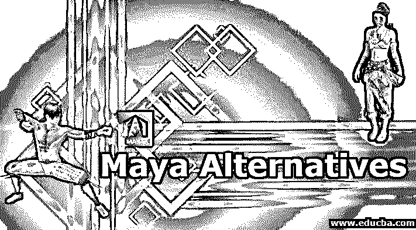
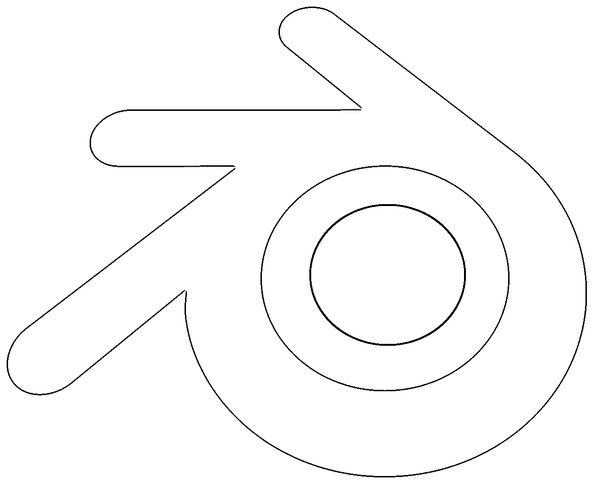
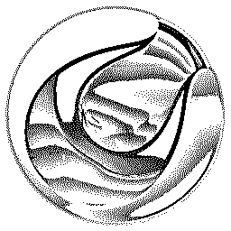
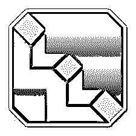
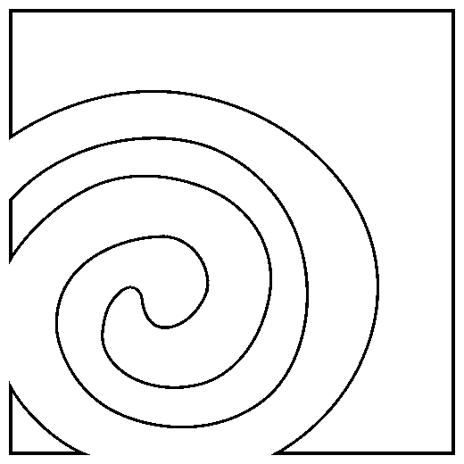
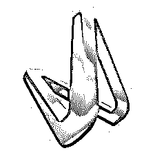
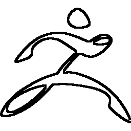
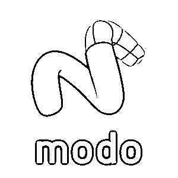

# Maya 替代方案

> 原文：<https://www.educba.com/maya-alternatives/>

## 玛雅简介

Maya 不是免费提供的，而且价格昂贵。它可能必须与其他软件结合使用，以获得广泛的设计解决方案，因此它不是一个一站式商店。有些软件是根据它们运行的平台来设计的，即有些软件在 Mac 上运行得更好，有些软件在 Linux 上运行得更快，等等。

有各种替代软件，而不是 Maya，用于建模，雕刻和动画的相同组合，我觉得这些应该列出来。其中一些可能像 Maya 一样昂贵，但界面、预设等可能更好、更快。

<small>网页开发、编程语言、软件测试&其他</small>

### Autodesk Maya 的最佳替代方案

Maya 是最著名的专业 3d 建模和动画软件。业界有几个最好的 Maya 替代品，我们来看看其中的几个。

#### 搅拌机

*   VFX，3D 建模，视频游戏创作，动画电影，3D 雕刻和绘画以及几乎所有的渲染和纹理效果都可以在 Blender 上实现。它是最受欢迎的免费开源软件。
*   它还带有自己的通用公共使用许可证，因此它使学生、专业人士和业余爱好者更容易追求设计和动画。
*   这里唯一的问题是，它可能需要一点额外的学习，因为理解 UI 需要一点时间。但是一旦你过了那个阶段，你就能几乎毫不费力地从事任何项目。
*   Blender 每三个月发布一次更新，并不时地帮助实时设计。它包括所有的功能，所以软件之间的切换更少，因为你所有的效果都将在一个屋檐下。

#### 4D 电影院

*   这个软件是一个视频动画师的好朋友，由德国的马辰创建。这个软件非常简单易学。它和 Maya 一样贵，但是有更好的定制模型，预置，灵活的界面，更多的艺术空间，而且非常酷，可以使用非常复杂的渲染，照明和动画效果。
*   这个软件在电影制作中相当受欢迎，因为它有 Mograph，可以像做蛋糕一样实现运动图形，还有动画电影的 3D 人体彩绘功能，这在其他软件中很少见，也很难实现。

#### 3D 翅膀

*   虽然该软件不做 3D 图形动画和运动图形，但这是 3D 建模的最佳替代方案，而不是 Maya。它配有所有这些详细的建模工具，这些工具由高度交互式的用户界面、易于学习和使用的材质和灯光效果支持。它是一个自由软件，并有一个用于执行个人或商业项目的开源。
*   它的主要吸引力是内置的自动 UV 映射功能，这在其他软件中很少见，尤其是免费提供的。

#### 乌丹尼

*   胡迪尼可能不是免费的，但它肯定没有玛雅昂贵。对于那些使用它的人来说，它带有一些奇妙的材料和效果，用于 3d 动画和建模，带有灯光和视觉效果，以创建动态环境和虚拟现实主题。该软件用于热门电影《冰雪奇缘》和《T2》中的一些特效以及《权力的游戏》和《使命召唤》中的一些特效。
*   胡迪尼与 Blender 和 Maya 不同的另一点是，它利用了基于节点的程序工作流。因此，我们所有的迭代都是完全可访问的，我们可以在项目期间的任何时候进行更改，不像其他软件那样不保存早期历史。

#### 向量

*   最初这个软件是免费提供的，但现在每月只需 12 美元。这是一个基于浏览器的在线软件，这意味着不需要安装软件。它将在你的浏览器上运行，并将你的所有工作保存在云上，这样你就可以随时进行实时修改。因此，这也意味着只要你在线，它就可以在任何操作系统上运行。
*   Vectary 拥有一套令人惊叹的工具和图形预设，用于 3D 建模和设计动画，以及一个易于学习和执行项目的用户界面。此外，它幻想自己是一个协作 3D 设计平台，因此它与 Google Poly、SketchFab 和其他公司共享其广泛的知识库。因此，它在功能方面与 Maya 竞争，而且作为一个在线应用程序，它可以从任何地方访问。

#### Pixologic 的 Sculptris 和 Zbrush

*   由 Pixologic 开发的 Sculptris 和 Zbrush 是两个 3D 建模和雕刻软件，它们可以一起使用，也可以以不同的方式使用。
*   所以最初 Sculptris 是从建模的角度来创建的。它确实为我们提供了一些工具，如虚拟粘土球和预设，允许设计师将其塑造成任何形式，从而提供了无限的可能性。作为初学者，你可以在 Sculptris 中创建模型，但是一旦你进入了行业标准，切换到 Zbrush 是很重要的。
*   [Zbrush 将通过简单易学的细节来完善](https://www.educba.com/zbrush-tools/)您的数字艺术，这将永远改变您的艺术。它是电影工作室、珠宝设计师、航空业等最广泛使用的设计、建模和创作应用程序。他们已经创建了预置，如使用一个工具查看 2d 到 3d 可视化，并且他们每年都在更新。

#### 模式

*   Foundry 附带了其非常著名的 3D 建模、渲染和纹理软件 MODO。这是 MeshFusion 基于布尔的工具集中内置的最著名的功能，甚至 [Maya 也没有提供](https://www.educba.com/maya-bonus-tools/)。这意味着您可以自定义您的工具组件，这也是在您的项目工作时直观的。
*   这使得 MODO 成为视频游戏、产品设计等内容的伟大创造者。它是一个多平台软件，许可费为每年 599 美元，因此属于较便宜的一类。

### 推荐文章

这是一个玛雅替代指南。在这里，我们还讨论了 Autodesk Maya 的最佳替代方案，并做了简要说明。您也可以浏览我们的其他相关文章，了解更多信息——

1.  [备选 3Ds Max 软件说明](https://www.educba.com/3ds-max-alternatives/)
2.  [什么是玛雅？|有什么好处？](https://www.educba.com/what-is-maya/)
3.  [Maya vs 3ds Max vs Blender |区别](https://www.educba.com/maya-vs-3ds-max-vs-blender/)
4.  有哪些搅拌机可供选择？
5.  [使用 Maya 软件渲染物体的步骤](https://www.educba.com/rendering-in-maya/)
6.  [VFX 顶级公司和特色指南](https://www.educba.com/vfx-companies/)
7.  [安装 Maya 的步骤](https://www.educba.com/install-maya/)

