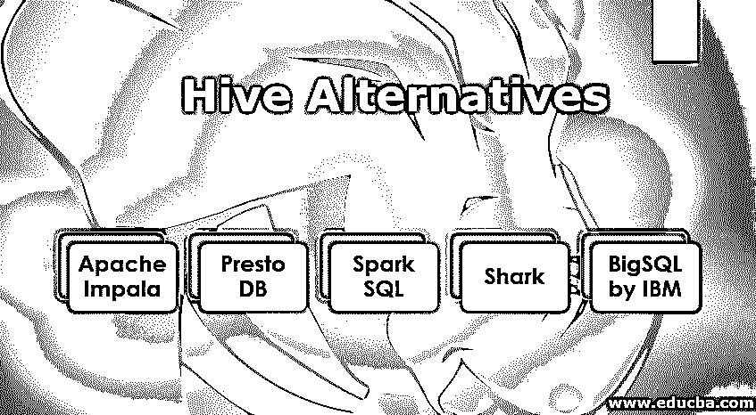

# 蜂巢替代品

> 原文：<https://www.educba.com/hive-alternatives/>

## 蜂巢替代品介绍

在我们讨论蜂巢的替代品之前。我们先来了解一下什么是蜂巢？因此，HIVE 基本上是一个基于 HDFS (Hadoop 分布式文件系统)开发的数据仓库工具。它用于提供一个类似 SQL 的查询接口来查询存储在与 Hadoop 集成的各种文件中的数据。它将类似 SQL 的查询转换为 Map Reduce 作业，这有助于轻松执行大量数据。

### 特征

以下是 Hive 的一些功能:

<small>网页开发、编程语言、软件测试&其他</small>

*   像 SQL 一样，它有自己的声明性语言 HiveQL。
*   它的表结构类似于关系数据库中的表，它还提供 ETL(提取/支持/加载)支持。
*   一个有趣的特性是它允许从配置单元内部进行格式转换。

### 蜂巢替代品的限制

让我们了解一下 Hive 的几个局限性:

*   它不是为 OLTP(在线事务处理)设计的，但支持 OLAP(在线分析处理)。
*   一个重要的限制是它不支持更新和删除。
*   也不支持 In Hive 子查询。

### 5 种重要的蜂箱替代品

下面我们将讨论目前市场上 HIVE 的五种重要替代品:

#### 1.阿帕奇黑斑羚

它是一个开源的并行处理 SQL 查询引擎，用于存储在运行 Apache Hadoop 的计算机集群中的数据。它于 2012 年 10 月公布。以下是 Apache Impala 作为 HIVE 替代品的显著特点。

*   [对于在 Hadoop 和 Apache HBase 上运行 SQL 查询而不转换数据的人来说，Impala 是一个很好的选择](https://www.educba.com/impala-database/),因为不需要像 HIVE 那样转换或移动数据。
*   这两者之间的另一个区别是查询表达式的生成。Impala 使用 llvm 在运行时生成它们，而 [HIVE](https://www.educba.com/hive-versions/) 在编译时生成它们。
*   Hive 查询有一个冷启动的问题，而 Impala 查询没有这个问题，因为在 Impala 守护进程中，进程是在启动时启动的，总是准备好处理查询，因此避免了冷启动问题。
*   Impala 识别 Hadoop 文件格式，Hadoop 安全，ODBC 驱动。
*   impala 的主要 USP 是并行处理的蛮力。所以，如果你开始一个新项目，Impala 是一个更好的选择。

#### 2.很快 DB

Presto 是 facebook 开发的 HIVE 的另一个替代方案。它的 USP 是它甚至可以在一次查询中查询来自多个来源的数据。下面是 PrestoDB 作为 HIVE 替代方案的显著特性。

*   Presto 是一个内存分布式 SQL 查询引擎，它也非常快，因为 Presto 的查询引擎很快，非常适合交互式分析。
*   Presto 优于其他产品的 USP 是它的即插即用模型，具有不同的数据源。由于这种即插即用的模型，跨不同数据源的连接查询变得非常容易。
*   很快，小维度连接表变得更快了。Presto 优于大多数其他分布式查询引擎。
*   Presto 不适合大型事实连接，因为它不利用磁盘和使用内存进行处理。
*   presto 更重要的一点是它的资源分配。它具有基于[优先级队列](https://www.educba.com/priority-queues-in-python/)的资源分配。
*   presto 中良好性能的一个代价是 presto 中没有 UDF 支持，因此必须编写自己的函数，这增加了开销，因为它必须专门为 Presto 构建，并且妨碍了[互操作性](https://www.educba.com/interoperability-testing/)。

#### 3.Spark SQL

它也是一个用于结构化数据处理的模块，也是开源的。它还可以充当分布式 SQL 查询引擎，其中一个独特的部分是它提供了称为数据帧的编程抽象。它于 2014 年首次发布，由 Apache 软件基金会开发。以下是 Spark SQL 作为 HIVE 替代方案的一些显著特性。

*   Spark SQL 的优点是它可以用 Java、Scala、Python 和 R 语言实现，而 HIVE 可以用 Java 语言实现。
*   HIVE 和 Spark 的主数据库模型完全相似，因为两者的主数据库模型都是关系型 DBMS。
*   它也类似于 HIVE，因为两者都支持键值存储作为附加的数据库模型。
*   它有预定义的数据类型，如 float 和 date。
*   它支持 SQL，因为它拥有 DML 和 DDL 语句。
*   与支持 JDBC、ODBC 和 Thrift 的 HIVE 不同，Spark SQL 只支持 JDBC 和 ODBC。
*   [Spark SQL 使用](https://www.educba.com/spark-sql-dataframe/) spark core 将数据存储到不同的节点。
*   spark 和 HIVE 之间的另一个主要区别是复制方法:HIVE 中有选择性复制因子用于在多个节点上存储冗余数据，但 Spark SQL 中没有复制因子。
*   在 Spark SQL 中，用户没有访问权限，而在 Apache Hive 中，我们有用户和组的访问权限。
*   它不支持事务表，也不支持 char 类型。

#### 4.鲨鱼

这是一个用 Scala 编写的开源 SQL 查询引擎。Shark 有趣的事实是，它不使用 Map-Reduce 来执行查询，而是使用自己的工作节点集。以下是 Shark 的一些特性:

*   它使用命令行客户端。
*   它为模式共享提供了与 Hive 的互操作性。
*   它支持现有的配置单元扩展，如 UDF。

它还不是很出名，但是它提供了一个 HIVE 的替代品。

#### 5.IBM 的 BigSQL

它由蓝色巨人(IBM)提供。IBM 有自己的 Hadoop 发行版，名为 Big Insights。因此，大 SQL 是作为它的一部分提供的。它不是开源的，因为它是由 IBM 提供的。他们提供的一些东西如下:

*   它们支持 JDBC 和 OJDBC 驱动程序。
*   它们提供 SQL 支持
*   它们可以用来查询来自 HDFS 的数据。

### 推荐文章

这是蜂巢替代品的指南。在这里，我们讨论基本含义，特点，限制和 5 个重要的蜂箱替代品。您也可以浏览我们的其他相关文章，了解更多信息-

1.  [Hive Order By](https://www.educba.com/hive-order-by/)
2.  [Hive 中的分区|命令|优势](https://www.educba.com/partitioning-in-hive/)
3.  [蜂巢数据库](https://www.educba.com/hive-database/)
4.  [配置单元中的日期函数](https://www.educba.com/date-functions-in-hive/)

