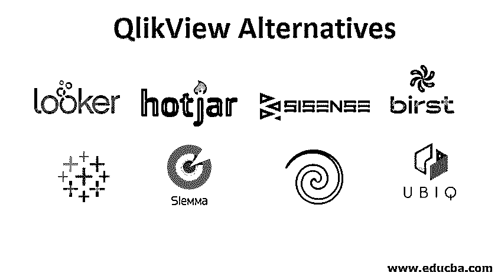
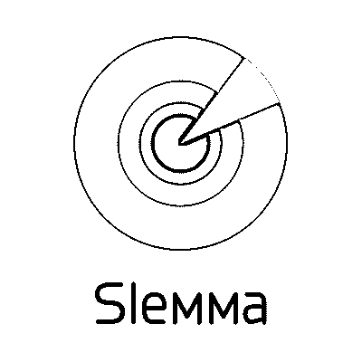
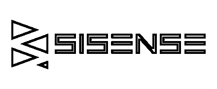

# QlikView 备选方案

> 原文：<https://www.educba.com/qlikview-alternatives/>

## QlikView 备选方案简介

QlikView 是一种商业智能工具，使用逻辑创建图形图像。QlikView 有多种备选方案。QlikView 提供带有表格的可视化图表。QlikView 使用 SQL 创建表格。通过图表可视化， [QlikView 提供了](https://www.educba.com/qlikview-functions/)更好的数据洞察。QlikView 的内存处理速度比竞争对手更快。

QlikView 使用 VB 脚本、C++和 SQL，但最终用户不必了解这些语言。该工具整合了不同来源的数据，并提供了对客户有用的报告。QlikView 使用不同的颜色让客户将数据可视化。本文讨论了 QlikView 的各种替代方案。

<small>网页开发、编程语言、软件测试&其他</small>

### QlikView 的替代产品

以下是 QlikView 的各种备选方案:

#### 1.活人画

*   借助 Tableau 中的交互式[仪表板，用于数据分析和可视化的商业智能工具。它借助图表显示各种趋势和图形。](https://www.educba.com/dashboard-in-tableau/)
*   从各种资源和数据库中收集绘制图表所需的信息。许多研究人员和专业人员使用 Tableau，因为它的独特性和可变性。
*   这个工具没有复杂的编码。我们可以使用 [Tableau 服务器](https://www.educba.com/what-is-tableau-server/)与其他人共享图表。Tableau 有助于过滤和排序数据，并通过网络浏览器刷新数据。
*   Tableau 可以轻松安装在桌面上，并且很容易用作 QlikView 的替代产品。
*   Tableau 有助于将数据简化为可理解的格式。在 Tableau 中很容易完成数据协作。理解 Tableau 不需要技巧。我们在 Tableau 中有开发人员工具和共享工具，可以可视化图表并与其他人共享。Tableau 提供了不能保存在本地而是保存在[公有云](https://www.educba.com/what-is-public-cloud/)的公共版本。

#### 2.坏消息

*   在 Slemma 的帮助下，收集了各种数据集并编写了报告。这是一个数据分析和可视化工具。这是一个基于网络的工具，可以免费使用。
*   Slemma 有助于将数据轻松呈现给客户和用户。Slemma 有助于轻松生成报告。
*   我们可以从包含图表、文本和媒体内容的仪表板中制作不同的图表。Slemma 可根据我们的喜好添加滤镜。此外，它还有助于向图表添加维度和度量。
*   Slemma 很容易与 Dropbox、Google 等服务集成。

#### 3.西森斯

*   Sisense 有助于模型分析和影响数据。数据被迁移到 Sisense Elasticube 中，并以不同的方式进行交互，使数据在整体和更深的层次上得到考虑。
*   在这一步之后，创建仪表板以使其他人理解数据。
*   Elasticube 有助于连接各种数据源，传递各种数据操作的查询。Elasticube 有助于从不同来源导入数据或直接连接到不同的数据库。我们可以使用不同的设置来定制数据。我们可以添加来自不同数据源的表，并将它们连接到 Elasticube。

#### 4\. Pentaho

*   Pentaho 是一个创建分析和关系报告的工具集合。Pentaho 帮助生成各种格式的报告，如 XML、PDF、HTML、文本等。
*   Pentaho 有一个商业智能服务器。它非常方便用户。
*   服务器和生成的报告之间有良好的连接，这有助于向用户发布报告。业务报告是 Pentaho 的一个特点。Pentaho 的成本更低，集成时间也更短。
*   其各层(数据层、服务器层和客户端层)有助于与业务分析集成并及时显示报告。有一个[数据集成](https://www.educba.com/what-is-data-integration/)工具可以从任何来源提取和加载数据。

#### 5\. Birst

*   Birst 是一个与云协同工作的商业智能工具。这有助于集成不同的数据源，并连接报表以实现可视化。
*   云帮助 Birst 在一个可靠的环境中灵活、可伸缩地工作。Birst 中有一个数据仓库自动化特性，有助于与其他商业智能工具集成。
*   Birst 允许用户上传和使用本地数据以及来自数据仓库的集中数据。这使得数据能够相互集成。Birst 帮助对收集的数据进行预测分析。

#### 6.检查员

*   Looker 是一款数据分析和[商业智能软件](https://www.educba.com/career-in-business-intelligence/)。拖放功能帮助 looker 创建图表。为图表分配了不同的角色，因此从不同用户的角度来看，数据的可视化会有所不同。技术数据可视化是在 Looker 中完成的。
*   Looker 用 LookML 数据模型代替 SQL 来集成不同的数据源。Looker 提供不同的模板，帮助用户创建报告。
*   Looker 在管理面板中为身份验证提供安全性。Looker 也可以通过移动设备访问。Looker 比 Tableau 慢。

#### 7.Ubiq

*   Ubiq 是一个在线报告工具。它支持本地和云数据。
*   轻松创建在线仪表板和基于 web 的报告。报告以不同的格式创建。我们可以通过 Ubiq 与他人分享报告。[拖放功能](https://www.educba.com/drag-and-drop-in-html/)能够分析数据。
*   过滤器通过仪表板应用。Ubiq 使用 SQL 来解释数据。Ubiq 不需要上传数据。更确切地说，Ubiq 为其报告访问不同的数据库。
*   Ubiq 中使用各种图表，如柱形图、饼图、漏斗图和许多其他类型的图表。自动刷新功能使 Ubiq 能够创建实时报告并自动更新。Ubiq 有助于更快地创建定制报告。

#### 8.热罐

*   Hotjar 有助于分析用户在网站上的行为。这有助于改善网站上的客户体验。为了使用 Hotjar，必须在系统中安装跟踪代码。
*   它给出了热图数据，记录了访问者的详细信息，并对访问者进行了调查。
*   这有助于提高站点性能。直接收集客户反馈。Hotjar 可以被称为分析和反馈工具。报告是自动生成的，显示了客户的反馈。
*   我们可以使用自己选择的任何浏览器。热图会改变颜色，以帮助用户直观显示客户现场访问的持续时间。在上面讨论的所有备选方案中，QlikView 的最佳备选方案是 Tableau。
*   Tableau 提供实时可视化，并为不同的用途提供不同的产品。虽然在 Tableau 中不容易创建表，但在该工具中很容易构建地图可视化。

### 推荐文章

这是 QlikView 备选方案指南。在这里，我们将详细讨论各种 QlikView 备选方案的基本概念。您还可以浏览我们推荐的其他文章——

1.  [QlikView Tools](https://www.educba.com/qlikview-tools/)
2.  表格 vs QlikView
3.  [Tableau 竞争者](https://www.educba.com/tableau-competitors/)
4.  [什么是 QlikView？](https://www.educba.com/what-is-qlikview/)

