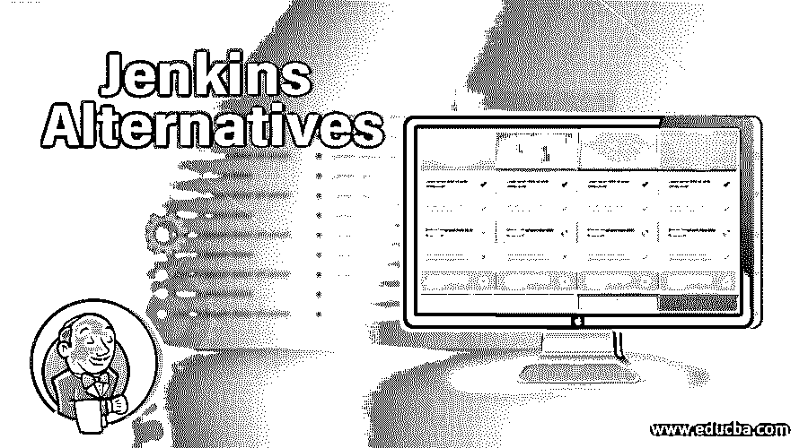

# 詹金斯替代方案

> 原文：<https://www.educba.com/jenkins-alternatives/>

## 詹金斯替代方案介绍

持续集成是软件系统中的一种萌芽实践，它涉及到以常规方式一天几次将代码部署到源系统中。构建是在每次检入时例行执行的，有助于我们确定可能的错误。这无疑有助于以相对较快的速度确定错误，并且除了故障排除之外，还能使它们变得更快。

这一过程涉及到一系列与之相关的原则，毫无疑问，CI 是近年来不断发展的最佳实践。应用程序部署在任何状态和团队期望的任何时间点都变得非常可能。

<small>网页开发、编程语言、软件测试&其他</small>

### 詹金斯备选方案列表

以下是不同的备选方案，如下所示:

#### 1.日蚀哈德森

Jenkins 的前身，它与 eclipse 的基础有很长一段时间的联系，直到大约 5 年前被 Oracle 移交。Apache Tomcat servlet 容器和 java 是 Hudson 的关键构建组件。Hudson 支持的配置管理工具如下:

*   CVS
*   饭桶
*   表演等

通过不同的方式制定，包括通过类似 Cron 的机制调度、在其他构建完成时构建，以及通过请求特定的构建 URL。最终，Oracle 在 2012 年将这个项目的优秀资产交给了 Eclipse Foundation。

#### 2.恒速控制器

它充当一个可扩展的框架，也是一个强大的 CI 工具，允许以非常定制的方式构建流程。一大套源代码控制系统，如 vss、git、hg、clear case、文件系统等。，可以轻松灵活地与巡航控制集成。从另一个角度来看，它允许大量插件，允许即时消息、电子邮件访问等。这些系统还支持报告管理，并在单个服务器上设置大量项目。

这些系统的三个关键组件如下:

*   **构建循环**:充当这些系统的心脏，在触发构建周期后通知监听器。这个过程可以通过大量的发布技术来实现。
*   工件访问和结果构建是通过 JSP 报告应用程序复杂地实现的。
*   项目构建状态及其可视化表示可以通过仪表板来实现。

#### 3.IBM 城市代码

软件巨头 IBM 发布的一款稳定的自动化软件。它将两个不同的产品或组件与其自身相关联。

1.  城市代码部署
2.  城市代码发布

*   以自动化方式实现轻松回滚和一致部署。
*   通过服务器、组件和所有层横向通知更改
*   跨环境的安全差异和配置
*   更好地了解谁更改了什么以及相关信息
*   服务虚拟化和软件供应
*   通过分离应用程序中的组件，轻松跟踪和部署。
*   浏览器设置中描述的简单且容易记的拖放过程
*   一个完善的库存清单，它保存了位于何处的内容
*   部署的水平可伸缩性和扩展可用性是通过结构良好的主/从设置实现的。
*   权利质押和必要的实体是在必要的情况下强加的。每个应用程序和环境都标有一套经过测量的标尺。
*   使用大量的工具来进行部署，并相对容易地设置流程。

#### 4.建筑风筝

BuildKite 是市场上另一个著名的集成工具，主要用于跨平台构建和部署。使用 Build kite CI，自动化构建的过程变得非常容易和专业。具有出色的客户支持并与 Github、harvest 等源代码控制系统集成的包。

制作风筝的主要特点如下:

*   几乎所有的版本控制系统都可以很容易地连接到这个 CI
*   n 个构建代理可以灵活地部署在一台独立的机器上
*   Slack、HipChat、Flowdock、Campfire 和许多其他工具可以很容易地与构建工具包集成
*   源代码或任何其他密码都不会被 build kite 设置追踪到，这极大地提高了这些系统的安全性
*   该系统的基础设施也很稳定
*   这是一种易于使用和设置的工具
*   允许简单的部署和强大的配置
*   此外，还可以建立与 Github 企业系统的集成。

#### 5.GoCD

GoCD 是另一个在市场上分发的有效 CI，它吸引了大量的市场参与者。开源软件的主要优势在于以一种简单而微妙的方式访问和理解复合工作流。CD 管道可以跨机构接口构建。

*   允许轻松配置依赖关系和并行执行事件
*   在任何时间部署任何版本的代码和应用程序
*   它使用流图，有助于以清晰的方式可视化最终工作流
*   生产环境中的安全部署
*   以简单的方式进行授权和认证
*   大量通用的插件来增强功能
*   一个非常有趣和活跃的帮助和支持社区
*   多条流水线的并行执行
*   多阶段顺序执行
*   一个阶段中的多个作业并行运行
*   一个作业中的多个任务按顺序运行

### 推荐文章

这是一个关于詹金斯替代品的指南。在这里，我们讨论了前 5 名詹金斯替代品及其利弊。您也可以阅读以下文章，了解更多信息——

1.  [Linux 替代品](https://www.educba.com/linux-alternatives/)
2.  [Ubuntu 替代品](https://www.educba.com/ubuntu-alternatives/)
3.  [WordPress 备选方案](https://www.educba.com/wordpress-alternatives/)
4.  [詹金斯 vs 哈德森](https://www.educba.com/jenkins-vs-hudson/)

