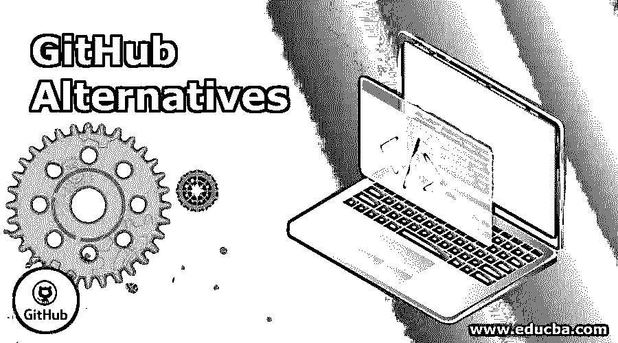

# GitHub 替代品

> 原文：<https://www.educba.com/github-alternatives/>

## GitHub 替代品介绍

GitHub 是一个重要的工具，在开源项目中运行良好。GitHub 用户可以使用 Git 或 Subversion 来管理他们的软件项目。他们允许 GitHub 的所有用户使用无限的免费公共代码库。此外，Github 还为软件开发人员提供了一个社交网站。开发人员使用的 GitHub 中的三个重要元素是 fork、merge 和 pull 请求。非程序员使用 GitHub 来处理多媒体项目和纪录片。虽然 GitHub 有助于建立一个中央存储库，但我们有其他有趣的选择来决定 GitHub 的替代方案，以在云服务器上显示和存储他们自己的创作。在当今的软件世界中，存储库管理服务是版本控制工具和代码协作的关键组件。

### 7 大 GitHub 备选方案

在本文中，我们简要讨论了 GitHub 的七大替代方案以及它们之间的比较。

<small>网页开发、编程语言、软件测试&其他</small>

#### 1\. Bitbucket

**开发者:**亚特兰蒂斯人

与 GIT 相比，bitbucket 在全球范围内的使用和流行程度更高。他们为至少五个用户提供一个免费账户，并且还提供对无限的私有和公共存储库的免费访问。不同的操作系统支持这个平台。他们有可能为任何团队成员创建新的部署模型，并且可以部署在云中。它们具有代码搜索、拉请求和分支权限等功能来保护作业。Atlassian 是位桶的客户端。他们主要通过 Git 大文件存储来支持[游戏开发](https://www.educba.com/careers-in-game-development/)。它们的特性包括与 Slack 的集成、支持静态网站和代码感知搜索，以及轻松管理代码。

#### 2.一套合作式软件开发管理系统

**开发商:** SlashDot Media

它是软件开发人员管理开源软件开发的集中场所。它们为开发人员创建自己的开源项目提供了高效的工具。它支持任意数量的单个项目(Apache、File Zilla)。SourceForge 托管在线代码库的静态和动态网页。优点是它们可靠且稳定。SourceForge 让下载项目变得很容易。SourceForge 允许在存储库中存储源代码和二进制文件。他们增加了维基、论坛、邮件列表、博客、票务系统等功能。

**SourceForge 网址:**【https://sourceforge.net/projects/myproject/ T2】

#### 3\. GitLab

开发商:GitLab.com

它是一个 GIT 库管理工具，开源软件。您可以将它安装在自己的服务器上，使用定制的主机和安全强大的应用程序来处理 [DevOps 生命周期](https://www.educba.com/devops-lifecycle/)以监控软件。随着软件包的出现，安装过程变得很快。他们做代码审查和问题跟踪过程。我们使用 GitLab 来获得干净直观的用户界面。除此之外，他们有扩展功能，如时间跟踪，更新是定期的，容易和无限的仓库(私人/公共用户)。Gitlab 与第三方应用集成，允许外部认证和保密。gitlab 中的分支系统使得有效地设计、测试和管理代码变得容易。

#### 4.基特克拉肯

**开发者:**滨逊 6 月

这是一个跨平台的 Git 客户端，具有用户友好的界面，具有吸引人的功能，如应用内任务和合并工具，增加了撤消和重做选项，并且易于学习。它们分别在 Mac、 [Windows 和 Linux 系统](https://www.educba.com/linux-vs-windows-server/)上运行，并免费用于商业目的。这些特性最有利于在软件项目上更快地协作。对于记忆较少的初学者来说，它们很容易使用。GitKraken 可以作为主要的 GIT GUI 工具，可以可视化阅读。它们与 GitLab、BitBucket 和 GitHub 实现了平滑集成。

#### 5.罗德码

**开发商:**罗德码公司。

它是 GitHub 的一个很好的替代物，具有开源平台，支持在线编辑。您可以通过实时聊天和来自外部用户的实时代码审查来执行和获取通知。它支持 Mercurial，Git 和 SVN。关于罗德码的随机事实是，他们有灵活和先进的代码审查和提交前和提交后。罗德码的社区版是免费的，企业版是付费服务。他们有非常高的安全性(先进的许可系统)和集中的用户管理。

#### 6.goggles 护目镜

**开发者:** GIT

俗称 Go Git 服务，是用 Go 编写的 GitHub 的替代品(可以在任何地方执行)，要求最低，需要的 RAM 更少。他们有一个内置的 wiki 和项目文档的问题跟踪。它们有一个很好的特性，性能和效率都很好。Gogs 可以在任何平台上运行。

#### 7.豆茎

**开发者:**通配符

GitHub 的另一个替代品是 Beanstalk。它允许在浏览器中编辑代码，因此用户不需要每次都切换到命令行。BeanStalk 不是一个需要试用订阅免费版本，而是一个通用版本。它们为密码保护提供了强大的安全性，大公司在使用 BeanStalk 时会感到更安全。BeanStalk 有一个代码审查选项，对于团队寻找外部编码人员很有用。它们允许组织多种环境。他们运行 Git 和 SVN 主机。

### GITHub 备选方案对照表

以下是解释如下的比较表:

| **GIT 备选方案比较** | **GitLab** | **来源** **伪造** | **BitBucket** | **罗德码** | **Gogs** | **豆** **梗** | **吉塔拉克** |
| **类型** | 主机和自[托管在云](https://www.educba.com/career-in-cloud-computing/)服务器上 | 网站主机 | 宿主和自宿主 | 自主托管 | 自托管 | 多功能平台 | 跨平台 |
| **成本效益** | 自由的 | 自由的 | 五个用户的免费订阅 | 自由的 | 免费版本 | 付费版本 15 美元/月 | 提供免费版本。 |
| **来源和支持** | 开源和导入 GIT | 开源项目 | 闭源，支持 GIT，CodePlex，HG | 开源社区版。 | 麻省理工学院许可开源。 | 开放源码 | 它们不是开源的。 |
| **多个数据库系统** | 受限量版支持 | MySql 数据库 | 它们具有良好的功能 | 它们具有良好的功能 | 它们只支持 GIT 管理和 SQL 驱动程序以及 go-sqlite3。 | 亚马逊 RDS | 克拉肯 _db |
| **内置 CI/CD** | 它们具有良好 CI/CD 特性 |  无 |  零。CI 工具不是免费的。 |  无 | 他们有内置的 CI/连续免费送货。 |  是的，使用 AWS。 |  他们有 CI/CD 集成。 |
| **拉合并请求** | 是 | 是 | 是 | 是的，通过简单的拉请求/提交-提交。 | 无法发出拉取请求 | 在拉式请求中创建新注释。 | 特定分支的拉取请求可用。 |
| **虚拟主机** | 静态 | 动态和 CMS | 静态站点 | 无 | GitLab 页面 | 没有主机 | [网络应用](https://www.educba.com/web-testing-application/) |
| **代码评审** | 是 | 是 | 是 | 是的。他们有强大的代码审查。 | 是 | 是 | 为了评审存储库，他们有代码评审。 |

### 推荐文章

这是 GitHub 替代品的指南。在这里，我们讨论了 7 大 GitHub 备选方案，并提供了一个全面的比较表。您也可以阅读以下文章，了解更多信息——

1.  [GitHub 命令](https://www.educba.com/github-commands/)
2.  [GIT 命令列表](https://www.educba.com/git-commands/)
3.  [GitLab vs GitHub](https://www.educba.com/gitlab-vs-github/)

