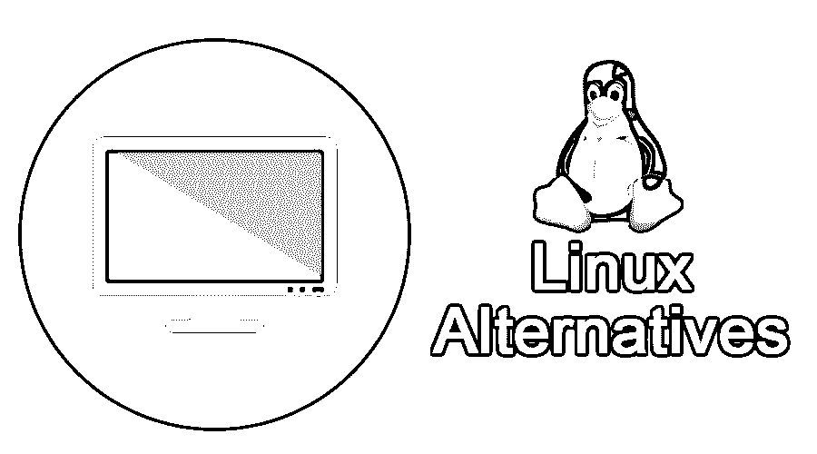
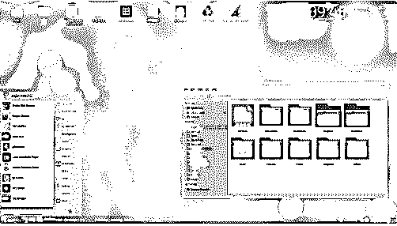
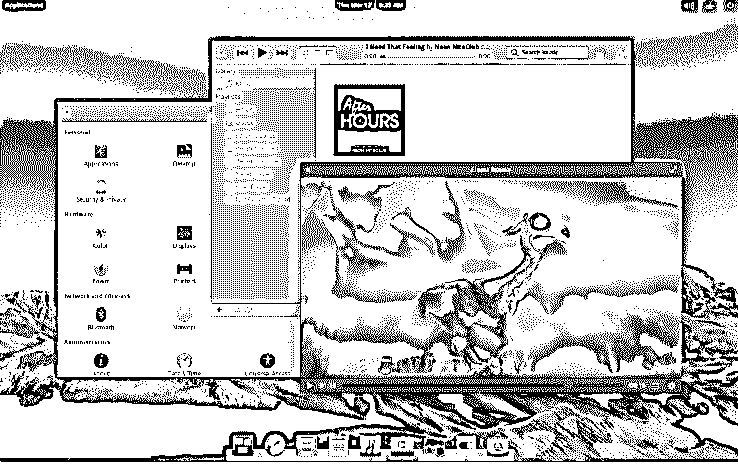
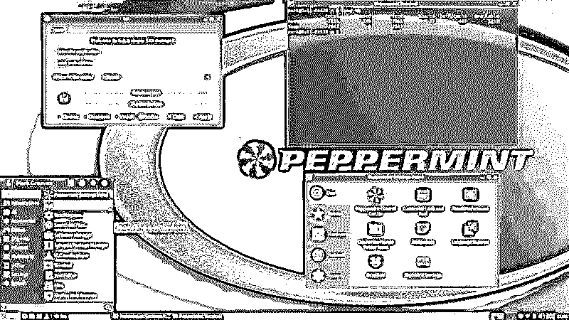
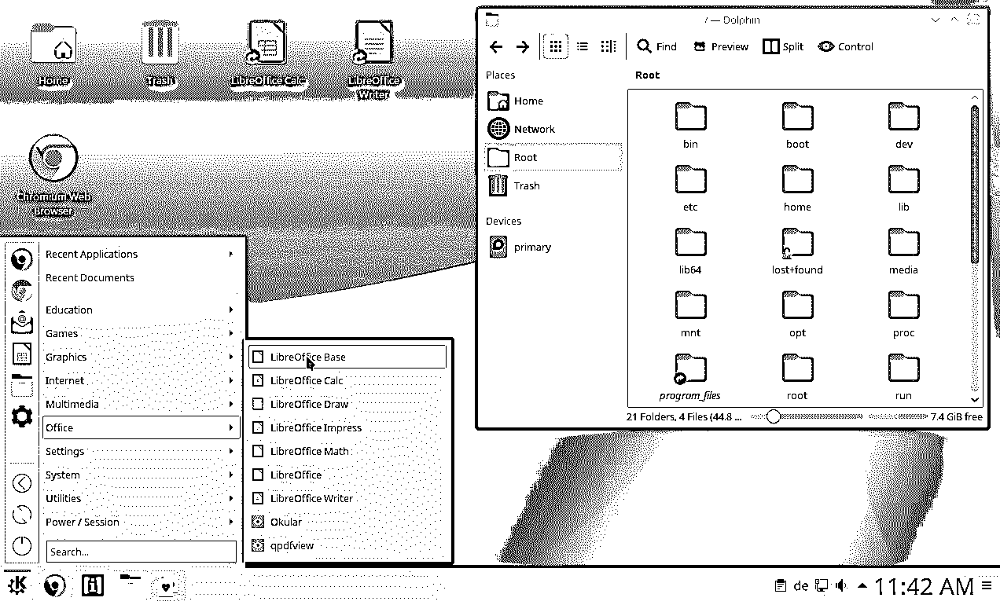
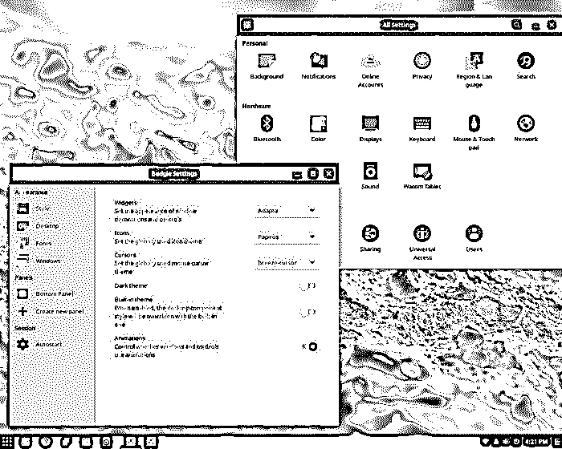
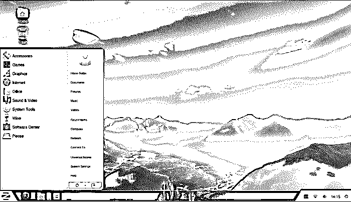

# Linux 替代品

> 原文：<https://www.educba.com/linux-alternatives/>

## Linux 替代品介绍

[Linux](https://www.educba.com/what-is-linux/) 是一个开源的操作系统。它打包在 Linux 发行版中。它于 1991 年首次发行。它是由 Linus Torvalds 开发的，用 C 语言编写。它有多种语言版本。它支持多种平台。它是基于[单片内核的](https://www.educba.com/monolithic-kernel/)型。操作系统是计算机和其他设备(如手机、平板电脑、笔记本电脑等)的主要组成部分之一。

### 8 大 Linux 替代品

在本文中，我们简要讨论了 Linux 的八种替代方案以及它们之间的比较。不同的 Linux 替代方案如下:

<small>网页开发、编程语言、软件测试&其他</small>

#### 1.木屋 OS

这是一个操作系统，具有完整和独特的定制功能，在整个操作系统中更加一致和广泛。它是 Linux 的一个很好的替代品，因为它有广泛的预装应用程序，如多媒体、安全、工作和天气等。它真的很快，提供最好的服务。

#### 2.基本操作系统

它也是最受欢迎的操作系统之一，用于那些想使用像 MAC 这样的操作系统的人。它的主要焦点是基于桌面演示和易用性。它有一个非常棒的用户界面。它主要强调易操作性。它的功能包括互联网，蓝牙，声音和电池小程序。它是一个坚固的操作系统，被称为轻量级桌面，有助于轻松地从一个功能导航到另一个功能。

#### 3.给我们讲讲

它的第一次出现就会吸引你使用这个操作系统。它提供给你整个桌面图标，开始按钮，系统托盘，底部面板等。它已经安装了必要的软件。网络浏览器也可以浏览世界各地的网站。您可以选择网络浏览器，这个操作系统允许您这样做。主要首选高配置笔记本电脑或电脑。最低 RAM 应为 3GB，但 8GB RAM 的机器是首选，并且最好与高功率机器一起使用。它可以定制的方式，用户可以有外观。

#### 4\. Kubuntu

另一个 Linux 替代品是 Kubuntu。它是主要关注用户友好行为的操作系统，由翻译、测试、开发和支持人员的大型社区开发。它是开源的、免费的，可以随时使用。它有许多功能，如办公、摄影、音乐软件、电子邮件和生产力。它提供了操作系统的易用性。

#### 5.薄荷 OS

这是一个更轻量级的操作系统，其要求可以很容易地与桌面和其他设备相匹配。它不需要高配置的机器，因为它是轻量级的操作系统。这个操作系统中有许多功能使它更特别，就像 Ice 概念一样令人惊叹。此功能有助于将 web 内容作为应用程序进行连接，无需连接到 URL。还有其他功能，如锁屏，薄荷交易，文件管理器和定制能力。

#### 6.Q4OS

这个操作系统是基于 Debian 操作系统的。在工程师中广受欢迎。他们主要关注速度、安全系统、可靠性和长期稳定性。对于这种操作系统，可以很容易地改变桌面环境。这是最具定制性的选项。这些选项可以根据用户的方便进行更改。有一些默认的应用程序被包括在内，如谷歌浏览器，火狐，射击井，雷鸟和征服者等。它是轻量级的，安装该操作系统需要较少的配置。

#### 7.索卢斯

这个操作系统是一个全新的核心。这个 Linux 替代品一次就提供了一种吸引人的感觉。Solus 有不同的包，主要取决于桌面环境，包有 Solus MATE，Solus GNOME 和 Solus Budgie。它还需要较少的配置机器来安装操作系统。它真的吸引了用户，并与日俱增。

#### 8.佐林操作系统

一旦安装到你的电脑上，它就是最有家的感觉的操作系统。它有相当的人力与标准化的开发周期。它的第一次出现真的很吸引人，也很好用。用户可以轻松管理正在运行的应用程序。它有内置的应用程序和功能，如天气，体育等。它与高密度显示器高度兼容，并可随屏幕自动调整。它还带有触摸手势，可以通过触摸操作屏幕。

### 结论

这些是可以使用的操作系统，它们也是开源的，它们提供了许多功能。由于它们的安全目的和易用性，它们在开发人员中也越来越受欢迎。这些可以与现代技术的高度多样性和时代性一起使用，并且在[技术区域](https://www.educba.com/careers-in-technology/)中时间正在快速更新。

### 推荐文章

这是一个关于 Linux 替代品的指南。在这里，我们已经讨论了 8 大 Linux 替代品，如 Zorin OS、Kubuntu、Chalet OS、Peppermint OS 等。您也可以阅读以下文章，了解更多信息——

1.  [Linux 和 Android](https://www.educba.com/linux-vs-android/)
2.  [Kali Linux 命令](https://www.educba.com/kali-linux-commands/)
3.  [Linux 和 BSD](https://www.educba.com/linux-vs-bsd/)
4.  [Linux 自由命令](https://www.educba.com/linux-free-command/)

