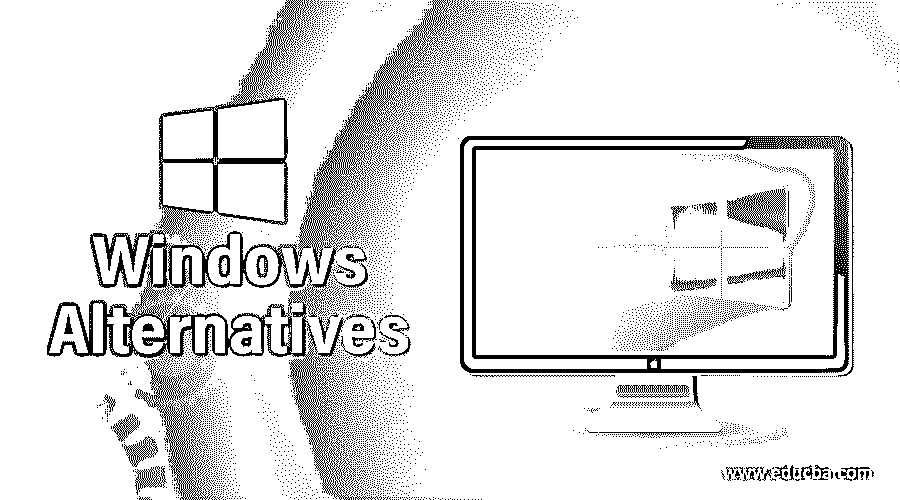
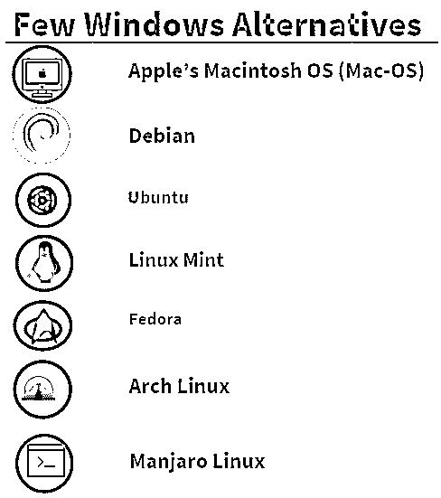

# Windows 替代品

> 原文：<https://www.educba.com/windows-alternatives/>

## Windows 替代方案介绍

微软在 1985 年发布了第一个 Windows 版本。它的目的是为运行在 MS-DOS 上的系统提供一个用户友好的图形用户界面。使用 MS-DOS 的用户必须在命令提示符的帮助下手工向计算机输入命令，才能与计算机进行交互。Windows 使得输入命令的整个过程只需点击一下鼠标。很快，Windows 成为世界上最受欢迎的操作系统，主要是因为它的易用性。

那么，到底什么是操作系统呢？简而言之，操作系统就是系统的主要软件，负责同步所有硬件，包括输入和输出设备(如鼠标、键盘、硬盘、显示器等)。)和其他第三方软件。操作系统管理系统上运行的所有进程(任务),并相应地为它们分配资源。

<small>网页开发、编程语言、软件测试&其他</small>

截至今天，2015 年 7 月 15 日发布的最新版本——Windows 10 是市场上最受欢迎的操作系统。Windows 10 自带 Cortana 集成、微软 Edge 网页浏览器、任务视图、通用应用等新功能。据估计，Windows 10 运行在超过 7 亿台设备上，包括 PC、笔记本电脑、平板电脑、手机等。

### 几乎没有 Windows 替代品

以下是 windows 的主要替代方案:

#### 1.苹果的麦金塔操作系统(Mac-OS)

Mac-OS 最初是由美国苹果公司于 1984 年推出的。然而，直到 2001 年，该公司推出了一项重大升级——Mac OS X，获得了巨大的欢迎。Mac OS 是 Windows 的顶级替代品之一，因为它有一个主要的限制，即它只能在苹果公司生产的电脑上运行。另一方面，它带有许多内置软件，如 iMovie、Garage Band、Siri 等。，使执行众多任务变得更加容易。Mac OS 提供了更好的安全性，因为与 Windows 相比，它更不容易受到病毒和其他恶意软件的攻击。

#### 2.一种自由操作系统

最古老的 Linux 发行版之一是由 Ian Murdok 在 1993 年大学时代发现的。那时候，伊恩·默多克正在和黛布拉·林恩约会，因此把他们的名字组合成了“黛布+伊恩”。它类似于 Unix，基于 Linux 内核或 FreeBSD 内核。它也是开源的，这意味着它的安装不需要任何成本。该安装附带了超过 51000 个软件包、一个软件包管理器和其他实用软件包，使得这些相互依赖的软件包能够协同工作。它还为构建在它之上的其他操作系统(如 Ubuntu、Linux Mint 等)提供了重用这些包的接口。截至今天，Debian 的最新更新版本 9.8 名为“stretch”，于 2019 年 2 月 16 日发布。

#### 3.人的本质

Ubuntu 是由 Canonical Ltd 在其创始人兼首席执行官马克·舒托沃尔斯的领导下开发的。Ubuntu 是以 Ubuntu 的非洲哲学命名的，意思是“对他人的人性”或“我之所以是我，是因为我们都是谁”。第一个稳定版本是 2004 年 10 月 20 日发布的 Ubuntu 4.10。它也是一个开源的 Linux 发行版，构建在 Debian 之上的[，为桌面、Ubuntu 服务器、Raspberry Pi 和云等物联网设备提供安装。最新版本是 Ubuntu 18.04 LTS“仿生海狸”，于 2018 年 4 月 26 日发布，将支持到 2028 年。](https://www.educba.com/install-debian/)

**下载链接:**【https://www.ubuntu.com/desktop#download T2】

#### 4.Linux 作为

windows 的开源替代品的最佳选择是 Linux Mint。它无疑是 Linux 最受欢迎的发行版之一。Linux Mint 于 2006 年首次发布，基于 Debian 和 Ubuntu OS。人们也可以在 Mint4Win 等应用程序的帮助下，使用 windows PC 来双启动 Linux Mint。

最新发布是在 2018 年 12 月 19 日，Linux Mint 19“Tessa”。该版本基于 Ubuntu 18.04，将支持到 2023 年 4 月。

**下载链接:**【https://linuxmint.com/download_all.php T2】

#### 5.一种男式软呢帽

然而，另一个来自 Linux 的开源发行版是由 Fedora 项目开发的，并得到了 Red Hat 的赞助。Fedora Core 1 的初始版本——“Yarrow”于 2003 年 11 月 6 日发布。它基于 Red Hat Linux 9，附带 Linux 内核和 GNOME 桌面环境。Fedora 也是 Windows 的替代品之一，因为它附带了一系列软件，包括 Firefox 和 LibreOffice。软件仓库中的其他第三方软件可以使用 GNOME 软件或 DNF 软件包管理器来安装。最后一次发布是在 2018 年 10 月 30 日。这个新版本有一些值得注意的特性，比如一个新的叫做模块化的可选软件包库，Fedora 模块化，GNOME 3.30 等等。

**下载链接:**【https://getfedora.org/en/workstation/download/ T2】

#### 6.Arch Linux

Aaron Griffin 是发现 Arch Linux 团队的首席开发人员。第一版于 2002 年 3 月 11 日发布。它是 Linux 开源发行版的又一个版本，轻量级且灵活。它是根据 KISS 原则开发的，KISS 原则代表“保持简单，笨蛋”。packman(package manager 的首字母缩写)是一个软件包管理器，它是为 Arch Linux 编写的，用于安装、删除、升级/降级软件包，并具有自动依赖性解析功能。Arch 用户库(AUR)是一个由 Arch Linux 的其他用户开发的软件库。使用 Arch Build 系统(ABS)和定制脚本，用户可以开发与 Packman 兼容的包。

当前版本的 Arch Linux 包括内核版本 4.20.13，于 2019 年 3 月 1 日 st 发布。

**下载链接:**【https://www.archlinux.org/download/ T2】

#### 7.Manjaro Linux

Manjaro Linux 由 Guillaume Benoit 和 Philip Müller 创建，最初于 2011 年 7 月 10 日发布。像大多数的 Linux 发行版一样，它也属于免费的操作系统，并且建立在 Arch Linux 之上。与 Debian、Ubuntu、Fedora 相比，它是一个相对较新的 Linux 发行版，也是其中最用户友好的操作系统。与 Linux 的其他发行版相比，Manjaro 还提供了出色的性能。Manjaro 18.0 的最新版本代号为 Illyria，于 2018 年 10 月 30 日发布。

**下载链接:**<u>[【https://manjaro.org/download/】](https://manjaro.org/download/)</u>

### 推荐文章

这是 Windows 替代品的指南。在这里，我们讨论了 windows 的基本概念，并解释了 7 大备选方案。您也可以阅读以下文章，了解更多信息:

1.  [Windows 简介](https://www.educba.com/introduction-to-windows/)
2.  [Ubuntu 替代品](https://www.educba.com/ubuntu-alternatives/)
3.  [Windows 操作人员](https://www.educba.com/windows-operators/)
4.  [Linux 替代品](https://www.educba.com/linux-alternatives/)

