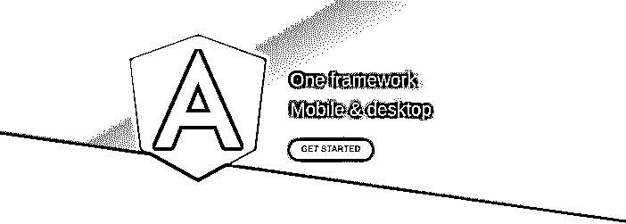
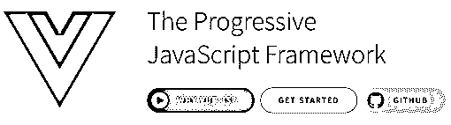
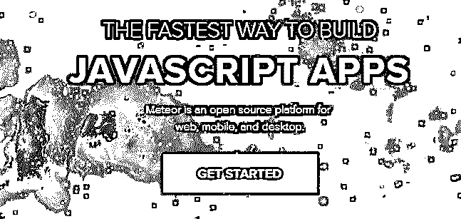
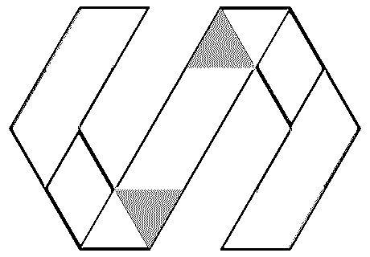
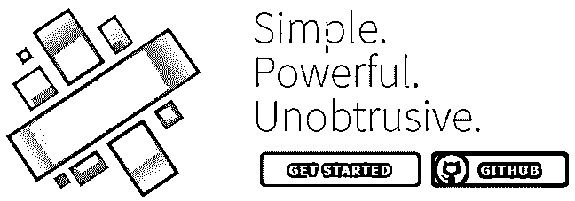

# 角度选择

> 原文：<https://www.educba.com/angular-alternatives/>

## 角度选择介绍

AngularJS 是开源 web 框架的第一个版本。AngularJS 有谷歌做后盾。AngularJS 是第一个基于 MVC 设计模式的前端框架。这允许称为双向绑定的功能，该功能使能够在页面上连续反映更改。此外，AngularJS 还提供了依赖注入、现成模板、测试等功能。它允许用整洁干净的代码开发单页应用程序。这些特点使 AngularJS 独一无二

### 什么是有角？

<small>网页开发、编程语言、软件测试&其他</small>

近 20 年来，前端技术有了很大的发展。从非常基本的 HTML、 [CSS 和 JavaScript](https://www.educba.com/css-vs-javascript/) 到许多库和框架，现在都有了很好的功能。开发人员现在能够在很短的时间内构建非常复杂的用户界面。自 2010 年以来，JavaScript 框架开始发展，起初，AngularJS 进入了市场。它在短时间内变得非常有名。最终，随着复杂性的增加，Angular 的新版本被编写出来，但它与旧版本不兼容。由于这种流行的棱角开始减少。

Angular v2 和更高版本是完全重写的，它是一个基于类型脚本的框架。[角度特征](https://www.educba.com/angular-features/)移动支持，而 AngularJS 不支持。Angular 是一种改进，与新版本兼容。

### 角度选择列表

以下是不同的角度选择，如下所示:

#### 1.反应

React 正在成为当今最流行的框架之一。一些开发者正从 Angular 转向 React。它是由脸书的一名工程师发明的。React 用于单页面[以及移动应用](https://www.educba.com/mobile-applications/)的开发。React 提供了一些创新功能，如虚拟 DOM、单向数据流。

React 是声明性的和基于组件的。这允许编写复杂的 UI，同时以一种简洁的方式维护代码。React 在应用程序的视图层工作。React 的规模较小，在开发复杂的 React 应用程序时通常需要额外的库。

#### 2.Vue

另一个角度选择是 Vue。Vue.js 是一个由作者尤雨溪创建的渐进式 JavaScript 框架，现已开源。Vue 足够强大，可以构建单页面应用程序。Vue 从【AngularJS 和 React 都有一些类似的概念。它在应用程序的视图层工作，它有一个虚拟 DOM 特性，并支持附加库，这与 React 类似。Vue 有一个类似于 Angular 的模板样式，但是 performance wise Vue 更强大，因为它更轻量级。

Vue 提供了诸如反应式界面、CSS 过渡和动画、自定义过滤器和非常简单的代码等功能。Vue 简单易懂，灵活多变。

#### 3.余烬

Ember 是一个开源的 JavaScript 框架。它允许开发人员通过使用框架中的最佳实践来构建可伸缩的单页应用程序。Ember 基于模型-视图-视图-模型(MVVM)模式。

Ember 正在被 LinkedIn、Vine、Nordstrom 等热门网站使用。使用 Ember 还可以构建桌面和移动应用程序。苹果音乐是这方面最显著的例子。

Ember 提供了 Ember CLI、Ember 模板、用于调试的 Ember 检查器工具等功能。Ember 提供了友好的 API，易于理解和使用。

#### 4.流星

Meteor 是一个用纯 JavaScript 开发 web 和移动应用程序的完整平台。这是一个免费的开源 JavaScript 框架，可以在客户端和服务器上运行。Meteor 将[直接与 MongoDB](https://www.educba.com/install-mongodb/) 集成，无需任何额外代码就可以将数据更改传播到客户端。Meteor 有自己的设计模板引擎，也可以和 Angular，React，Vue 框架一起使用。

Meteor 是最好的角度选择，因为它是一个全栈框架，可以通过学习一次来构建应用程序中的所有内容。Meteor 易于学习，能够更快地构建，是开发人员的最爱。

#### 5.聚合物

polymer 是一个开源的 JavaScript 库，用于构建由 Google 开发者开发的 web 应用程序。YouTube、谷歌地球、网飞和电子艺界都使用聚合物。

聚合物是基于 web 组件的概念构建的。Polymer 提供了构建定制 HTML 元素、跨浏览器兼容性、Polymer CLI 等功能。Polymer 确实有一些不足之处，比如缺乏文档和支持，但它再次得到了 Google 的支持，因此它可能会在未来获得更大的市场。

#### 6.毅力

Backbone 是一个轻量级的 JavaScript 库，为开发单页面应用程序而设计。它基于模型-视图-展示者(MVP)设计模式，该模式将数据抽象为模型，将 DOM 抽象为视图，并使用事件绑定这两者。 [Backbone.js](https://www.educba.com/what-is-backbone-dot-js/) 进入市场已有很长时间，有一个成熟的平台。

Backbone 提供了一些特性，比如 RESTful JSON 接口、与后端同步、事件驱动的通信。Backbone 允许以一种有组织的、结构良好的格式构建 web 应用程序和移动应用程序。

#### 7.蛹

Aurelia 是用于开发 web 和移动应用程序的下一代现代开源 UI 框架。它允许使用纯 JavaScript 或 TypeScript 设计复杂的应用程序。它遵循最新的 JavaScript 标准。奥雷利亚是干净的，有一个很好的 API。Aurelia 简洁而简单，同时又强大而灵活。Aurelia 是模块化的，它有一系列可以单独使用的库，当它们组合在一起时，就形成了一个强大而健壮的框架。

Aurelia 采用基于现代和反应的方法。它提供了一些优势和特性，如前瞻性思维、双向数据绑定、自定义 HTML 元素、测试等。Aurelia 对开发人员友好，易于使用。对于那些对前沿 JavaScript 应用感兴趣的人来说，Aurelia 是最好的选择。

#### 8.秘银

这是目前 angular 最著名的替代方案之一。Mithril 是一个用于构建单页面应用程序的现代客户端 JavaScript 框架。它体积小(< 8kb 容量)，速度快，并提供开箱即用的路由和 XHR 实用程序。Mithril 被耐克、Vimeo 等公司和 Liches 等开源平台使用。

它已经有了用于常见任务的可用文档。Mithril 是关于高效完成有意义的工作。Mithril 是一个用纯 JavaScript 构建网络和移动应用的完整平台。

### 推荐文章

这是一个角度选择的指南。在这里，我们讨论了 8 大角度选择及其利弊。您也可以阅读以下文章，了解更多信息——

1.  [Linux 替代品列表](https://www.educba.com/linux-alternatives/)
2.  [WordPress 备选方案](https://www.educba.com/wordpress-alternatives/)
3.  [PHP 替代方案](https://www.educba.com/php-alternatives/)
4.  [GitHub 备选列表](https://www.educba.com/github-alternatives/)

