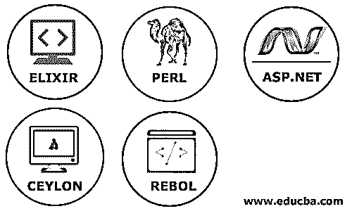

# Node.js 替代项

> 原文：<https://www.educba.com/node-dot-js-alternatives/>

## Node.js 替代方案介绍

众所周知的节点是一个很棒的开发环境。它与 JavaScript 的兼容性为市场和用户创造了更多的空间和需求。在本文中，我们将看到 Node.js 的一些顶级替代品。Node.js 是一个运行时环境，这意味着允许在给定操作系统的 Javascript 可执行文件中创建应用程序的软件。为此 [Node.js 使用了](https://www.educba.com/why-use-node-js/)Chrome V8 Javascript 引擎[，这是用 C++](https://www.educba.com/introduction-to-c-plus-plus/) 编写的。Node 是 Ryan Dalp 在 2009 年创造的；目前有 v0.10.36 稳定版(也是最新版本)。Node 的事件驱动和非阻塞 I/O 特性使其轻量级、高效且兼容不同设备。

*   开放源码
*   跨平台
*   运行时环境
*   用于创建服务器端和网络应用程序
*   操作系统–Windows、Linux 和 X
*   许可证–麻省理工学院许可证

谁在使用 Node.js: 这里有一长串的公司，易贝、通用电气、GoDaddy、微软、PayPal、优步、Yammer 和雅虎

<small>网页开发、编程语言、软件测试&其他</small>

**在哪里使用 Node.js:** 用于 I/O 特定应用程序、数据流应用程序、DIRT、基于 JSON API 的应用程序和单页应用程序

### Node.js 备选列表

市场上还有其他几种优秀的 Node.js 替代品，如下所示

#### 1.长生不老药

想象一下，你有一个在浏览器上运行良好的产品，但是现在你想在手机上运行。这样，您将选择 Rest API(在这种情况下，选择 ERLANG 没有任何意义)。使用 Java 或 Node.js，您可以轻松实现可伸缩的解决方案。

我们什么时候需要 ERLANG？

所以，你已经有了一个移动应用程序，现在你想实现消息服务，或者更严格地说，你想实时提供消息服务。这种实时意味着快速的数据处理。在这种情况下，二郎肯定是非常难打的。Erlang 具有较短的代码结构，这使得缩放系统更容易快速执行。有了 Erlang 调试产品，套件就简单了。

**什么是二郎，仙丹和它有什么关系？**

Elixir 是一种动态的函数式语言，用于构建可伸缩的应用程序，在这一过程中，Erlang(它是 Elixir 的虚拟机)提供了帮助。

*   长生不老药是开源的
*   兼容 Mac、Windows 和 Linux

**仙丹的特性:**

*   **可伸缩性:**Elixir 中的代码用户既有垂直的也有水平的可伸缩性，这意味着它允许数千个进程同时运行(即垂直伸缩)，甚至在同一网络中的不同机器上运行(即水平伸缩)。这种行为有助于在许多方面为高效的资源管理打下坚实的基础。
*   函数式编程:对于 Elixir 而言，它始终是一个优势，因为它能为用户提供简短、快速且易于维护的编码。

#### 2.实际抽取与汇报语言(Practical Extraction and Reporting Language)

这是一种高级通用编程语言。它有一个很棒的开发工具集，用户群不断增加。Perl 与其他编程语言有联系，因为它有多个工作段。它类似于 C、Shell 脚本、AWK 和 SED。有了这些相似的特性，Perl 为用户提供了强大的文本处理工具。

**Perl 的特性:**

*   超过 25，000 个开源模块可在全球范围内或通过 CPAN 轻松使用。
*   文本操作使它与 HTML、XML 和其他一些标记语言相关。
*   开源——拥有 GPL 许可的开源软件
*   它有一个 C/C++接口和数据库集成。

在市场上，有几个使用 Perl 构建的应用程序，即 Matrix、Gitweb、AWStats 和 Cucumber。

*   Perl 是开源的
*   兼容 Mac、Windows 和 Linux 操作系统

#### 3.ASP.NET

无论是基于网络的应用程序、复杂的 API、实时开发还是微服务。ASP.NET 就是这样一个完整的包裹。这使它成为最有资格的竞争者之一，也是 Node.js 的替代品。

*   这是一个开源软件
*   服务器端 web 应用程序框架

ASP 的特点。净:

*   使用 HTML、CSS 和 JavaScript 的网站非常棒，并且在与 ASP.NET 合作时最兼容。
*   用于创建 REST-ful web 服务的 API，这些服务使用 JSON、XML 来支持内容。
*   对于价值提供者来说，使用过滤器是一个很好的工具。这些过滤器是 Cookies、控制值、会话详细信息和 Querystring。

#### 4.锡兰

它是一个通用的 PL，语法类似于 C#和 Java。定义 Ceylon 的几个关键亮点是它是一个命令式的、静态类型的、模块化的结构和面向对象的行为。

**锡兰特色:**

*   统计类型化意味着由编译器进行完整和广泛的检查，这发生在代码中构建的注释结构中。
*   高阶意味着每个属性、操作和使用的每个类型都是一个值。
*   对于 block，structure 意味着它具有减速和语句的词法范围和递归语法。
*   Ceylon 也是开源的
*   兼容 Mac、Windows、Linux、JavaScript 和 Hotspot JVM

#### 5.雷博尔

Rebol 是一种跨平台语言，它是为多范例方法的有效数据交换而开发的。由于网络通信是其功能背后的主要目的，它也适用于小型的优化领域——编码数据的特定语言。

**REBOL 的特点:**

*   文件共享，同步和存档-易于共享文件，以保持用户同步，文件自动实现调用早期版本的编码，如果需要立即。
*   高度安全的平台–强大的语言功能为创建、数据交换、数据存储检索和客户端/服务器管理任务提供了一个安全的平台。
*   办公室访问
*   私人团体网络功能使 Rebol 免于垃圾工作邮件。
*   易于安装和使用

**Note:** Although Rebol is a programming language which enables the user to write functions and perform the processes its greatest strength lies in the ability to create domain-specific dialects.

*   这是一个免费的资源
*   与 Mac、Windows 和 Linux 兼容

### 结论

希望这能让我们的读者对 Node.js 的可选选项有所了解，并理解何时选择某个特定的选项。正如我们所知，在任何特定的语言中都有几个内置的功能，但是在本文中，我们讨论了 Node.js 与操作系统(大多数情况下是 OS、Windows 和 Linux)兼容的替代方案。

### 推荐文章

这是 Node.js 替代方案的指南。在这里，我们讨论了 Node.js 的基本概念及其重要特性。您也可以阅读以下文章，了解更多信息:

1.  [Node.js 命令](https://www.educba.com/node-dot-js-commands/)
2.  [node . js 的用途](https://www.educba.com/uses-of-node-dot-js/)
3.  [节点中的事件。Js](https://www.educba.com/events-in-node-js/)
4.  [Node.js 流程](https://www.educba.com/node-dot-js-process/)

