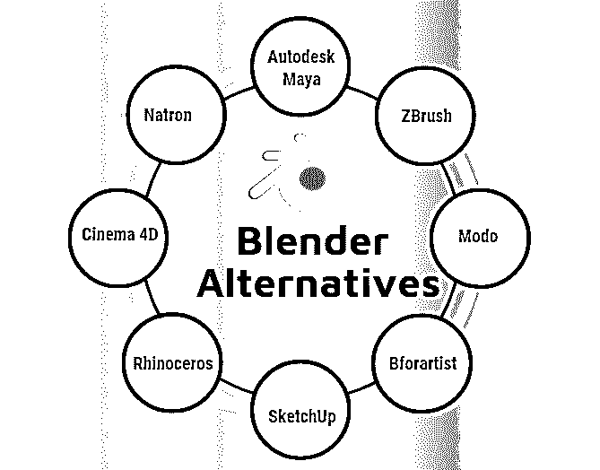
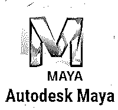
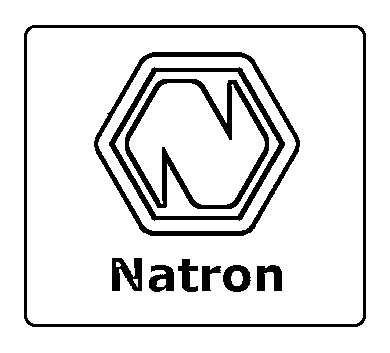
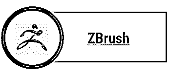
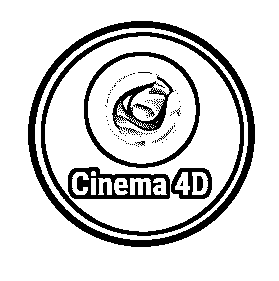
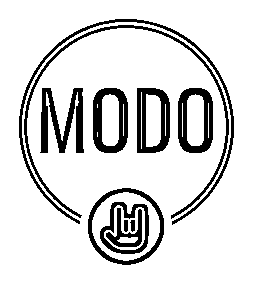
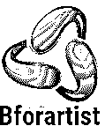
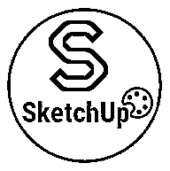

# 搅拌机替代品

> 原文：<https://www.educba.com/blender-alternatives/>

## 搅拌机替代品概述

Blender 是一个 3D 计算机图形程序，用于创建动画电影、3D 模型、视频游戏、3D 程序和动画视频。Blender 最重要的特点是它是免费的，并且有许多可用的功能，这使它成为一个完美的 3D 动画和建模程序。

该软件最初是由 Ton Roosendaal 开发的，但目前归 Blender Foundation 所有。它发布于 1988 年，兼容 Linux、Mac OS、FreeBSD、OpenBSD 和 Windows 操作系统。程序用 C、C++和 Python 语言编写。

<small>网页开发、编程语言、软件测试&其他</small>

Blender 支持 UV 展开、纹理、3D 模型的装配和蒙皮、流体和烟雾模拟、匹配移动、运动图形、视频编辑、雕刻、软体模拟和合成。Blender 也有一个默认的内部渲染系统和环境遮挡，也可以传输到其他格式。它还可以借助各种插件和媒体库，与其他渲染引擎进行桥接和融合。

Blender 还支持相机和对象跟随器，并且基于 Python 语言，有助于创建自定义工具和函数，这对用户非常有用。它还支持视频和音频编辑，这是非线性的性质。总而言之，Blender 是一个为 3D 艺术家和排版人员创造的令人惊讶的程序，它被证明对他们非常有用和有帮助。

### 搅拌机替代品

以下是搅拌机的主要替代品:

#### 1\. Autodesk Maya

Maya 是 3D 艺术家使用的非常著名的 3D 动画、建模、视觉效果和渲染程序。它受 Mac、Windows 和 Linux 支持。虽然 Maya 是 Autodesk 的一部分，每月的费用为 50 美元。主要用于 3D 雕刻，关键帧动画和纹理，Maya 是一个工具和功能强大的软件，使用起来有点复杂。尽管如此，一旦学会，它是搅拌机软件的最佳替代品。

#### 2.泡碱

这是一个[开源程序](https://www.educba.com/what-is-open-source/)，一般用于节点合成需求。作为一个跨平台的软件，Natron 的一些特性包括使用 f 曲线的动画，渲染，2D 跟踪系统。程序中的项目是一个创建的 XML 文件。虽然，程序不支持脚本，但是有关键帧和运动图形渲染等动画工具。该计划是免费的，并支持视频过滤器和许多功能用于三维建模和动画。

#### 3.布鲁什

这个程序被证明是非常有用的，并且在很大程度上影响了 3D 产业。主要用于数字雕刻和绘画目的，ZBrush 是一个特殊的程序，具有令人印象深刻的功能和工具集。它也有一个惊人的和有效的工作流程，并提供最新的和更新的工具集，其数字用户。Zbrush 主要用于脚本、3D 雕刻、纹理和其他程序， [Zbrush 已经证明了](https://www.educba.com/zbrush-tools/)在各方面都是非凡的。

#### 4.4D 电影院

这是 Blender 的商业和专业替代品。这是一个动态的 3D 程序，能够执行各种功能，如动画，照明，纹理，渲染和多边形建模。主要用于其人体彩绘 3D 功能，电影院 4D 是非常常用的 3D 艺术家和画家。该计划的工作流程也是用户友好的，非常高效。虽然这个程序有少量的钱，但仍然值得购买。

#### 5.模式

这个项目节奏快，充满活力。该计划的惊人特点包括现有的最好的雕刻工具，建模技术，以及关键帧动画的支持，使 Modo 成为一个高要求的计划。它有一个用户友好的工作流程和工具集，它侧重于创造力和想法。它可以在 Mac、Linux 或 Windows 操作系统上运行。

#### 6.犀牛

这个程序是一个基于商业的 3D 建模程序。它是由罗伯特·麦克尼尔事务所创建的。该程序主要由 3D 艺术家和室内设计师使用，可用于汽车设计、建筑、珠宝设计、工程组件和其他多媒体设计。该软件基于 NURBS 曲面建模、参数化建模和程序建模。这是一个非常方便的程序，已经显示出有效的结果。

#### 7.Bforartist

这是一个完整的 3D 程序，包括所有必要的工具和功能，用于创建 3D 材料。该软件可用于建模、渲染、蒙皮、 [UV 展开](https://www.educba.com/uv-unwrapping-in-blender/)、纹理、模拟和其他 3D 合成。该程序可以安装在 Mac、Windows、Linux、MorphOS、Amiga OS 操作系统上。该软件基于 python 脚本语言，是最轻量级的 3D 程序。它也是免费的，是一个开源程序。

#### 8.草图

Sketch Up 程序是最强大的软件之一，也是最简单的工具。它主要用于 CAD 绘图和构图。它有免费版和付费版。借助 SketchUp，艺术家可以创作视频游戏、电影、工程项目、室内设计和其他 [CAD 绘图](https://www.educba.com/uses-of-autocad/)。这个程序的好处是，它有各种预装的 3D 模型，用户可以使用和上传他们的原始模型。

这是 Blender 程序的一些备选方案列表。用户可以在没有 Blender 的情况下使用上述任何程序。有些程序提供额外的功能，而有些程序与 Blender 的功能基本相同。用户可以根据自己的需要和要求选择任何程序，Blender 最重要的好处是它是一个开源软件，提供了一套完美的工具和功能。

### 推荐文章

这是搅拌机替代品的指南。在这里，我们讨论搅拌机的概述和 8 大替代品。您也可以浏览我们推荐的其他文章，了解更多信息——

1.  [搅拌机插件](https://www.educba.com/blender-plugins/)
2.  [搅拌机工具](https://www.educba.com/blender-tools/)
3.  [搅拌机中的紫外线展开](https://www.educba.com/uv-unwrapping-in-blender/)
4.  [搅拌机中的纹理绘制](https://www.educba.com/texture-painting-in-blender/)

