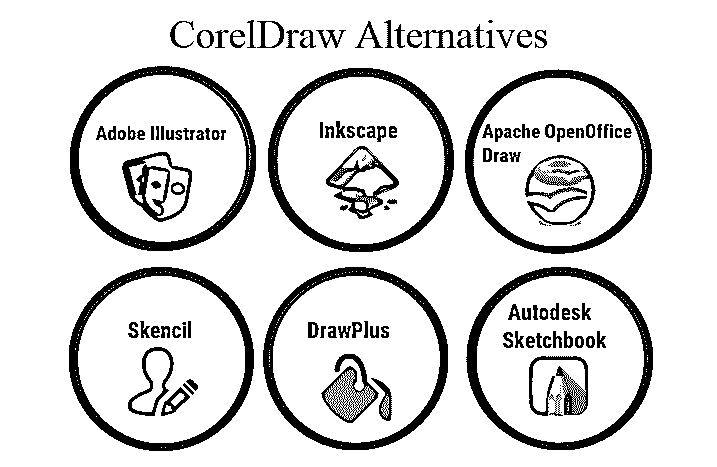
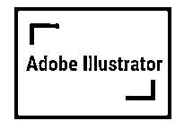
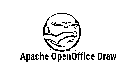
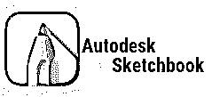

# CorelDraw 替代品

> 原文：<https://www.educba.com/coreldraw-alternatives/>

## CorelDraw 替代品简介

CorelDraw 是 Corel 公司开发的最著名和最流行的矢量软件之一。该程序与 Windows 和 Mac OS 操作系统兼容。CorelDraw 是图形设计师和艺术家中要求非常高的软件[。它基本上是一个二维软件，用于创建各种 2d 艺术品，如海报、徽标、名片和许多其他东西。](https://www.educba.com/graphic-design-interview-questions/)

CorelDraw 的最新版本于 2019 年 3 月发布，这是该程序的 2019 年版本。CorelDraw 有许多工具和特性，使它成为用户使用的高效而简单的程序。程序的界面也非常友好，工具简单易懂。

<small>网页开发、编程语言、软件测试&其他</small>

网上也有很多教程，教授不同的 CorelDraw 课程。作为一个向量程序。CorelDraw 还可以同时编辑和创建图像。这个程序是独立于分辨率的，因此对设计者来说是图形设计的更好选择。CorelDraw 有一种独特的设计方式和一个直观的工具集，可以提供惊人的速度和性能。CorelDraw Graphic Creative Suite 的最新版本可以从网站上以 399 美元的价格购买。

### CorelDraw 的替代品

虽然市场上有很多 CorelDraw 的替代品，但 CorelDraw 是一种可以被任何其他软件取代的同类程序。CorelDraw 的一些替代品是-

#### 1.Adobe Illustrator 中

该软件是 Adobe systems 和 Adobe CC 版本的一部分。与早期版本相比，最新版本的 Illustrator 速度更快，效率更高。Illustrator CC 的一些最新功能包括 CSS 提取工具、免费转换选项、文件打包、访问 Adobe Stock 资产、捕捉像素功能、智能参考线、颜色同步以及许多其他功能。该程序可从 Adobe 网站以每月 36.89 欧元的价格购买。

#### 2.Inkscape

这个软件是一个开源的矢量编辑器。它是初学者非常常用的工具，拥有图形编辑器的许多功能。该程序是一个高级软件，同时也可以执行高级功能。它可以读取克隆、标记和其他混合选项。用户界面也非常人性化。该计划可以创建 2D 标志，地图，海报，图形，等等。因为它是一个[开源程序](https://www.educba.com/what-is-open-source/)，任何人都可以下载并免费使用它。这个程序对很多初学者和新生都很有帮助。

#### 3.Apache OpenOffice Draw

这是另一个开源的图形编辑器，专业人士和业余爱好者都可以使用。这个程序允许用户创建复杂的草图并同时渲染它们。它有一个独特的功能，用户可以停放所有经常使用的工具，并在需要时使用它们。该程序甚至可以导入所有格式的图像，如 PNG、GIF、BMP、TIFF 和 JPEG。该计划的一些最重要的功能是先进的渲染，三维控制器，尺寸线和颜色和文本样式。

#### 4.DrawPlus

这个程序是开发人员的杰出成果，它主要用于其令人惊叹的画笔和钢笔工具效果。这些工具可以创建逼真的效果，并具有许多用于编辑和样式化文本和图像的详细功能。它还有一个路径上的文本选项，有助于根据路径创建文本，然后相应地设置它的样式。这个软件最重要的部分是它可以在网上免费获得。

#### 5\. Skencil

该软件主要用于其插图和素描工具，它在一个广泛的范围。程序中提供了一组详细的工具集，帮助用户轻松简单地设计和创建他们想要的任何东西。这个程序最著名的工具是渐变填充，混合选项，贝塞尔曲线，它也可以执行 EPS 功能。该软件与 Mac OS、Linux、FreeBSD 和 Windows 兼容。这个程序也是免费的，对平面设计师非常有用。

#### 6.Autodesk Sketchbook

该程序是 Autodesk 公司的一部分，可用作 CorelDraw 的替代方案。这个程序的界面简单、整洁、直观。有了这个，用户就喜欢在这个程序上工作。这个程序最重要的特点就是它是 PSD (Photoshop)兼容软件。它还会在导入或导出 PSD 文件时保留它们的层和组。其他兼容的文件格式有 TIFF、PNG、JPEG 和 BMP。这个程序的一些最重要的工具是椭圆指南，色彩库，相机扫描，进口艺术线条。该计划对学生和教育目的是免费的，并可作为一个单一的订阅跨所有平台。

尽管我们列出了 CorelDraw 的替代产品，但 CorelDraw 的质量和效率仍然值得称赞，毫无疑问，它是任何其他技术都无法替代的。由于 CorelDraw 是一个相当昂贵的程序，用户可以选择上述开源程序作为替代和学习图形编辑工具的媒介。

### 推荐文章

这是 CorelDraw 替代品的指南。在这里，我们将讨论 CorelDraw 替代品的概念和列表，这些替代品被许多组织广泛使用。你也可以浏览我们推荐的其他文章来了解更多信息-

1.  [什么是 CorelDraw？](https://www.educba.com/what-is-coreldraw/)
2.  [CorelDRAW 版本](https://www.educba.com/coreldraw-versions/)
3.  [CorelDRAW 标志设计](https://www.educba.com/coreldraw-logo-design/)
4.  [安装 CorelDraw](https://www.educba.com/install-coreldraw/)

