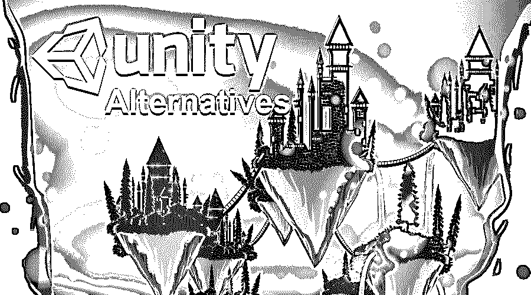

# Unity 备选方案

> 原文：<https://www.educba.com/unity-alternatives/>

## Unity 备选方案介绍

这是我们将要看到的关于 Unity 替代方案的文章，在继续之前，我们将了解什么是 Unity Unity 是一个流行的跨平台游戏引擎。它被游戏艺术家和开发者广泛使用。最初，该程序只在苹果的 Mac OS 上发布。目前，该程序在全球超过 25 个平台上使用。Unity 是一款游戏引擎，可以帮助用户在[2D 和 3D](https://www.educba.com/2d-and-3d-shapes/) 中进行娱乐，并提供 C#的脚本 API。

Unity 是由 Unity Technologies 创造的一款跨舞台游戏马达。学习 Unity 可以让我们了解两个世界中最好的——2D 和 3D 游戏改进，它开辟了我们进入游戏世界的途径。它帮助用户创建 2d 材质和精灵以及 3d 对象和粒子。这是一个很好的例子，融合了两种环境，创造了惊人的游戏和视觉效果。

<small>网页开发、编程语言、软件测试&其他</small>

Unity 兼容并可在 Windows、Linux、Mac OS 和其他平台上运行。该程序基于组件思想。该计划包括预置，这有助于用户和游戏开发者在很大程度上，他们可以很容易地创建对象和游戏更有效率和准确性。在这个项目中，用户可以得到一个巨大的物资库，用来制作游戏和物品。这个库对游戏开发者来说非常有用，因为他们可以节省很多时间，同时还可以学到很多其他东西。

### 统一的选择

统一的一些替代方案是

#### 1.虚幻引擎 4

这个程序是 Unity 游戏引擎的完美替代品。虽然这个程序是基于可视化脚本的，而且[支持 C++语言](https://www.educba.com/what-is-c-plus-plus/)，但是它在游戏开发者中被广泛使用。开发者可以使用这个程序完全访问游戏引擎和脚本部分。C++编码系统允许即时修改和更新。这个程序也有很多需求，因为它惊人而强大的着色器和超级特效功能。作为一个强大的程序，[虚幻引擎有时对初学者来说可能是一个困难的程序。初学者可能会发现这个程序在学习过程中有点混乱和缓慢。](https://www.educba.com/unreal-engine-tutorial/)

#### 2.应用游戏套件

它与 Windows、Linux 和 Mac 操作系统兼容。该程序可以在多台机器上运行和测试，其工作性能是值得称赞的。该软件支持 Windows 的各种插件，也可用于 C++语言的高级脚本编写。虽然，它是一个很好的游戏程序，但它不支持游戏机制，历史和事件。此外，代码编辑过程相当复杂和混乱。这是一个基本的 3D 程序，功能和效果有限。

#### 3.构造 2

这个程序基于 [JavaScript 语言](https://www.educba.com/what-is-javascript/)。它与 Windows 操作系统兼容。这个程序大多是初学者或非编码人员使用的。这个程序涉及很少的脚本，是基于拖放功能。用户只需要购买该程序一次，他将收到所有未来的更新。该软件有一个默认的内部动画编辑器，帮助用户创建简单的动画和对象，没有混乱。这个程序最大的缺点是它只支持视窗操作系统。

#### 4.JMonkeyEngine 3

这个应用程序完全可以在市场上免费获得，并且是一个开源应用程序。Mac OS、Windows 和 Linux 可用于此应用程序。该应用程序可以在 Java 上运行，并且被证明是一个很好的游戏开发平台。该应用程序更容易和更快地使用和创建游戏。该应用程序是一个仓库，并强制提供一个媒体，可以控制渲染，物理，电影和其他动画。该应用程序兼容并支持多种平台和设备。应用程序可以在 API 和发布周期方面进行改进。此外，这个项目对大一新生来说有点难。

#### 5.戈多

这个应用程序是免费的，对用户来说是开源的。该应用程序支持一个强大的 2d 引擎，可以执行许多 2d 效果，并用于制作 2d 游戏。这是一个多平台的应用程序，用户可以在桌面、智能手机和网络上开发游戏。该计划是便携式使用和使用不到 45 MB 的存储空间。用户可以通过向场景添加角色、材料和其他属性来容易地修改场景和项目。此外，该应用程序支持拖放功能，这不需要太多的编码知识。游戏开发和脚本编写是在一个叫做引擎编辑器的平台上完成的。该应用程序不需要任何额外的编辑器或插件。如果一个已经做过 Unity 游戏引擎的用户会使用这个程序，他会发现这个应用程序很有限，很难得到。此外，用这个应用程序重写数据是困难的。

### 结论

Unity 是一款功能强大的多任务软件，非常受开发者欢迎。如果用户没有发现 Unity 程序更容易，他们可以选择上面提到的替代方案。这些替代品或多或少类似于 Unity 游戏引擎，肯定会帮助游戏开发人员、编码人员、编程人员和游戏设计人员找到满足他们需求的替代品。

### 推荐文章

这是 Unity 替代方案的指南。在这里，我们讨论了 5 大 Unity 替代方案及其优缺点。您也可以阅读以下文章，了解更多信息——

1.  [胆大妄为的替代品](https://www.educba.com/audacity-alternatives/)
2.  [ZBrush 替代品](https://www.educba.com/zbrush-alternatives/)
3.  [AutoCAD 备选方案](https://www.educba.com/autocad-alternatives/)
4.  [Adobe Photoshop 替代品](https://www.educba.com/adobe-photoshop-alternatives/)

