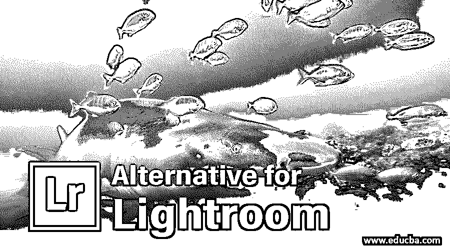

# Lightroom 的替代方案

> 原文：<https://www.educba.com/alternative-for-lightroom/>

## Adobe Lightroom 软件简介

以下文章概述了 Lightroom 的替代方案。Adobe Lightroom 软件是由 Adobe Systems 维护的软件之一，用于组织和处理数字媒体的图像。该软件与 Windows、Mac OS、iOS 和 Android 等不同的操作系统兼容。对于这款 Lightroom 软件，我们有不同类型的替代产品。我们将在文章中讨论该软件的一些替代方案。Lightroom 软件的替代品有 Luminar 软件、[微软 Windows 10](https://www.educba.com/windows-10-desktop-mode/) Photos 软件、苹果 Photos 软件、 [GIMP 软件](https://www.educba.com/gimp-alternatives/)、Paint.NET 软件等众多软件。

### Lightroom 软件的替代品

在这里，我们将为您提供 Lightroom 软件的替代软件，以增强您对[图像编辑软件](https://www.educba.com/best-photo-editors/)的了解，一旦您了解了这些软件，您就可以更轻松地建立自己的图像编辑技能。

<small>网页开发、编程语言、软件测试&其他</small>

#### 1.Luminar 软件

也是一款照片编辑软件，由 Skylum 软件于 2016 年 11 月开发。它兼容 Windows 和 Mac OS 操作软件，其最新版本是 Luminar 4，将于 2018 年 11 月发布。你可以从 Skylum 软件的官方网站找到这个软件，它的名字是[www.skylum.com](https://skylum.com/luminar)。

该软件可以以两种形式工作，即独立(独立意味着作为独立软件用于任何任务)或用作插件应用程序(插件意味着您可以在其他图形设计软件中使用该软件作为任何特定任务的支持软件)。你可以使用这个软件来过滤图像，也可以使用这个软件的图层和蒙版属性，通过这个软件提供的不同工具和许多其他东西来获得图像中的效果。

#### 2.苹果照片软件

下一个替代产品是苹果照片软件，这是苹果公司在 2014 年 9 月作为 iOS 8 应用程序的一部分开发的。你可以在 iOS 8 及其更高版本、iPad OS、OS X Yosemite 以及许多其他操作软件上运行这个软件。这款软件在苹果公司的官方网站上有售，名字是[www.apple.com/macos/photos](https://www.apple.com/macos/photos/)。它有许多令人兴奋的特性，这使得它对图形编辑非常有用。iCloud Photo Library 是该软件的主要功能之一，它为您提供了许多不同的预设计术语，使您在该软件中的工作变得简单，或者您也可以从该 iCloud photo library 中获得您的项目作品的想法。

#### 3.GIMP 软件

GIMP 是 Lightroom 软件的另一个有用的替代品，它有自己有趣的方面。让我们来看看这个软件及其功能。GIMP 是由“GIMP 开发小组”于 1996 年 2 月开发的，是一种开源软件，这意味着你可以在你的个人电脑上安装这种软件，而无需向其开发者支付任何费用。最初，它只是为 Linux 系统设计的，但后来它也兼容 Windows 和 Mac。该软件的最新版本于 2019 年 10 月发布，你可以在官方网站[www.gimp.org](https://www.gimp.org/)找到它。

GIMP 代表 GNU 图像处理程序，与 adobe Photoshop 软件非常相似，但是它不提供组织图像的功能。你必须在外部软件中组织图像，然后在这个软件中利用这个软件中可用的工具进行编辑。您还可以在其中操作图像，因为它是一个图像操作程序，由图像编辑器使用。

#### 4.微软 Windows 10 照片

现在让我们来看看 Windows 在我们这方面提供了什么。Windows Corporation 在 2012 年 10 月开发的 Adobe Lightroom 的替代品是微软 windows 10 Photos 软件。该软件的最新版本于 2019 年 9 月发布。该软件兼容所有版本的 Windows，如 Windows 8、Windows 8.1 和 Windows 10 等。

它用于图像编辑和操作，也允许一个窗口同时工作。这个软件的缺点是，它不支持 raw 文件。你有一个令人兴奋的功能，在这个软件是一个标志或标签你的形象。这意味着你可以在你的图像上做一个标记，这样你就可以随时从大量的图像中找到你的图像。

#### 5.Paint.NET

Paint.NET 软件也是一个开源程序，每个人都可以免费使用。它通常是为 Windows 操作软件设计的，与 Mac 或 Linux 操作软件不兼容。该光栅图形图像编辑器软件最初于 2004 年 5 月发布，并以 C#、C++、C++/CLI 计算机语言编写。你可以在许多不同的语言中找到这个软件；他们中的一些人是英国人、法国人、丹麦人、中国人、波兰人、葡萄牙人和许多其他人。这个软件可以在 www.getpaint.net 的官方网站上找到，你可以在你的个人电脑上使用它。

这个软件有一个老式的用户界面，为图像编辑器的初学者提供了简单的工具。你可以用这个软件来操作图像，但不能用来组织它们。这个软件更重要的一点是，它一次只能编辑一张图片，所以它不适合专业人士，他们一次只能编辑一张图片。

### 结论–Lightroom 的替代方案

这都是关于 Adobe Lightroom 软件的替代软件。读完这篇文章后，现在你对替代方案有了很好的了解，你可以很容易地理解它们。一旦你了解了这些选择，你就可以为你的项目工作选择其中最好的一个，并掌握它。

### 推荐文章

这是 Lightroom 的替代方案指南。在这里，我们讨论了市场上 lightroom 软件在图像编辑方面的 5 大替代产品。您也可以浏览我们的其他相关文章，了解更多信息——

1.  [暗台 vs 灯箱](https://www.educba.com/darktable-vs-lightroom/)
2.  [后效替代品](https://www.educba.com/after-effect-alternatives/)
3.  [亲和力 vs Lightroom](https://www.educba.com/affinity-vs-lightroom/)
4.  [Photoshop Elements vs Lightroom](https://www.educba.com/photoshop-elements-vs-lightroom/)

