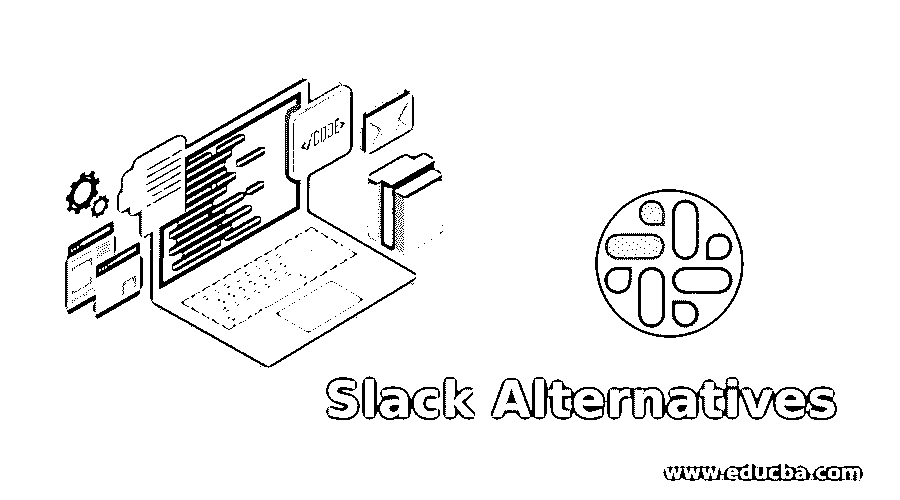
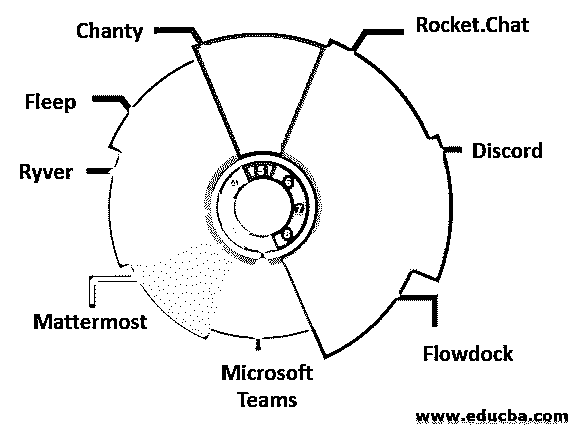

# 宽松的替代方案

> 原文：<https://www.educba.com/slack-alternatives/>

## 松弛替代方案介绍

在团队信使世界里，Slack 很受欢迎。Slack 在硅谷很受欢迎。Slack 还有其他几个功能，比如直接消息传递功能、文档共享、通知和提醒、群聊和搜索，这些功能让你的团队聊天变得漫长而曲折，超出了你所在组织的预期。为什么应该探索 Slack 选项的第二个解释是每个用户每月 8 美元的成本。特别是对于小型的、资源匮乏的团队和初创企业。不管原因是什么，团队都将从商业通信设备的海洋中受益。其他的是可选的，比 Slack 的简单程序有更多的选择。其中一些不限制你的信息。其中任何一个都可以放在你自己的网站上。

### 松弛时间的 8 个最佳选择

现在我们将看到松弛的替代方案如下。

<small>网页开发、编程语言、软件测试&其他</small>

#### 1.微软团队

如果您可以访问 Microsoft Office 365 计划，也可以使用 Microsoft Teams。或者，多达 300 名用户可以开始使用该工具的免费增值版。免费计划包括所有最基本的团队聊天功能:文本消息、音频和视频通话以及集成。就带宽而言，每个用户只有 2 GB，10 GB 由[团队](https://www.avepoint.com/blog/microsoft-teams/microsoft-teams-apps/)共享。付费版起价为每个用户每月 5 美元，提供额外的存储空间和功能，包括预定会议和会议录音。

#### 2.Mattermost

当您在寻找私有云、开源协作平台和高度定制的软件时，Mattermost 正是您想要的。虽然 messager 的目标是更多的企业，但 Mattermost 为较小的团队提供了一个免费版本，具有无限制的协作、集成和多语言支持历史。付费计划为个性化和增强的保护提供了无尽的选择，每个用户每年 39 美元起。请记住，您需要从至少 10 个用户那里购买 Mattermost。

#### 3.里弗

Ryver 是像 Trello 这样的团队的协作设备，具有集成的任务管理器。想象看板板上有开放论坛、私人小组和个人对话。然后给 400 个人配上声音和图像，再加上一个 Zapier 账户，你就有了 Ryver。这位团队领导正在考虑定价和为期 14 天的试用。12 个用户每月 49 美元起，无限用户 99 美元起。

#### 4.弗利普

与其他 Slack 选项不同，Fleep 是一个开放的网络，因此您可以在 Fleep 上与其他人连接。它弥合了收件箱和公司信使之间的差距。Fleep 将电子邮件与聊天系统相结合，如果你必须成为多个团队的一员，这将非常有帮助。Fleep 完全免费使用，并提供无限的消息历史和免费计划集成。但是，如果您管理您的团队帐户，您将每月获得 5 欧元的升级费用。

#### 5.船歌

Chanty 是一个安全、简单、直观的团队聊天工具，可以与中小型团队进行无限的、可搜索的消息历史记录。该平台具有典型的聊天功能，如公共、私人和一对一对话。当考虑在一个叫做 Teambook 的功能中安装 Chanty 时，它会将你所有的文件、链接、任务和消息组织到文件夹中。然而，Chanty 的彻底登船过程是你会喜欢的。

#### 6.火箭。闲谈

火箭。Chat 是一个免费的 Slack 替代品，是开源的，对于任何希望为自己提供聊天服务的人来说都是完全可定制的。除了聊天功能之外，它还有其他一些奇妙的功能。首先，迁移到 Rocket。聊天速度超快。导出您的松弛文件—就这样！此外，该设备提供自动实时语音信息翻译和端到端加密，有 50 多种语言版本。

#### 7.不调和

Discord 是免费的，也是团队中游戏玩家最常用的交流工具。该应用为用户提供了熟悉的 slack 式用户界面、Skype 式视频和语音聊天。在与 Dota 2 的战斗中，Discord 非常适合使用，但它也面临着其他公司的合作挑战。该方法将文本和语音分成多个通道。然而，用户可以在公共网络和私有网络之间无缝切换。Discord 不提供与您可能在工作中使用的应用程序的集成。这一点值得注意。因此，如果您的团队只需要文本、声音或照片，这种方法将是一个不错的选择。它也是该列表中唯一提供一键通功能和即时通话连接以共享聊天服务器的聊天工具。

#### 8.流动船坞

Flowdock 是一个团队聊天工具，可以在所有对话的主题之间顺畅导航，这些对话由彩色线标识。通过 appear.in 可以进行视频通话，并且有超过 100 种集成可用。这种第三方服务提醒会被放入所谓的“集成收件箱”中，以保持谈话的重点。

### 推荐文章

这是一个松弛替代品的指南。在这里我们也讨论了 slack 的介绍和前 8 名备选，包括微软团队，MatterMost 和 Ryver 等。您也可以看看以下文章，了解更多信息–

1.  再编订备选案文
2.  [JIRA 的替代方案](https://www.educba.com/jira-alternatives/)
3.  [Sharepoint 备选方案](https://www.educba.com/sharepoint-alternatives/)
4.  [SoapUI 替代品](https://www.educba.com/soapui-alternatives/)

