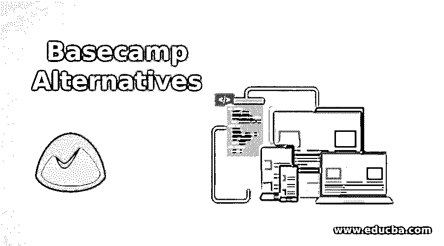

# 大本营备选方案

> 原文：<https://www.educba.com/basecamp-alternatives/>

## Basecamp 替代方案介绍

Basecamp 是项目管理的工具之一，它为客户提供简洁而集中的特性。随着用户数量的增加，Basecamp 在互联网用户中赢得了声誉和认可。当你独自工作时，必须协调你的工作或为一个小组、一项工作或一些个人的事情使用它，Basecamp 使它变得简单。设置很简单，如果您坚持使用它，应该会使与您的团队的交流更加容易。特别是互动的团队。与 Basecamp 内部的客户合作的机会是升级的额外好处。在本主题中，我们将了解 Basecamp 的替代方案。

### 大本营的替代品

现在，我们将看到以下各种替代方案

<small>网页开发、编程语言、软件测试&其他</small>

#### 1\. nTask

nTask 主要是为团队和在线任务管理平台而设计和创建的。简化的界面帮助每个人使用完整的模块和功能，从房屋建筑商到自由职业者，从团队到企业。对项目管理的各个阶段来说，这很好。此外，使用简单的导航和透明的功能来使用个人使用和生产力是很好的。nTask 是我们免费 Basecamp 的首选。

**nTask 的主要特性:**

*   可以同时管理和跟踪的团队工作空间。
*   一个时间表管理程序，帮助您创建和管理与团队相关的任务区域和员工薪资。

#### 2.打开**t1**

Avaza 是处理项目从最初报价到项目创建到细节管理的最高速公路之一。您可以通过使用 Avaza 的问题选项卡来保持与客户端的同步。因此，Avaza 可以向潜在买家发送并跟踪准确的评估，这些潜在买家随后可以很容易地转化为项目。您可以将工作分成易于管理的部分，如工作流程或时间表，并列出开始和结束日期。

**Avaza 的主要特性**

*   项目控制，包括项目预算和项目进度仪表板。
*   帐单和时间表条目
*   云会计

#### 3.发送任务

Sendtask 是任务管理的解决方案，也是团队协作的优秀方法。这是 Basecamp 最好的免费选项之一，提供团队、客户和供应商之间的交流。它可以确保您不必从不同的渠道在层次结构的多个级别上传递项目信息。该平台通过许多选项来促进任务管理，以便更好地组织活动、跟踪工作流、安排项目和任务，同时保持客户和利益相关者的协调。

**发送任务的特性**

*   项目协作。
*   协作团队
*   它有一个过滤器和搜索选项，使任务更容易。

#### 4.所有事情

Allthings 是我们最相关的免费大本营选择列表中的第四个资源。有看板瓷砖，其中拖放系统可用于继续稳定的工作流程。这个特性为团队监控任务和工作条件提供了极大的便利。所有这些使得任务和程序的划分成为可能，并提供了一个简单的 GUI。此外，作业可以以集群列表或列的形式呈现。

**万物的主要特征**

*   附件和评论
*   在线仪表板
*   拖放功能

#### 5.团队项目

团队合作项目是我们免费 Basecamp 选项列表中的下一个工具。它是一个构建在云中的平台，为用户提供高级任务管理功能。团队项目拥有 Basecamp 在任何方面都没有的所有项目管理功能。由于全面的集成选项，团队项目鼓励团队成员之间顺畅的工作流程和顺畅的沟通。

**团队项目的主要特点**

*   它提供了项目和甘特图的其他报告
*   任务筛选器
*   跟踪时间

#### 6.Zoho 项目

Zoho Projects 是我们在 Basecamp 的免费选择列表中的第六名。这是一个基于网络的项目管理软件，有助于管理任务。Zoho 提供了将复杂项目分解成更小、更易管理的任务的机会。该软件还通过允许您与整个团队交换反馈来鼓励通过开放 feed 进行协作。该平台还提供问题监控和任务管理工具，帮助项目经理迅速解决这些问题。

**Zoho 项目特点**

*   问题跟踪
*   文件管理
*   任务的依赖性

#### 7.佩莫

Paymo 是一个项目管理平台，帮助中小企业高效地开展项目和任务。该平台提供了几个与项目相关的功能，从个人任务管理、准备和日程安排到高级时间跟踪、通信和开发票。

**paymo 的特点**

*   内置任务模板。
*   客户开具发票。

#### 8.波迪奥

Podio 是这个系列中 Basecamp 的最佳免费替代品。帮助团队在项目上协作并有效实施项目的资源。项目管理和社交协作 Podio 将内容、通信和流程集成到一个平台中，以便用户可以透明地一起工作。

**Podio 的特点**

*   独立于工作空间
*   饲料活性

### 结论

在本文中，我们已经了解了什么是 Basecamp 工具及其各种替代工具。你可以根据自己的需要选择其中的任何一个。我希望这篇文章对你有所帮助。

### 推荐文章

这是一份营地选择指南。在这里，我们将详细讨论 Basecamp 的 8 大备选方案及其关键特性。您也可以阅读以下文章，了解更多信息——

1.  [新遗迹替代品](https://www.educba.com/new-relic-alternatives/)
2.  [分享替代方案](https://www.educba.com/shareit-alternatives/)
3.  [CamScanner 替代品](https://www.educba.com/camscanner-alternatives/)
4.  [Wrike 替代方案](https://www.educba.com/wrike-alternatives/)

