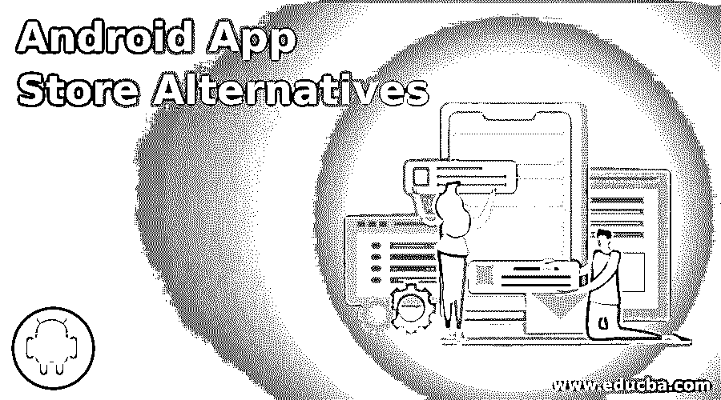

# Android 应用商店替代方案

> 原文：<https://www.educba.com/android-app-store-alternatives/>

## Android 应用商店替代品介绍

其中最受欢迎和广泛使用的 Android 应用商店，谷歌 Play 商店。这包括每月数百万台设备和数千次下载。有很多地方可以买到你的安卓版本，包括谷歌 Play 商店。Android 应用程序商店的另一个替代品将被发现。大多数应用商店提供一整天的免费下载，提供购买折扣或其他省钱的交易。使用特定的 Android 应用商店也很容易发现新的有用的功能。许多应用商店只专注于有限的类别。他们根据应用的年龄组、意图或价格来过滤应用。你可以在我们的 Android 应用商店列表中找到许多商店，它们可以通过将产品作为日常项目进行推广，或者通过向设备所有者提供一些省钱的促销交易来推广产品。

### 顶级 Android 应用商店替代品

以下是 9 大安卓应用商店选择:

<small>网页开发、编程语言、软件测试&其他</small>

#### 1.APKPure

APKPure 是一个来自第三方的应用商店，有几个好的方面。它包括一系列有吸引力的应用程序，如 WhatsApp、UC 浏览器、抖音、Facebook Messenger、PUBG Mobile 等。APKPure 比谷歌 Play 商店有更多的类别，这些类别也可以作为一个好的应用程序下载。任何类似 Gmail 的谷歌应用都能找到。

#### 2.APKUpdater

APKUpdater 真的不是一个应用商店，但它是一个干净的工具。您可以将当前程序升级到新程序，而无需使用另一个 app store。该软件的版本可以从许多其他网站下载，您可以尽快获得新的更新。您将使您的计算机保持最新状态，不会出现任何问题。

#### 3.Aptoide

它是这个系列中最古老的第三方应用商店之一。它包括许多应用程序，如 Twitter、Fleksy、YoWindow Environment、Nest 和最近的几款游戏。困难的软件，如显示框和成人游戏和应用程序可以在这里找到。这会引起不好的感觉，所以请确保当您访问该网站时，您的计算机上有反垄断应用程序。

#### 4.三星 GalaxyApps

在三星的 GalaxyApps 商店中，三星的应用程序数量比谷歌 Play 商店或亚马逊的 Appstore 有限，因此三星的设备也有限。然而，三星的 GalaxyApps 商店拥有清晰的用户界面，简单的导航，包括几个流行的应用程序，堡垒之夜，微软，包括 Hulu，Brawl Stars，网飞等。三星手机还具有一个替代应用商店，该商店已经在设备上和 Google Play 上启用。

#### 5.舔我

Yalp 商店使用谷歌 Play 商店的 APKs 脚本。这是一个特殊的应用程序商店，没有谷歌 Play 商店你也可以从那里获得应用程序。您可以直接从源代码扫描、安装和升级应用程序。它的用户界面非常特别，但工作起来非常完美。它还为根用户提供了额外的功能。你不需要下载或安装谷歌账户。

#### 6.手机 9

Mobile9 应用商店就像一个社交网络，有数百万人在不断使用它。消费者将评论他们的应用程序并与他们分享。在 Mobile9 上，你可以发布一款免费的 Android 应用。由于用户面广，开发完善的应用效果极佳。这个应用商店的最大价值是巨大的软件下载率。

#### 7.f-机器人

F-Droid 是一个开源网站，上面也有开源应用。F-Droid 是最古老、最可信的应用商店之一。这个应用商店主要维护生产力特性，例如软件浏览器 Arch Linux。它还包括一些核心应用程序，如简单日历、简单图库和游戏。这个应用程序商店非常适合那些想要一些在应用程序商店里没有的特别的东西的人。

#### 8.亚马逊应用商店

亚马逊应用商店是 Play Store 最成功的应用商店之一。app store 包含一系列应用程序，包括一些著名的大牌应用程序。亚马逊 Appstore 的主要优势是 HTML5，移动应用可以发布在亚马逊 app store 上。这是一个不断增长的市场，拥有成千上万的应用程序和广泛的客户基础。亚马逊应用商店对所有开发者来说也非常容易操作。这包括各种亚马逊应用程序和单个亚马逊 Prime 视频。Amazon Prime Video 是一个安装没有任何问题的应用程序。这个应用商店提供的应用程序既有免费的，也有收费的。

#### 9\. QooApp

QooApp 是一种特殊的应用商店。这个应用商店是希望亚洲开发者玩亚运会的用户使用的。你可以在这里找到各种各样的软件，但是只有那些被翻译成英语的。

### 推荐文章

这是一个 Android 应用商店替代品的指南。在这里，我们讨论了 android 应用商店替代方案的介绍以及 9 大应用商店替代方案。你可以根据自己的需要选择任何一种。您也可以看看以下文章，了解更多信息–

1.  [安卓架构](https://www.educba.com/android-architecture/)
2.  [安卓是什么？](https://www.educba.com/what-is-android/)
3.  [安卓操作系统](https://www.educba.com/android-operating-system/)
4.  [安卓替代品](https://www.educba.com/android-alternatives/)

