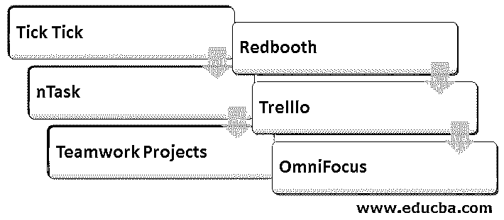

# todolist 替代方案

> 原文：<https://www.educba.com/todoist-alternative/>

## todolist 备选方案介绍

Todoist 是数百万人的最佳待办事项列表应用程序之一，是数百种生产力应用程序和任务管理工具之一。通常在网上搜索是找到最好的方法。这在某些地方可能有点难以处理。世界上最重要的领域之一，但一般来说，包括 Todoist:在作业管理中，时间监控是关键。它让您对当前任务监控期间的输入有了一个大致的了解。不幸的是，这一重要特征没有受到 Todoist 的保护。为了让 2020 更加成功，我们收集了您目前可以关注的资源。

### Todoist 的 6 大备选方案

以下是 Todoist 的不同替代方案:

<small>网页开发、编程语言、软件测试&其他</small>

#### 1.滴答滴答

TickTick 是 Softpedia、LifeHacker、App Times 等网站推荐的。这是一个最好的选择，通过有效的任务管理选项让你的游戏保持正轨。Siri 的智能任务构成让它与众不同。此外，它可以帮助您在任何时候用某个键盘键来建立一个任务。这可以节省您手动转到特定任务模块的时间。然后你应该毫不犹豫地拾起你的想法。它可以从许多网站下载，因此可以从任何地方访问。此外，您的数据是安全的，并且符合数据复制和备份选项。

**滴答滴答的关键特征:**

*   每日日程提醒，包括位置提醒。
*   数据的同步和备份。
*   Android 和 ios 移动应用程序

#### 2\. nTask

nTask 是可以给某些服务带来资金冲刺的资源之一。与其他设备相比，它包括几个不仅仅是做事情的功能。简而言之，它是时间表管理评估威胁和问题的一体化平台。每个模块都有评论和附件的形式以及高效的团队沟通渠道。工作环境非常简单，从一个仪表板就可以访问任何内容。NTask 将成为你的免费生产力助手，它有一个安全且非常便宜的付费计划，并在最佳戒酒选择列表中排名第二。

**nTask 的主要特性:**

*   项目管理包括用于项目进度管理和跟踪的甘特图、项目更新和项目时间表。
*   时间表的管理模块，用于创建和处理员工工作和工资的团队特定部分。
*   用于定义和列出问题的问题管理模块。
*   对项目任务的灵活注释，以及将注释翻译成松弛任务。

#### 3.团队项目

Teamwork Ventures 是我们的第三大 todoist 解决方案。它包括多种功能，帮助您在一个屋檐下协调和维护您的工作流程。与同事一起工作的工具，如团队办公桌和团队聊天可以纳入。这个工具就像一股清风，提供了一个易于使用的看板界面和许多定制工作流程的选项。为了让您的工作区更有趣，请从丰富多彩的模板和主题中选择一个。现在检查一下我们所说的免费计划是什么意思。

**团队项目的主要特点:**

*   广泛的项目管理功能包括项目图表、报告、所有权转移、里程碑报告和完成成本跟踪。
*   概念和预算的控制。
*   它还具有强大的搜索功能。

#### 4.雷德布斯

如果你是看板迷，并且有一个美丽的东西，看看 Redbooth。这个辉煌而优雅的软件包含了许多实用而强大的应用程序。这种 todoist 替代方案为工作、项目管理，甚至团队管理提供了一种可负担得起的价格方案选择。直观地跟踪甘特图和报告及其进度。通过屏幕共享和视频会议，您还可以更有效地组织远程团队并与之互动。本质上，你不会后悔对雷德布斯的投资。

**red booth 的主要特点:**

*   数据效率项目的现状和进展。
*   分享讲座屏幕。
*   数据效率项目的现状和进展。

#### 5.特雷罗

Trello 当然是 Todoist 的强有力的替代者之一，因为大多数项目经理首先决定何时涉及任务管理。Trello 通过一个非常智能和易于理解的用户界面，确保它不会用一系列复杂的功能使用户名过载。看板用于项目监督。卡在电路板上的自由移动有助于您识别过程和出现的瓶颈。例如，应该在工作清单上设置 WIP 上限，并明确定义可以添加到清单中的项目数量。它还对容量规划做出了重大贡献。

**Trello 的主要特性:**

*   WIP 限制，用于限制任务列表的工作量。
*   数百次工作流优化加电。
*   任务管理，包括分配角色、分数和截止日期。

#### 6.全聚焦

这是 iOS 或 Mac 用户的最佳 todoist 选择！OmniFocus 的核心是一个新的应用程序，它让你可以智能地处理你的待办事项，而无需改变应用程序或选择任何复杂的补充。你可以根据自己的意愿有效地构建、处理和委派任务。创建 Siri 的行为并添加标签以添加上下文。为了提供更多的细节，可以在你的表演中添加更多的注释。您可以选择定期执行行为，而无需重新建立它们。

**OmniFocus 的主要特性:**

*   重复步骤以定期执行任务。
*   基于位置的通知和警告。
*   每种选择都有轻便和深色。

### 推荐文章

这是一个 Todoist 替代指南。在这里，我们讨论了 Todoist 的关键特性和 6 大备选方案，如 Tick Tick、nTask、团队合作项目等。您也可以浏览我们推荐的其他文章，了解更多信息——

1.  [SOA 替代方案](https://www.educba.com/soa-alternatives/)
2.  [分享替代方案](https://www.educba.com/shareit-alternatives/)
3.  [JMeter 备选方案](https://www.educba.com/jmeter-alternatives/)
4.  [体式选择](https://www.educba.com/asana-alternatives/)

