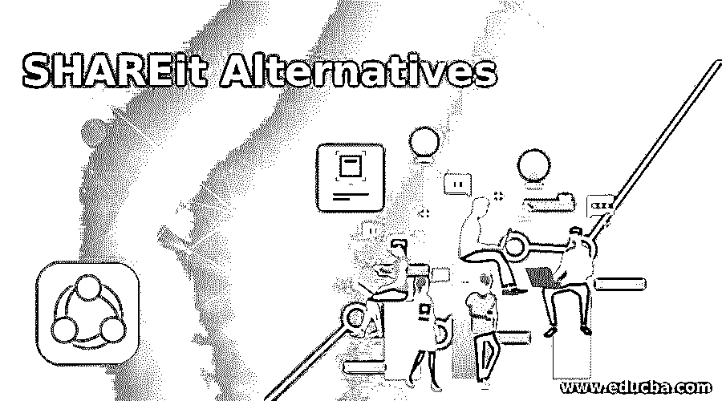
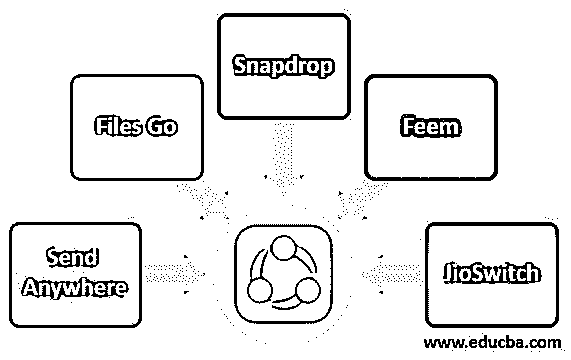

# 共享替代方案

> 原文：<https://www.educba.com/shareit-alternatives/>

## SHAREit 替代方案简介

SHAREit 用于传输照片、视频、应用程序等文件。但随着相应的应用程序更新和谷歌加强安全统治每一个新版本的 Android，体验并不像以前那样顺利。除此之外，该应用程序现在不断地在通知面板中放置非常烦人的广告，甚至是侵扰性的广告。所以，如果你正在寻找干净的替代品在 Android 上分享，这是有意义的。下面是 SHAREit 的绝佳替代应用列表，如下所示。

### SHAREit 的五大备选方案

shareit 的替代方案如下:

<small>网页开发、编程语言、软件测试&其他</small>

#### 1.发送到任何地方

Send Anywhere 是 SHAREit 最广泛使用和最有效的替代方案之一。Send Anywhere 是一个文件共享应用程序，它使共享变得简单、快速和无限制。它还通过允许云共享和存储服务来存储文件。从任何设备向世界上的任何人快速发送高质量的内容。Send Anywhere 从其他文件传输应用程序中脱颖而出，因为它能够发送原始文件大小，而不会破坏文件的质量。与 SHAREit 不同，它还允许将文件快速发送到世界上的任何地方。

该应用程序包括一个 6 位数的安全密钥，用于发送和接收文件。在链接的帮助下，通过“发送到任何地方”共享文件非常容易。当您想要与多人共享文件或无法实时共享文件时，您可以创建安全链接。出于安全目的，该安全链接仅在 48 小时内有效。但是你可以通过使用一个链接在过期时间内多次无限制下载文件。该应用程序还允许在 Send Anywhere 网站、Outlook 插件以及 Chrome 扩展的帮助下附加大文件。Send Anywhere 适用于 Android、Windows、macOS、iOS、Linux 和 web 等平台。

#### 2.文件走了

由 Google 开发的 Files Go 是一个很棒的文件管理器，设计用于在一次传输中共享和接收单个或多个文件。它提供离线、快速、无数据的文件共享。它有助于清除 Android 手机上的杂物。该应用程序可以自动拾取隐藏和丢弃的垃圾，如重复的文件，未使用的 APK 文件，不想要的音频文件，短信，如早上好或晚安祝愿等。，然后允许您一次性删除它们。

“文件转到”还显示设备上的可用空间量以及正在使用的空间量。它有一个文件选项卡。这个部分提供了一个文件管理器，其中有各种部分，如应用程序，视频，下载，图像，音频，收到的文件以及文件。通过搜索和浏览，它有助于更快地找到文件。它还提供文件的删除和管理。您也可以在从设备上删除文件之前，将文件备份到 Google Drive 或 Dropbox，这样可以节省设备上的空间。它只在 Android 上可用。

#### 3.快照

Snapdrop 也是 Shareit 的一个免费开源替代方案。它提供了一种简单快捷的跨设备共享数据的方式。文件大小没有限制，所以你可以方便快捷地发送任何你想要的东西。它不需要太多的配置，这使它更加可靠。因为这是一个网络应用程序，它需要一个互联网连接。它是可靠的，并为数据提供所需的安全性。所以，不应该有什么担心。作为一个在线文件共享平台，这是最好的 SHAREit 选择之一。它只能在网上找到。

#### 4.Feem

Feem 是一个流行的文件共享平台，提供完全统一的体验。它具有集成的聊天功能，因此您可以轻松地直接在设备之间发送链接和文本。Feem 使用 TLS(即传输层安全性)对整个本地传输进行加密，因此数据通过连接是安全的。它可以在 Android、Windows、macOS、iOS、Linux 以及 web 上使用。

#### 5.JioSwitch

JioSwitch 是一款免费且易于使用的文件传输应用程序。它支持 Android 和 iOS 之间的数据传输。对文件类型和文件大小没有限制。您可以发送任意大小的视频、照片和音乐。它使用起来很可靠，因为它不会像 shareit 那样显示广告。您也可以离线发送文件，因为它不需要互联网，所以您也可以在共享文件时保存数据包。

### 推荐文章

这是一个分享选择的指南。在这里，我们还讨论了 SHAREit 的简介和 5 大备选方案，并给出了解释。您也可以看看以下文章，了解更多信息–

1.  [AutoCAD 备选方案](https://www.educba.com/autocad-alternatives/)
2.  [大本营备选方案](https://www.educba.com/basecamp-alternatives/)
3.  [特雷罗替代方案](https://www.educba.com/trello-alternatives/)
4.  [松弛替代方案](https://www.educba.com/slack-alternatives/)

