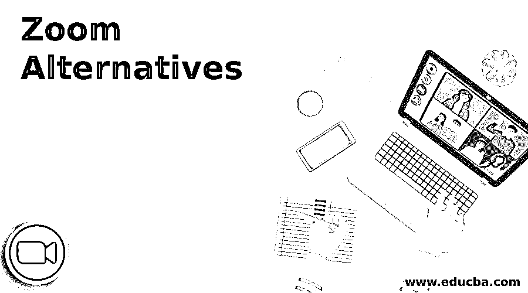

# 缩放选项

> 原文：<https://www.educba.com/zoom-alternatives/>

## 缩放备选方案介绍

最近的全球封锁导致视频会议应用程序的使用激增，Zoom 是使用最广泛的应用程序之一。但最近，Zoom 视频会议应用程序遭到黑客攻击，用户的敏感数据，即 Zoom 帐户凭据，如电子邮件地址，个人会议网址和密码，在暗网上出售。因此，使用缩放不再安全。

### 顶部缩放选项

如果你想使用一个更安全的视频会议应用程序，那么这里有一个顶级缩放替代方案的列表，它们提供了一个额外的安全层以及端到端加密。

<small>网页开发、编程语言、软件测试&其他</small>

#### 1.微软团队

微软团队是一个免费的商业和会议视频会议平台。它广泛应用于工作场所。微软团队中的 250 人同时进行视频电话会议。由于它是由微软开发的，它不会损害用户数据的安全性。Microsoft Teams 为 PowerPoint 演示文稿提供视频会议。这个会议可以安排在多达 10，000 人之间进行。它还集成了 Office 365。因此，您可以在 Microsoft Excel、Word 以及其他 MS Office 应用程序之间快速共享文档。微软团队支持多达 250 人同时进行视频电话会议。

#### 2.Skype Meet

Skype 是一款流行且广泛使用的视频聊天应用程序，也是过去十年的软件。其新的 Skype Meet Now 功能用于视频会议，这是 Zoom 的一个很好的替代方案。点击应用程序左侧的“立即开会”按钮，即可使用该功能。Skype Meet 最多支持 50 个人。新用户无需登录，只需一个链接即可加入会议。它最适合在线课堂，因为它有可靠的工具和易于使用的特性。它还可以记录长达 30 天的视频会议电话。如果你有这个应用程序，你还可以模糊背景和分享演示文稿。

#### 3.Google Meet

Google Meet 也是流行的、广泛使用的 Zoom 替代方案，用于安排网络研讨会和会议。Google Meet 以前只对教育工作者和付费 G-suite 用户开放，但在这些全球流行病中，Meet 从 5 月起也对免费 Gmail 服务用户开放。Google Meet 是与同事、家人和朋友进行视频聊天的最简单方式。在这种情况下，您可以安排多达 250 个参与者的视频通话，并共享演示文稿。您也可以记录这些会议，并将记录保存到驱动器中。它还能让你访问谷歌文档服务，如日历、表格、幻灯片等。每个拥有谷歌账户的人都可以参加会议，并命名他们的会议。会议链接也可以发送给公司以外的参与者。Google meet 允许我们在 Google Calendar 的帮助下安排会议。它有一个很大的特点就是通过允许和拒绝参与者的进入来保证会议的安全性。现在 Meet 和 Gmail 合并了，所以很容易从 Gmail 窗口的左栏进行视频通话。Google meet 还提供网格视图，如放大视图，您可以共享屏幕、文本聊天、共享图像、视频以及位置。

#### 4.WhatsApp

Whatsapp 是使用最广泛的社交消息应用程序，它具有视频通话功能，允许用户轻松连接。这就是为什么 WhatsApp 是家人和朋友中最好的 Zoom 替代品。Whatsapp 提供的群组视频通话是免费的，所以现在它是人们最可靠的选择。WhatsApp 为视频通话提供端到端加密，但它一次只允许四个人进行视频通话。

#### 5.视频通话的 Facebook Messenger

不用说，脸书是最受全世界人民欢迎和喜爱的人。因此，脸书也为其用户提供视频会议功能。你可以通过脸书账户使用 Facebook Messenger 进行视频通话，该账户还具有表情反应、游戏和贴纸等功能。在这个应用程序上，一次最多可以有六个人加入视频通话。

#### 6.谷歌二重奏

Google Duo 也是一个很好的平台，让你虚拟地认识你的家人、朋友和同事。Google Duo 支持音频通话和视频通话。它提供了视频语音邮件等附加选项。它还通过端到端加密来确保安全性。这两个人可以通过手机、平板电脑和笔记本电脑访问。

### 结论

在这篇文章中，我们看到了各种可靠且使用安全的会议和网络研讨会缩放替代方案。您可以根据自己的需求选择任何一种。

### 推荐文章

这是缩放替代方案的指南。在这里，我们详细讨论缩放替代方案及其六种不同类型的介绍。您也可以浏览我们的其他相关文章，了解更多信息——

1.  [AutoCAD 备选方案](https://www.educba.com/autocad-alternatives/)
2.  [文件浏览器备选](https://www.educba.com/file-explorer-alternative/)
3.  [松弛替代方案](https://www.educba.com/slack-alternatives/)
4.  [弹性搜索备选方案](https://www.educba.com/elasticsearch-alternatives/)

