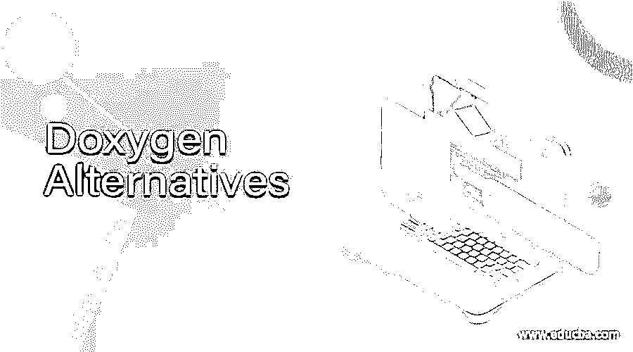

# Doxygen 替代品

> 原文：<https://www.educba.com/doxygen-alternatives/>

## Doxygen 替代品介绍

Doxygen 是用于从图解 C++源代码创建文档的软件，但也支持其他编程语言，如 C、C#、Objective-C、UNO/OpenOffice、PHP、Java、Corba 的 IDL、Python 和 Microsoft、VHDL、Fortran。从文档源文件的集合中，用户可以创建 HTML 在线文档浏览器和离线参考手册。它还提供压缩的 HTML、PostScript、超链接 PDF 和 Unix 页面来生成输出。文档是从源代码中显式派生出来的，这使得保持源代码与文档兼容变得更加简单。然而，这个收费标准存在一些缺陷。这是 Doxygen 的各种替代品列表。

### 强力霉素的替代品

让我们讨论一系列 Doxygen 替代品。

<small>网页开发、编程语言、软件测试&其他</small>

#### 1.狮身人面像

Sphinx 是一个开源的全文搜索服务器，为了效率、相关搜索质量和集成而简单构建。Sphinx 既制作批量索引又制作数据库搜索数据、SQL 数据库、NoSQL 存储等。

它提供的输出格式包括纯文本、带有 Windows HTML 帮助的 HTML、LaTeX、Texinfo、ePub、手册页等。Sphinx 允许对类、函数、术语表、引用和类似信息以及语义标记的自动链接进行大量的交叉引用。它还有一个层次结构，包含一个简单的文档树描述，可以自动连接到同级、父级和子级

它为模块的通用索引和特定于语言的索引提供了自动索引。Sphinx 具有代码处理功能，在 Pygments highlighter 的帮助下，它可以自动高亮显示

#### 2.MkDocs

这是静态网站生成器软件。用户可以获得扩展，如代码的自动测试。还包括来自 Python 模块的 docstrings 等。

用户可以在亚马逊 S3、GitHub 等网站上托管完整的静态 HTML 网站。有一堆看起来很棒的主题。内置的开发服务器允许用户预览，因为它已经写在文档上。每当用户保存更改时，它也会自动重新加载并刷新选项卡。MkDocs 是搜索引擎技术堆栈组中的一个工具。

#### 3\. Gitbook

这是一个标准的文档系统，团队可以在其中记录所有的产品、API 和内部知识库。这是一个让用户思考和追踪想法的平台。Gitbook 是 Documentation as a Service & Tools 部分技术栈中的一个工具。

#### 4.汇合

Confluence 是项目管理的技术堆栈类别中的一个工具。在 Confluence 中，很容易捕获电子邮件收件箱和共享网络驱动器中经常丢失的信息，因为它易于搜索、更新和使用。

#### 5.斯瓦格木卫一

Swagger io 是文档中作为技术堆栈的服务和工具部分的软件。它是一个开源工具。Swagger io 是一套独立的 Javascript、CSS 和 HTML 工具，来自一个兼容 Swagger 的 API，它可以动态地创建文档和沙箱。

#### 6.DocX

DocX 是 NuGet 包的 Tech Stack 组中的一个开源工具。DocX 是一个. NET 库，可以帮助开发人员轻松操作 Microsoft Word 文件。DocX 既快速又简单，不需要安装 Microsoft Word 或 Office。v1.5.0 中引入了 19 个错误修复和增强功能，并在 Xceed Software Inc 社区许可证下提供。

#### 7.阿皮根

它是从 PHP 源代码开发专业 API 文档的解决方案。ApiGen 提供了对 PHP 5.3 名称空间、包、文档链接、标准 PHP 类和一般文档的交叉引用、突出显示的源代码的开发以及对 PHP 5.4 特性的实验性支持的支持。

#### 8.沙堡

通过关注源程序集和可选地集成 XML 文档注释，Sandcastle 产生精确的、MSDN 风格的、详细的文档。Sandcastle 的主要特点是它可以在有或没有作者评论的情况下运行，并且它支持。NET 和泛型

#### 9.药典

Codex 是一个简单的基于文件的 Markdown 文档平台，是在 Laravel 之上开发的。为了构建漂亮的文档，它是完全可定制的，并且非常容易使用。它支持 Laravel 4.2-4。github 风格的 Markdown，代码高亮，它可以托管无限数量的指南以及支持它们的版本。它有其他功能，如搜索引擎优化友好的网址，简单的目录/导航系统，快速简单的搜索，主题提供了建立在引导，谷歌分析支持等。

#### 10.道克斯，我

Daux.io 是一个文档开发者，它使用标准的文件夹结构和 Markdown 文件在现场创建定制文档。以一种开发人员友好的方式，它帮助用户创建令人惊叹的文档。

### 结论

在本文中，我们已经看到了各种 Doxygen 替代方案及其特性。您可以根据自己的需求选择任何一种。我希望这篇文章对你有所帮助。

### 推荐文章

这是 Doxygen 替代品的指南。在这里，我们讨论了简介和各种 Doxygen 替代品及其特性。您也可以浏览我们推荐的其他文章，了解更多信息——

1.  [Neo4j 替代品](https://www.educba.com/neo4j-alternatives/)
2.  [Figma 备选方案](https://www.educba.com/figma-alternatives/)
3.  [缩放选项](https://www.educba.com/zoom-alternatives/)
4.  [页面任务选项](https://www.educba.com/pagerduty-alternatives/)

