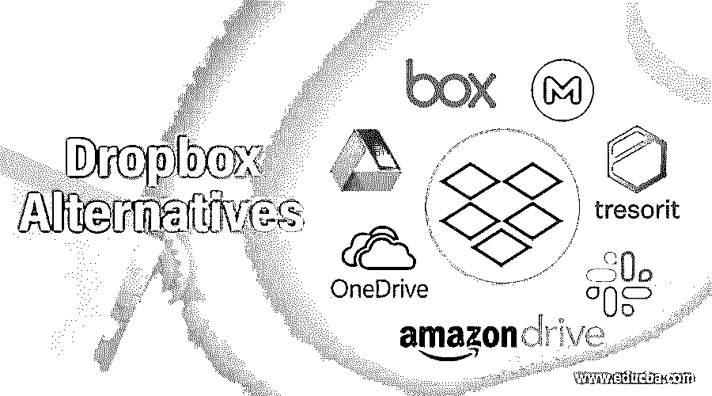

# Dropbox 替代品

> 原文：<https://www.educba.com/dropbox-alternatives/>

## DropBox 替代品介绍

如果你还没有使用过 Dropbox，文件存储可能是一个令人痛苦的问题。它可以让你在云驱动器上存储各种文件，并通过你的连接在任何其他地球计算机或智能手机上访问它们。Dropbox 是世界上最常见的云存储，但是用光了怎么办？此外，近年来，他们出现了一些错误，影响了 5000 万个帐户。你可以获得一个更具空间针对性的高级账户，或者直接使用 Dropbox 替代品。大多数网站提供几乎相同的，甚至更好的功能只有保护。

### Dropbox 的替代品

让我们来看看 dropbox 的替代品:

<small>网页开发、编程语言、软件测试&其他</small>

#### 1.Google Drive

Google Drive 是谷歌最知名的云存储服务之一。它提供 15 GB 的免费存储空间，付费存储空间可扩展至 30 TB。您可以使用 Google Drive dashboard 创建具有查看、编辑或评论文档权限的相互链接。而且 Google Drive 的免费存储区域是在 Gmail、云存储和 Google photos 之间分割的。

#### 2.一个驱动器

微软提供了 OneDrive 云存储，有 5 GB 的免费存储空间。你将免费获得 1 TB 的存储空间，包括如果你使用微软办公软件，微软办公软件计划。OneDrive 还提供多因素身份验证、内置安全要求、勒索软件保护和商业帐户恢复功能等功能。Office 365 计划都捆绑了高级安全功能，如个人储物柜、过期网络链接和勒索软件检测。该计划还包括所有灵活的方法—多页搜索、脱机目录和增强共享。

#### 3.多云天气

CloudUp 使发送者和接收者都能够以一种简单而美好的方式共享文件。您可以上传任何视频文件的链接和代码。您只需要提交一个连接就可以与其他用户共享文件。这是最大的免费在线存储和共享应用之一。但是，您不能同时将日程表升级到高级版本。你不能扩大你的日程。

#### 4.蜘蛛橡树

SpiderOak 不仅是 Dropbox 可靠的云存储选择，也是一个非常好的文件备份。SpiderOak 没有为你提供免费存储或其他云备份服务。它非常昂贵，因为 1 TB 的存储比 Dropbox 贵 30 美元。对于需要简单云存储和备份的人来说，这是一个很好的资源。它为精通技术的用户提供了流畅而简单的体验。

#### 5.箱子

云盒子存储主要面向企业和公司。它有 10 GB 的免费存储空间，比 Dropbox 多得多。有了 Box，公司可以使用强大而安全的协作工具来共享和管理所有内容。通过多级加密、冗余数据中心和 24/7/365 监视，Box 的基础设施得到了很好的保护。

#### 6.非常

Mega 是一个强大、稳定的 15 GB 免费云服务，当你注册时。对于你的用户来说，除了 2 GB 的 Dropbox 之外，这是巨大的。Mega 不是一个你可以用来和其他用户交流的工具，因为某些编辑功能并不存在。但是，与此同时，它是最容易获得的零知识云存储服务之一。

#### 7.特雷索里特

Tresorit 是一个基于云的瑞士存储服务，声称是安全的。近 1000 名黑客试图加密他们的文件，但失败了。你需要用 Dropbox 把你的文件转移到某个同步文件夹，但是云存储可能是你电脑上有 Tresorit 的文件夹。

#### 8.亚马逊大道

Amazon Drive 是 Dropbox 的竞争对手，但它不像存储设备那样受欢迎，但它没有同步功能。现在他们增加了 Mac 和 Windows 用户同步功能。为了使用旅行，你需要一个亚马逊帐户。5 GB 存储和公平计划每年 12 美元，1 TB 每年 60 美元。存储价格适用于 100 GB 存储。

#### 9.松弛的

Slack 是团队协作、交换和管理所有通信的公共平台。您可以与团队成员进行聊天、语音和视频通话。文件上传程序帮助团队在拖放文件上传程序中共享文档、共享照片、pdf、视频和其他内容。您可以免费使用 5 GB 的 Slack 空间，也可以为团队成员购买 10 GB 的定价方案

#### 10.皮迪奥

Pydio 是一个开源的文件同步和存储服务，或者说是文件管理系统。例如，它允许你在公共云服务中部署微软 Azure。

### 结论

在这篇文章中，我们看到了 DropBox 的各种替代方案。这些工具还提供云存储、个人云、文件同步等。您可以根据自己的需求选择任何一种。我们希望这篇文章对您有所帮助。

### 推荐文章

这是 Dropbox 替代品的指南。在这里，我们讨论了 DropBox 的 10 种不同选择，因此您可以根据自己的需求选择其中任何一种。您也可以看看以下文章，了解更多信息–

1.  [Dropbox 是什么？](https://www.educba.com/what-is-dropbox/)
2.  [分享替代方案](https://www.educba.com/shareit-alternatives/)
3.  [Wrike 替代方案](https://www.educba.com/wrike-alternatives/)
4.  [纳吉奥斯替代品](https://www.educba.com/nagios-alternatives/)

