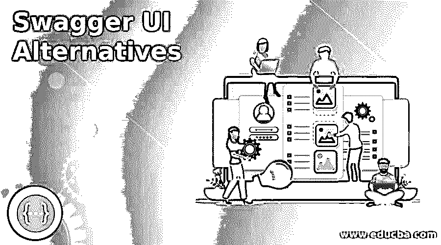

# Swagger UI 备选方案

> 原文：<https://www.educba.com/swagger-ui-alternatives/>

## **Swagger UI 简介**

下面的文章提供了 Swagger UI 替代方案的概要。Swagger UI 是一个免费的 web 文档项目，可以使用开放 API 规范可视化地制作。该平台帮助所有部门访问 API 工具并与之通信，并提供特定服务来支持后端部署和客户使用。这个程序的主要好处是 UI 可以在任何开发环境中独立运行。这个应用程序允许开发人员以一种人性化的方式直接与 API 进行交流，并尝试每个过程。Swagger UI 提供了一系列易于使用、完全可定制的高级功能，并支持所有浏览器。

### Swagger UI 备选列表

下面是 Swagger UI 的备选列表:

<small>网页开发、编程语言、软件测试&其他</small>

#### 1.养蜂场

Apigee 创建于 2004 年，旨在帮助开发人员和 API 供应商调试、测试、保护和收集 API 的分析数据。API 是用于 API 管理和预测分析的软件。它是 DreamFactory 的替代产品。通过一些新的补充，它提供了所有相关的服务。它是一个现代 API 网络，将数十亿平板电脑、智能手机和机顶盒用户连接到浏览环境之外的网络。在这种方法的支持下，开发人员可以轻松地创建和部署新的应用程序，将传统系统与现代应用程序连接起来，并使用 API 轻松地为消费者提供合作伙伴和第三方。

#### 2.梦工厂

DreamFactory 是获得业务级 REST APIs 的最便捷的方式，它可以让所有不同的数据源在一个地方正常可用。它是整个 API 生命周期管理行业的颠覆者。这种强大的方法包括安全的帐户管理、基于角色的访问控制、身份验证和所有 API 端点的活动目录。最好的一点是，您可以对来自服务器端任何 API 端点的请求或响应应用定制逻辑，或者使用 JS 或 PHP 节点轻松构建您自己的定制 API。

#### 3.多重云

Multcloud 是一个开放式解决方案，可以快速集成和集中管理 Dropbox、Google Docs、FTP、SkyDrive 等存储驱动器。如果正在进行服务器到云的传输或云同步，您可以快速关闭浏览器并离线执行云传输或云同步任务。你甚至可以关闭你的设备。

#### 4.驱动器

Drive 是一个云存储管理系统。它服务于网站的大部分托管设施，并吸收其他网络。使用 Drive 链接您的 YouTube 频道、SoundCloud、CloudApp、社交帐户、Droplr 等。但是您只能连接到提供商的一个帐户。对于您所有的在线存储帐户，Drive 提供了几个属性。

你可以在平台之间传输文件，上传，保存等等。Drive 是你的云录制软件。您是否使用了文件扫描、复制、删除、重命名以及将记录拖到需要的地方等所有功能？在你的 Chromebook 上，Drive 仍然可以在你的软件中随时使用，这很重要。Drive 为您提供了加快运行速度所需的所有工具。

#### 5.奥蒂索

Otixo 将提供各种评分服务，包括 Package、Picasa、Twitter、Yandex、Amazon、OneDrive、OwnCloud 等。当您链接服务后，您将能够执行所有必要的选项来处理您的帐户。该服务支持预可视化，复制，保存文件或删除文件/文件夹，交换文件建立新的文件夹，与其他用户等。您应该设置结束日期和密码来共享您的文件。如果您使用一个以上的分布式存储管理来管理您的记录，这可能是不稳定的。

#### 6.ZeroPC

ZeroPC 有一个惊人的功能，可以让你访问和浏览本地存储文件和文件夹。该服务提供了一个“云桌面”来添加相关的资源快捷方式。接下来，您可以打开任何快捷方式来显示和深入到您的文件内置到该帐户的活动。除了云存储网站之外，它还促进了网站和其他网站的文件和视频共享。Dropbox、OneDrive、Yandex、4shared、Evernote、Twitter 等。是一些受支持的平台。

#### 7.云引信

CloudFuze stage 还通过一个一致的网络，为免费、私有和半分级内容管理系统提供了可分发存储替代方案的进化世界。更重要的是，CloudFuze 提供了一系列安全的存储功能，允许对文档和档案进行分组和跟踪，而不太注意它们的位置。最后，CloudFuze 在各种小工具上的实用性巩固了其轻量级的弹性。

#### 8\. Dell Boomi

Dell Boomi 提供了一个组合阶段，可用于建立云到云的兼容性、合理混合和半速率包含。您可以通过可视化界面输入大量必要的连接段，并对其进行排序，以完成合并工作流程。获得许可的视觉时尚者使用点击设备来创建不需要学习编码的联盟。

#### 9.Back4App

Back4App 是一个单击式开源后端平台，它使用 Parse 系统自动化所有后端组件。它提供模块化技术，并允许开发人员轻松创建大型应用程序。该平台使用户能够以特定的方式配置和改进每个应用程序，使其成为当前最受欢迎的应用程序。

### 推荐文章

这是一个大摇大摆的用户界面替代品的指南。在这里，我们分别讨论 swagger UI 备选方案的介绍和列表。您也可以看看以下文章，了解更多信息–

1.  [强力霉素替代品](https://www.educba.com/doxygen-alternatives/)
2.  [SoapUI 替代品](https://www.educba.com/soapui-alternatives/)
3.  [页面任务选项](https://www.educba.com/pagerduty-alternatives/)
4.  [缩放选项](https://www.educba.com/zoom-alternatives/)

