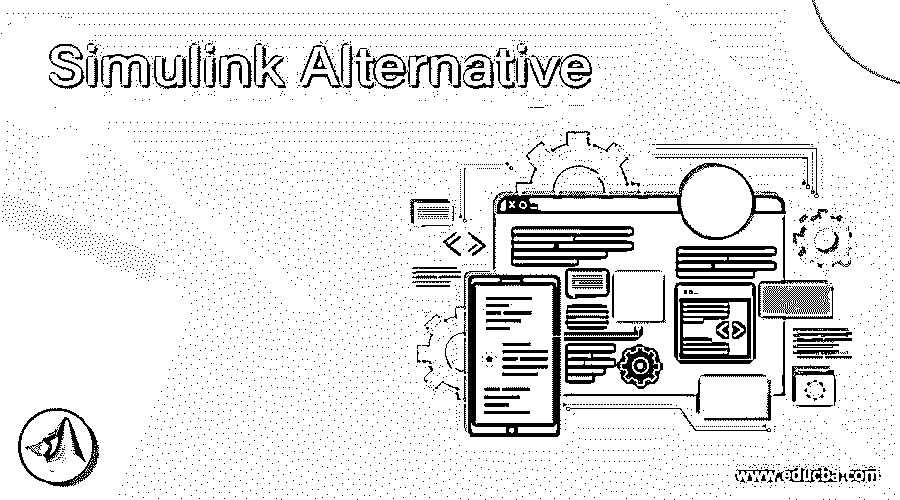

# Simulink 备选方案

> 原文：<https://www.educba.com/simulink-alternative/>

## Simulink 备选方案介绍

Simulink 是与 MATLAB 集成的动态嵌入式系统仿真和基于模型的设计环境。同样由 MathWorks 开发的 Simulink 是一个设计、模拟和分析多主导动态系统图形化编程流程的工具。它本质上是一种带有可定制库集的图表化图形块方法。它支持在仿真中使用 MATLAB 算法，并将仿真结果导出到 MATLAB 中进行进一步分析。Simulink 支持自动代码的设计、仿真和生成。在本主题中，我们将了解 Simulink 替代方案。

### Simulink 备选方案列表

以下是备选提及的列表

<small>网页开发、编程语言、软件测试&其他</small>

#### 1.创造者

Autodesk Inventor 是由 Autodesk 设计的软件，用于创建机械实体建模的三维数字原型。它用于 3D 机械设计、设计交流、工具开发和产品模拟。该软件允许用户创建详细的 3D 模型，以便在项目建造之前进行设计、展示和模拟。

#### 2.八度音阶

Octave 是可扩展的，主要是因为它使用了可以动态加载的模块。octave 中的脚本语言是由解释器完成的。其解释器具有 Open GL 图形，用于开发、保存和打印相同的绘图、图表和图形。除了标准的命令行界面，还包括图形用户界面。它是一种高级语言，主要用于数值计算。约翰·w·伊顿发展了它。它于 1980 年首次出版。教科书是用 C、C++和 Fortran 语言编写的。

#### 3.融合 360

Autodesk Fusion 360 是一个支持云的协作设计平台，具有上述所有功能。它包括从概念到制造的所有设备，不需要离开工具。Fusion 360 很重要，因为它可以在一个地方做所有事情，作为实用软件的工具。3D 设计可以被产生、协作、数据被控制、wcs 构建、通过模拟验证的设计等。它对环境有巨大的影响，是下一代的设计工具。

#### 4.Scilab

剪报是技术的媒介。有了它，你可以做很多事情。它可以数值计算，分析和跟踪，建模，虚拟结构，有图形用户界面等等。

从编程语言的角度来看，Scilab 是一种解释型语言。它包含许多已经被确认的功能，可以用来解决技术和科学问题。当我们看许可证的形式时，Scilab 是一个开源项目。用户可以下载、更改和编译源代码以满足需求。

#### 5.数学

Mathematica 程序也称为计算机代数程序，用于科学、工程、数学和计算的各个领域。这个应用程序是由史蒂夫·沃尔夫勒姆开发的，是在伊利诺伊州沃尔夫拉姆研究所开发的。Mathematica 中的钨语言是编程语言。即时动态和音频交互、高影响力自适应可视化、符号界面设计、按需管理的数据、图像和音频处理、神经网络打印、3D 打印、CUDA、DLL、Fortran、SQL。NET、C++、Java、OpenCL 和基于 http 的系统。给出了关于该样本的更多细节。

#### 6.流利的

Fluent 已经完全整合到 Ansys Workbench 中，这是一个高效且可扩展的工作流、CAD 关联以及实体几何建模和网格划分功能的论坛。内置的参数管理器允许轻松探索几种设计选择。更深入地了解各种力学，如流体和结构之间的关系，总是违反直觉的(FSI)。Ansys Fluent 与 Ansys Workbench 完全集成，可通过 Ansys Mechanical 和 Ansys Maxwell 提供完整的双向协作工作。

#### 7.西摩

一个自由可编程建模的区域，可以模拟自然和社会现象的复杂场景。西蒙·派珀特大学的学生 Uri Wilensky 开发了一个基于智能体的建模/仿真框架，该框架易于访问，适用于研究和教育。NetLogo 的图形性能使其甚至可以模拟小学生，其强大的编程语言使该框架对于正式的学术研究和开发非常有用。NetLogo 对新兴现象的视觉证明在许多层面和主题上成为机器思维的有力工具。

#### 8.ETAP

ETAP 代表瞬态电分析仪计划。它是电力系统建模、仿真和分析的重要方法。ETAP 是一个程序，提供了一个电气工程师接口，从源头到支付的电力系统建模。在建模之后，可以模拟不同类型的缺陷，并且可以分析被分析的器件。为了保证系统的整体完整性和稳定性，这些研究非常重要。

### 推荐文章

这是一个 Simulink 替代指南。这里我们讨论 Simulink 的各种替代方案。您可以根据自己的需求选择任何一种。我们希望这篇文章对您有所帮助。您也可以看看以下文章，了解更多信息–

1.  [XAMPP 另类](https://www.educba.com/xampp-alternative/)
2.  [缩放选项](https://www.educba.com/zoom-alternatives/)
3.  [基巴纳替代品](https://www.educba.com/kibana-alternatives/)
4.  [Zabbix 替代方案](https://www.educba.com/zabbix-alternative/)

