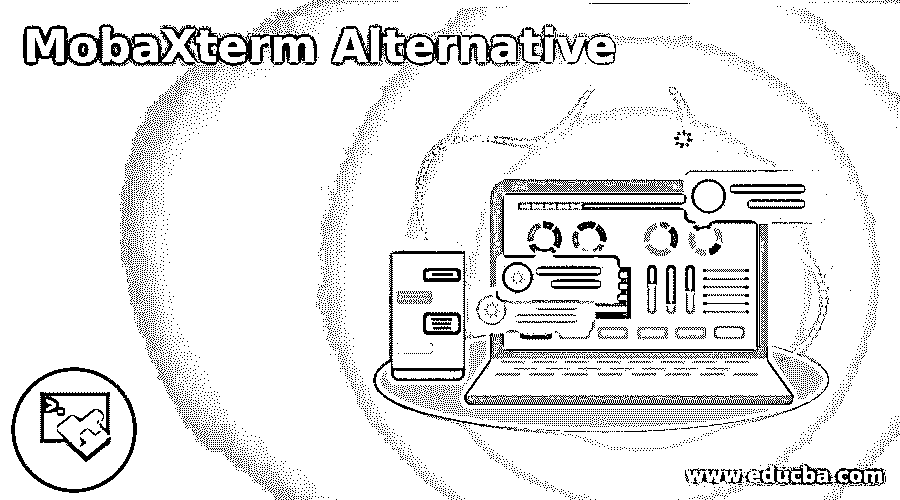

# MobaXterm 替代方案

> 原文：<https://www.educba.com/mobaxterm-alternative/>

## MobaXterm 简介

以下文章提供了 MobaXterm 替代方案的概要。Windows 终端软件 MobaXterm 以其远程访问能力和覆盖更广泛应用的大量功能而闻名。特别是，X11 服务器与所有主要的终端应用程序都打包在一起。在这方面，它也是可移植的，所以管理员可以方便地使用它，而不用把它放在任意的地方。移动功能可以找到类似的便携工具。

对于像这样的通信应用程序来说，您可以在不同的会话之间使用选项卡式界面功能来调整界面是至关重要的。虽然有一些适用于 Android 和 iPhone 的移动应用程序，但大多数工具都是专门用于桌面的。Windows 是一个得到更广泛支持的平台，尽管有几个工具支持 Mac。Linux 用户更喜欢通过他们的终端拥有更广泛的选择，尽管其中一些工具支持它们。

<small>网页开发、编程语言、软件测试&其他</small>

### MobaXterm 的顶级替代产品

以下是 MobaXterm 的主要替代方案:

#### 1.FileZilla

FileZilla 是一个 FTP 协议或客户端传输文件。它允许将单个文件或 bat 移动到 Web 服务器。多年来，FTP 一直是开发网站的模型。对于喜欢用 HTML 编码网站的人来说，FileZilla 仍然是一个有用的选择。这个软件是一个免费下载的开源项目。它可以在许多操作系统上运行，但是是专门为 Linux 设计的。

#### 2.无与伦比

Beyond comparison 是一个客户端支持的软件，允许进行高级文件、数据和文件夹比较，然后采取相应的行动。该软件由威斯康星州麦迪逊市的一家名为 Scooter Software，Inc .的小公司维护。该软件正在积极开发中，并于 2018 年 1 月推出。

#### 3.油灰

PuTTY 支持许多网络协议，如 SSH、SCP、SFTP、rlogin 和 Telnet，是一个免费的开源终端仿真器。它还支持连接原始套接字。最初是专门为 Windows 设计的，它为操作系统提供了类似于 Unix 类操作系统的终端仿真工具，但后来被移植到其他操作系统上。

#### 4.OpenSSH

OpenSSH 是 SSH 领先的远程登录连接方法。它加密所有流量，以消除窃听，劫持链接和其他攻击。OpenSSH 还提供了各种各样的受保护隧道功能、多重身份验证过程和高级设置解决方案。OpenSSH: OpenBSD 手册页。

#### 5.PowerShell

WCF 用于旧版本 Windows 的 PowerShell、DSC、WMI 和 WinRM 的最新版本可以在 Windows 管理系统中找到。PowerShell 模块的浏览器。检查 PowerShell 的模块和 cmdlets。Azure 云壳 PowerShell。PowerShell 现已在 Azure 云壳面向公众开放。

#### 6.mobaxterm(mobaxterm)

MobaXterm 是一个使用一系列网络资源的程序，这些资源在单个 exe 文件中进行了优化。在 X server 中，MobaXterm 结合了各种网络客户机，并提供了完整的 Unix 命令选择。MobaXterm 是一个理想的远程机器工具箱。网站管理员、IT 管理员、程序员和任何用户在远程任务中提供的功能都需要更加用户友好。MobaXterm 包括大 RDP、SSH、X11、VNC 和 MOSH 远程网络资源。Unix 命令也是完整的。

#### 7.WinSCP

WinSCP 是一个免费的开源 Windows Copy 软件，它使用户能够安全地在 Windows 计算机和远程计算机(如 Linux 服务器)之间传输文件。WinSCP 是 Windows 安全复制的简称。不仅支持 SCP，还支持 SSH、FTP SFTP 和 WebDAV。它还提供了几个图形界面，允许您在远程计算机上拖放文件以及复制、传输和删除文件。

#### 8.网络驱动器

WebDrive 是一款稳定的文件共享网络应用。该软件是由成立于 2001 年的南河科技公司的迈克尔·j·瑞安和约翰·c·格拉文开发的。Sirius XM、纽约城市大学、哈佛大学、杰克逊维尔医疗中心、海军情报局、佐治亚理工学院、Teleflora、罗格斯大学、威瑞森、Land O'Lakes、西悉尼大学、美国邮政服务等都是 Sirius XM 有影响力的客户。

#### 9.IFTTT

IFTTT 是一个出色的应用程序，它使您能够在不同的应用程序之间构建自动化链，以自动触发此类事件。这可以极大地增强做事的能力，因为启动一系列任务的单个初始任务可以执行多个任务。每个自动化系列都是一个 applet，在您的应用程序即服务之间执行特定的事件链。

#### 10.Dropbox

Dropbox 是一种常见的云存储解决方案，提供跨平台的平滑文件同步，以便团队成员和员工可以轻松地相互共享。它已经存在了很多年，并且已经建立了良好的、可信的声誉。

### 推荐文章

这是 MobaXterm 替代方案的指南。这里我们分别讨论 MobaXterm 的入门和顶级替代品。您也可以看看以下文章，了解更多信息–

1.  [Dropbox 替代品](https://www.educba.com/dropbox-alternatives/)
2.  [7-Zip 备选方案](https://www.educba.com/7-zip-alternatives/)
3.  [电报选择](https://www.educba.com/telegram-alternatives/)
4.  [Zendesk 替代方案](https://www.educba.com/zendesk-alternative/)

