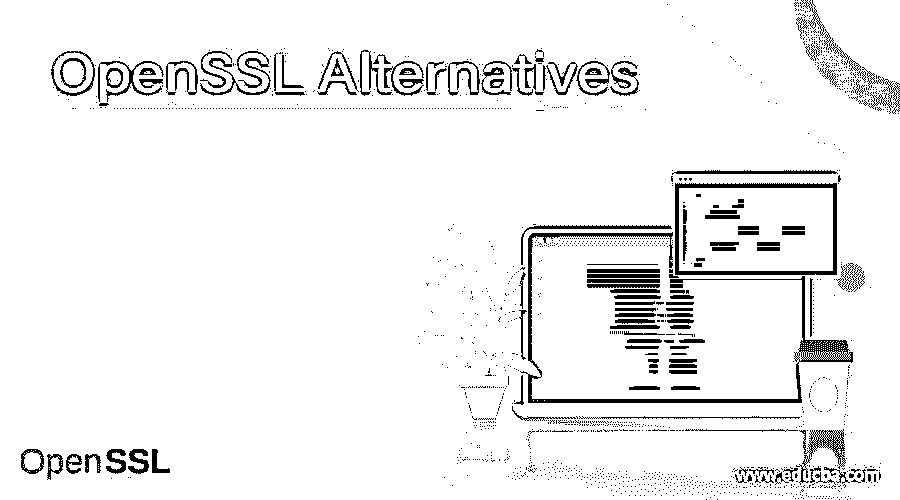

# OpenSSL 替代方案

> 原文：<https://www.educba.com/openssl-alternatives/>

## OpenSSL 替代方案介绍

OpenSSL 是一个开源的加密库，实现了安全套接字层(SSL)和传输层安全(TLS)协议，主要用于保护 web 浏览器-web 通信。本质上是阻止消费者被掉线举报。该库为生成 RSA 私有密钥和 CSR 以及管理证书和校验和提供了资源。OpenSSL 还为用 C 和汇编语言编写的各种其他编程语言提供包装设备。大多数操作系统都有库版本，包括 Microsoft Windows、Linux 以及许多 Unix 和类 Unix 版本。它的使用如此普遍，以至于今天大多数服务器都以这样或那样的形式在互联网上运行。

让我们看看 OpenSSL 的替代方案

<small>网页开发、编程语言、软件测试&其他</small>

#### 1.突岩

Toris 是一个服务器网络，旨在增强互联网的隐私和保护。该程序基本上作为一个安全的浏览器，通过一些编码的隧道连接到互联网。Tor 还允许网站由。黑暗网络上的洋葱被访问。

#### 2.Tor 浏览器

除了. onion 域网站之外，Tor 浏览器是一种允许用户访问常规网站的网络应用。默认浏览器无法访问这些网站。Tor 还提供安全层，使得跟踪用户的 IP 地址或位置几乎不可能。这个是免费下载的，各大操作系统都有版本。

#### 3.OpenVPN

OpenVPNis 是虚拟专用网络的应用程序，允许用户通过不同类型的虚拟网络进行通信。OpenVPN 桌面和移动应用程序对用户数据进行加密，以便通过指定的门户安全传输。这款应用在需要安全在线连接的工作、大学和家庭互联网用户中很受欢迎。OpenVPN 是一个开源的软件包，与新的 VPN 服务提供商兼容。

#### 4.热点屏蔽

Hotspot Shieldis 是全球领先的 VPN 供应商。对于所有预算，该组织都提供虚拟专用网络包。你也可以选择免费计划。使用公司的虚拟专用网络，用户可以提高他们在互联网上的安全性，虚拟专用网络可以支持那些必须逃离地理限制的旅行者。

#### 5.超表面

UltraSurfis 是一个免费的软件工具，允许计算机用户通过 HTTP 代理服务器避开政府防火墙和审查。它还使用加密来确保通信保护。Windows 和 Android 应用程序是可用的，实际上可以在微软浏览器上使用。但是也有 Chrome 和 Firefox 的插件。该程序也是可移植的，所以不需要安装更多的文件，也不需要修改注册表。因此，可以通过删除可执行文件来禁用该程序。

#### 6\. Socat

Socatis 是共享数据的系统工具。可以建立现有的链路，也可以建立两个系统之间的新通道。这在中继流量、快速传输数据或检查其他系统时非常有用。添加加密通道的另一种方法是在本地设备上使用它。

#### 7.证书透明度

为了提供机密性和完整性，HTTPS 连接使用加密功能。它可以包括域验证、端到端加密以及证书和最终用户之间的信任链等功能。任何故障都可能危及这些目标，如设备假冒、对中心人员的攻击和网站欺骗。该项目旨在识别漏洞并增强整体互联网保护。

#### 8.SSLsplit

SSLsplitis 是对 SSL/TLS 网络的加密连接进行中间攻击的一种方法。连接被透明地拦截，并通过网络地址转换引擎路由到 SSL split。SSLsplit 以 SSL/TLS 结束，并启动原始的 SSL/TLS 链接，同时记录所有传输的数据。对于网络治疗和渗透测试，SSLsplit 是有用的。

#### 9.工业废水

Indusface scanning web 应用程序有助于检测常规或按需全扫描 web 应用程序故障、恶意软件和逻辑缺陷。由合格的安全专家操作的 Indusface 对 web 应用程序的扫描，允许公司通过逻辑缺陷的详细证据找到更大的业务影响。

#### 10.Tlsenum

Tlsenumis 是一个 CLI 工具，它列出了服务器对 TLS 协议和 TLS 密码的支持。该工具根据优先级顺序列出生产。Tlsenum 可用于定位支持的协议和系统密码，并评估系统的正确加固。这些知识对于系统管理员和系统控制者执行安全检查是有用的。

### 结论

在本文中，我们看到了 OpenSSL 的各种替代方案。您可以根据自己的需求选择任何一种。我希望这篇文章对你有所帮助。

### 推荐文章

这是一个 OpenSSL 替代方案的指南。这里我们分别讨论 OpenSSL 的介绍和各种类型的替代方案。您也可以看看以下文章，了解更多信息–

1.  [谷歌地图替代品](https://www.educba.com/google-maps-alternatives/)
2.  [Dropbox 替代品](https://www.educba.com/dropbox-alternatives/)
3.  [鲁弗斯的替代品](https://www.educba.com/rufus-alternatives/)
4.  [安全替代方案](https://www.educba.com/securecrt-alternatives/)

