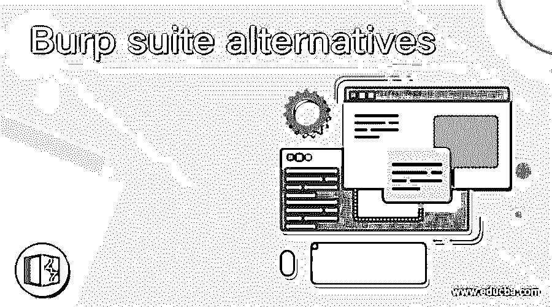

# 打嗝套件备选方案

> 原文：<https://www.educba.com/burp-suite-alternatives/>

## Burp 套件替代品介绍

Burp suite 是一套用于 web 应用程序渗透测试的工具。它是网络安全研究人员和漏洞猎人中最受欢迎的工具。它的易用性使它更适合用户。尽管如此，市场上还有其他替代品可以用来代替打嗝套件。在这篇文章中，我们要去打嗝套件的这些替代品。

### 打嗝套件备选方案列表

以下是打嗝套件备选方案列表

<small>网页开发、编程语言、软件测试&其他</small>

*   #### Nessus

Nessus 是打嗝套件的最佳替代选择。这是一个流行的漏洞扫描软件。它可以扫描多种技术，包括操作系统、数据库、网络设备、web 服务器、虚拟机管理程序和关键基础架构。扫描的输出可以是各种格式，比如纯文本、XML、Latex 和 HTML。Nessus 为网络漏洞提供了额外的功能。它使用 windows 凭据来检查运行 Windows 操作系统的计算机的修补程序级别。

*   #### network spark

另一个最好的选择是，它可以自动抓取和扫描所有类型的传统和现代网络应用程序，包括 HTML5，单页应用程序，密码保护的网络应用程序和 web 2.0。它会自动分配一个安全级别，以强调必须修复的潜在损害和紧迫性。Netsparker 提供了一个资产发现服务来扫描互联网，根据主要和次要域、IP 和安全证书来发现资产。它使用可扩展的扫描代理来报告主应用程序，并可以有效地使用多种 It 资源来减少扫描时间。

*   [T0】 Acunetix vulnerability scanner

Acunetix 漏洞扫描器是 burp suite 的另一个替代产品。它是一个自动化的 web 应用程序安全测试工具，旨在保护 web 应用层。它通过对网站发起一系列攻击来审计网络安全。之后，它会提供发现的任何漏洞的报告。它还提供了解决问题的方法(如果有的话)。Acunetix 漏洞扫描程序带来了两种测试方法，并提供了更准确和全面的扫描。它指示易受攻击的代码行，并报告其他调试信息。它以解决严重的安全漏洞而闻名

*   #### OpenVAS

它是一个开放的漏洞评估系统，是一个提供漏洞扫描和漏洞评估的服务和工具的软件框架。OpenVAS 协议的目的是帮助开发者。OpenVAS 的所有产品都是免费的，大多数组件都是在 GNU 通用公共许可证下授权的。它的插件是用 NASL (Nessus 攻击脚本语言)编写的。

*   [T0】 Qualys cloud platform

Qualys 云平台提供云安全合规。它提供端到端的解决方案，允许用户避免管理多个安全供应商带来的成本和复杂性。该平台在可扩展的先进后端中自动收集和分析 IT、安全性和合规性数据。用户可以通过浏览器直接访问 Qualys 云平台，不需要任何其他插件。借助强大的控制面板、安全性和专业优势，法规遵从性和管理人员可以从单一控制台界面获得其所有 IT 资产的完整视图。它的仪表板是完全可定制的，允许用户查看大图，深入细节，生成报告。

*   #### IBM Security Qradar

IBM Security Qradar 是一个企业安全信息和事件管理产品。它从企业、其主机、网络设备、操作系统、应用程序、漏洞以及用户的操作和行为中收集日志数据。然后，它对日志数据和网络流量执行实时分析，并确定恶意软件活动，以便可以立即阻止恶意软件活动，防止或最大限度地降低对组织造成损害的风险。此外，IBM security Qradar 提供了对威胁情报提要的支持。线程智能识别与恶意软件活动相关联的 IP 地址和 URL。

*   #### Salt pile

盐堆是打嗝组曲的另一个最佳选择。Its 是一个基于 python 的开源框架，用于 IT 自动化、配置管理和远程任务。Saltstack 支持许多模块类型来管理特定的操作。模块可以添加到任何支持动态模块的系统中。这些模块管理所有远程执行和状态管理行为。它被设计成高度模块化和易于扩展，以便于适应不同的 It 使用案例

### 结论

在这里，我们已经讨论了各种软件，可以用来作为一个打嗝套件的替代品。每一种都有自己的特点、优点和缺点。您可以根据自己的需求选择其中任何一个。希望这篇文章对你有所帮助。

### 推荐文章

这是一个指南打嗝套件的替代品。在这里，我们讨论介绍，打嗝套件的替代品列表。您也可以看看以下文章，了解更多信息–

1.  [谷歌地图替代品](https://www.educba.com/google-maps-alternatives/)
2.  [Dropbox 替代品](https://www.educba.com/dropbox-alternatives/)
3.  [鲁弗斯的替代品](https://www.educba.com/rufus-alternatives/)
4.  [安全替代方案](https://www.educba.com/securecrt-alternatives/)

