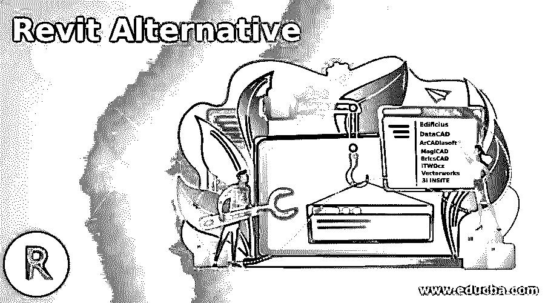

# Revit 备选方案

> 原文：<https://www.educba.com/revit-alternative/>

## Revit 简介

如果您花更多的时间研究 Revit 解决方案，您会发现替代产品在质量、可用功能和供应商可靠性方面的差异。因此，在你同意与卖家建立长期关系之前，你会有足够的证据做出合理的判断。也可以降低购买一个坏了或者不符合所有规范的 app 的风险。我们的评级门户网站提供了观看各种节目的资源，购买选择将受到我们的反馈和消费者意见的影响。

经过一段时间的综合评估后，我们的专家团队给 Revit 的累积评分为 9.5/10。真正的 Revit 消费者的总体购买满意度为 100%，这表明了他们对这种方法的看法。如果您花点时间分析其他 Revit 替代产品，您肯定会找到得分相当或可能更高的其他产品。

<small>网页开发、编程语言、软件测试&其他</small>

### Revit 的不同替代方案

下面给出了 revit 的不同备选方案:

#### 1.Edificius

Edificius 是一个最先进的 BIM 框架，拥有强大、便捷的设计资源。该计划根据现行法律和最新技术不断修订。Edificius 是领先的 BIM 设计软件，具有内部渲染引擎，可与其他功能无缝集成，如 3D 概念和成本估算。该应用程序提供软件，以及对庞大的 BIM 材料、3D 模型和纹理库的完全免费访问，用于优化景观和花园设计的外部空间。

在 Edificios 实时再现环境中，您可以立即看到您的概念元素是如何组合在一起的。您将节省时间，并且您不需要等待数小时来挑选商品和纠正潜在的错误。建筑的实时渲染确保了即使在与客户一起查看提案时，概念和验证过程也已开始。它还配备了光线跟踪引擎，推动更加现实。

#### 2.计算机辅助设计

DataCAD 是 AEC CADD 公司在技术层面上的工程、照片实现的建模、动画和建筑图纸开发软件。DataCAD 由建筑工程师和软件工程师创建，包含促进门、窗的设计和绘图的工具，自动 3D 框架，泰加语的 DXF/DWG 翻译器，关联设计和阴影，DCAL 是一种应用程序开发语言。根据最近美国建筑师协会(AIA)公司的研究，DataCAD 现在被列为建筑师第二大最常用的程序。对于 Windows 8、7 和 10，DataCAD 是打开的。

#### 3.ArCADiasoft

ArCADiasoft Inc .正在为机构客户设计和销售衍生品和抵押品保护策略。ArCADiasoft 建立了一个解决方案，通过倾听市场和客户的声音，整合不同的知识来源，以优化企业生产信息，并满足全球股东、债券持有人和监管机构日益增长的财务审查。

#### 4.魔法卡

MagiCAD 简化、加速和精确 BIM 版本的构建。MagiCAD 完全整合到 Autodesk 的 Revit 和 AutoCAD 系统中，并为 MEP 的每个专业提供了许多有效的角色模型。借助 MagiCAD，您可以设计领先 MEP 供应商的 BIM 项目，这些供应商拥有超过 1，000，000 种经过制造商测试的智能产品。相比较而言，MagiCAD 是各种地方规范和符号的明显的国际替代品。

#### 5.金砖四国

BricsCAD shape 是一款免费、易用的原生 3D 建模程序，专为 CAD 新用户设计，旨在帮助他们立即获得 3D 建模。它是为消费者准备的。如果您对大多数 CAD 程序提供的动态工作空间望而却步，那么这是 BricsCAD Shape 的一个完美起点。它给出了你喜欢的和你不喜欢的。它包含各种所需的仪器，例如 BricsCAD 和 BricsCAD BIM 中的 quickdraw、quad 和 component pieces。

#### 6.iTWOcx

iTWOcx 是一个云中的项目合作管理平台，它收集和管理生命周期中的所有项目数据。它支持作业管理、记录管理、流程管理、构建项目权限和可配置功能，以最大限度地提高执行性能。iTWO 和 iTWOcx 的合作使得在构建阶段无缝地分发和控制数据变得可行。

#### 7.矢量工程

Vectorworks，Inc .是一家建筑、技术、建筑(AEC)设计、景观和娱乐应用软件制作公司。它由 Richard Diehlin 于 1985 年以 Graphsoft 的名字创建。该公司的第一个软件版本被称为微型汽车。后来迪尔把名字改成了迪尔 Graphsoft。MiniCAD Plus 版可帮助建筑师模拟接近手绘工作的定制数据。在 20 世纪 90 年代末，这个包后来被称为 Vectorworks。

#### 8.3i INSITE

3i INSITE 是一个 3D 设施维护和设计信息工具。3i INSITE 是即时、方便地将您的工作场所数字化的最简单方法。为了促进现场评估、报告和维修活动，我们拉近了现场和场外利益相关者之间的距离。通过提供最直观和自然的方式来组织和设想知识，掌握和交流任务和概念，团队将能够为您的设施创建一个数字双胞胎。您的团队将通过 3i INSITE 直接在 3D 环境中工作，以避免不必要的过渡、转移和误解。

### 推荐文章

这是 Revit 替代方案的指南。为了更好地理解，我们在这里讨论 revit 的简介和不同的替代方案。您也可以看看以下文章，了解更多信息–

1.  [AutoCAD 中的偏移](https://www.educba.com/offset-in-autocad/)
2.  [AutoCAD 中的粗线](https://www.educba.com/thick-lines-in-autocad/)
3.  [AutoCAD 拉伸](https://www.educba.com/autocad-stretch/)
4.  [AutoCAD 中的极坐标阵列](https://www.educba.com/polar-array-in-autocad/)

