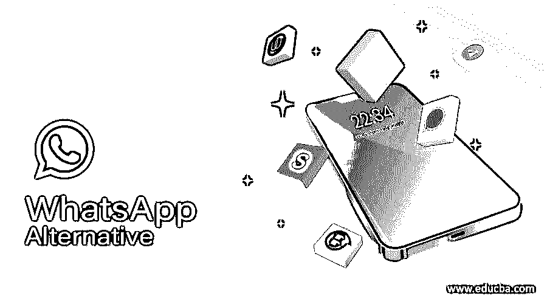

# WhatsApp 替代品

> 原文：<https://www.educba.com/whatsapp-alternative/>

## WhatsApp 替代品介绍

脸书旗下的 WhatsApp Messenger 是最受欢迎的即时通讯应用。为了确保它处于领先地位，该组织引入了新功能。然而，并非所有人都对 WhatsApp 感到满意。WhatsApp 最近更新了隐私政策，解释了它如何监管应用程序中的个人信息。该政策明确指出，该公司收集了大量用户数据和元数据。还有就是这年头大家都用 WhatsApp，太分散注意力了。在本主题中，我们将了解 WhatsApp 替代方案。

### WhatsApp 备选列表

所以，如果你想换一个更安全的消息应用，这里有一个 WhatsApp 的最佳替代品列表。

<small>网页开发、编程语言、软件测试&其他</small>

#### 1.电报信使

Telegram Messenger 被誉为 WhatsApp 的最佳替代品之一。它是免费和开源的。Telegram 群组对话最多可有 200 名参与者，100，000 名参与者可加入频道和公共论坛的超级群组。

1.  有语音和视频通话功能
2.  它提供端到端加密。
3.  用户可以共享高达 1.5GB 的文件和媒体
4.  它有一个聊天机器人功能，非常可靠和用户友好。
5.  它提供内置贴纸
6.  它还提供密码验证。用户可以将状态更新为简历。用户可以在 48 小时内编辑信息
7.  教育团体或企业可以创建分享信息的渠道。用户可以随时加入或退出这些频道。
8.  聊天记录存储在云服务器上，因此可以随身携带。

除此之外，Telegram 可以在多个平台上同时使用，因此用户可以在手机上发短信，也可以在 PC 上继续使用。然而，Telegram 目前还没有任何支付功能。

平台可用性:iOS，Android，Windows，macOS，Linux。

#### 2.信号

运营 Facebook Messenger 和 WhatsApp Messenger 端到端加密技术的公司 Signal Foundation 推出了自己的 Signal Private Messenger 消息应用。

与 WhatsApp 相比，Signal 提供了各种安全功能。它有自毁的信息，以及屏幕安全，没有人可以截图聊天。

1.  在 signal 上，用户可以在群组中添加多达 100 名参与者，群组视频通话最多允许 5 名成员。
2.  在 signal 上，用户可以共享高达 100MB 的媒体和文件
3.  信号不允许备份驱动器或云服务。它只提供本地备份。
4.  Signal 提供呼叫、群组呼叫、备份和元数据
5.  目前还没有提供状态特性。
6.  Signal 提供了“密封发送者”选项和中继呼叫功能，其中呼叫通过信号服务器重新路由。
7.  用户不能在 3 小时内删除消息
8.  Signal 只收集用户的电话号码，不收集其他个人数据。
9.  它支持 PIN 锁，指纹，双因素认证以及匿名键盘。此外，用户可以在发送前自动模糊面部。

然而，它没有任何支付功能。

平台可用性:iOS，Android，Windows，macOS，Linux。

#### 3.网络电话

Skype 是最受欢迎和最知名的视频通话应用。在 Skype 的更新版本中，它允许用户发送消息、共享图像和文件。Skype 可以在智能手机和台式机上使用，但垃圾邮件发送者可以在 Skype 上给你发送消息，这是使用 Skype 的缺点。

平台可用性:iOS、Android、Mac、Windows Phone、Windows

#### 4.谷歌视频

Google Hangouts 是一个流行的消息工具，用户可以通过它与所有拥有 Gmail 帐户的朋友或同事联系并聊天。它是一个独立的应用程序，或者你可以在 Gmail 中使用它，在手机上发送信息。

它不能用于与没有 Gmail 帐户的朋友聊天。在这里，可以创建群聊。它支持共享文件，扫描短信。

平台可用性:Android、iOS、Windows Phone、Windows、Mac、

#### 5.电线

Wire app 是 Whatsapp 的热门替代品之一，因为它提供端到端加密。它有一个用户友好和简单的界面。

Skype 联合创始人 Janus Friis 创建了 Wire 应用程序。它只要求用户注册时提供电话号码和电子邮件地址，不会与任何人分享。

平台可用性:Web、Android、iOS、

#### 6.Snapchat

Snapchat 是一个广泛使用的应用程序，用于创建在线故事，如 24 小时内消失的图像和短视频。用户可以在照片上添加贴纸或有趣的面具。很多通讯应用都抄袭了这个功能。它还提供安全的消息传递、文件共享、群组聊天等。

它还允许创建表情符号和与朋友联系。

平台可用性:Android 和 iOS

### 结论

在这篇文章中，我们已经看到了 WhatsApp 的各种替代品及其功能。您可以根据自己的需求和隐私偏好选择其中任何一个。我希望这篇文章对你有所帮助。

### 推荐文章

这是 WhatsApp 替代品的指南。在这里，我们讨论了 WhatsApp 的各种替代品及其特性。您也可以看看以下文章，了解更多信息–

1.  [缩放选项](https://www.educba.com/zoom-alternatives/)
2.  [Zabbix 替代方案](https://www.educba.com/zabbix-alternative/)
3.  [分享替代方案](https://www.educba.com/shareit-alternatives/)
4.  [Wrike 替代方案](https://www.educba.com/wrike-alternatives/)

