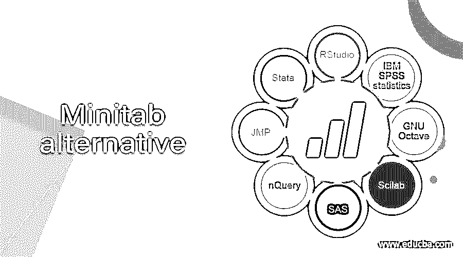

# Minitab 替代

> 原文：<https://www.educba.com/minitab-alternative/>

## Minitab 替代方案介绍

Minitab 是一款统计软件，通过提供全面的同类最佳的机器学习、统计分析和流程改进工具套件，帮助组织解决问题并发现数据中有价值的见解。Minitab 使从数据中获得深刻见解变得前所未有的简单。市场上还有其他替代产品，提供与 Minitab 相同的功能，如 RStudio、GNU octave、IBM SPss statistics、Scilab、SAS、nQuery、JMP、stata、KNIME。在本文中，我们将详细讨论这些替代方案。

### Minitab 替代产品列表

以下是 Minitab 替代产品列表

<small>Hadoop、数据科学、统计学&其他</small>

#### 1.RStudio

RStudio 是一个用于执行 R 程序的集成开发环境，用于统计计算和图形。RStudio 有桌面和服务器两种格式。RStudio 桌面是一个常规的桌面应用程序，RStudio 服务器运行在远程服务器上。服务器允许使用网络浏览器访问 RStudio 数据。它是一款采用 R、python 等开源数据科学软件的开源数据科学软件。RStudio 的设置很容易部署。它有助于了解您正在处理哪些对象。

#### 2.IBM SPSS 统计

IBM SPSs statistics 是 Minitab 的另一种选择。这是一个用于交互式批量统计分析的软件包。它提供各种功能，如从 ASCII 文本文件、电子表格、数据库和其他统计软件包中读取和写入数据。其功能可以通过下拉菜单访问，也可以用专有的 4GL 命令语法语言编程。它对内部文件结构、数据处理、数据类型和匹配文件进行了限制，这大大简化了编程。

#### 3.GNU 八度音阶

GNU octave 是 Minitab 的另一种选择，它支持高级编程语言，主要用于数值计算。它用于解决线性和非线性问题，并使用 matlab 语言执行数字运算。这是一个开放源码软件，受 GNU 通用公共许可证约束。除了命令行界面，GNU Octave 还包括图形用户界面。Octave 使用解释器来执行脚本语言。它支持 Microsoft windows 和 UNIX 等操作系统。

#### 4.Scilab

Minitab 的另一个最佳选择是 Scilab，用于数学计算。它用于统计分析、信号处理、图像增强、数值优化、流体动力学模拟和建模。Scilab 提供解释型编程环境。它的特性允许用户快速构建数学问题的模型。它支持数学运算，如加、减、乘、相关和其他复杂的数学运算。

#### 5.斯堪的纳维亚航空公司

SAS 代表统计分析系统，是一个统计软件，是 Minitab 的另一个最佳选择。它由 SAS institute 开发，用于数据管理、商业智能、数据分析、多元分析和预测分析。SAS 软件可以管理和检索各种来源的数据，并对其进行统计分析。SAS 提供易于使用的图形用户界面。这是一个完整的数据流分析包。它的内置库包含分析和报告数据所需的所有必要的包。

#### 6.恩奎里

nQuery 是一个临床试验设计平台，用于设计和监控自适应分组序贯试验和固定相同规模的试验。它最常用于计算适应性临床试验设计的样本量和统计功效。它用于生物分析。

#### 7.JMP

它是主要用于统计分析的 Minitab 的另一个最佳替代方案。它用于许多应用，如质量控制、六西格玛、工程、实验设计、科学研究、工程和社会科学。它主要涉及探索性数据分析和可视化。JMP 软件将统计数据与图形表示联系起来。用户可以向下钻取或向上钻取，以探索数据及其各种可视化表示。它的主要应用是设计实验和统计工业数据。

#### 8.斯塔塔

它是为数据统计而创建的 Minitab 的另一个最佳替代方案。它包括数据管理、图形、统计分析、图形、回归、自定义分析和模拟。它可以导入各种格式的数据，如 ASCII 数据格式，电子表格格式。文件格式随着时间而改变。每个版本都可以读取所有较旧的数据集，并可以写入当前和以前的数据集格式。

#### 9.KNIME 分析软件

这是一款开源数据分析软件，集成了各种数据挖掘和机器学习组件。它的图形用户界面和 JDBC 驱动程序允许混合不同数据源的节点组装。它包括 ETL 处理。KNIME 允许用户可视化地创建数据流，执行部分或全部分析步骤，检查结果，使用交互式部件和视图建模。

### 推荐文章

这是一个 Minitab 替代指南。在这里，我们讨论了市场上可用的 Minitab 的最佳替代产品。您也可以看看以下文章，了解更多信息–

1.  [什么是 Minitab？](https://www.educba.com/what-is-minitab/)
2.  [Dropbox 替代品](https://www.educba.com/dropbox-alternatives/)
3.  [鲁弗斯的替代品](https://www.educba.com/rufus-alternatives/)
4.  [电报选择](https://www.educba.com/telegram-alternatives/)