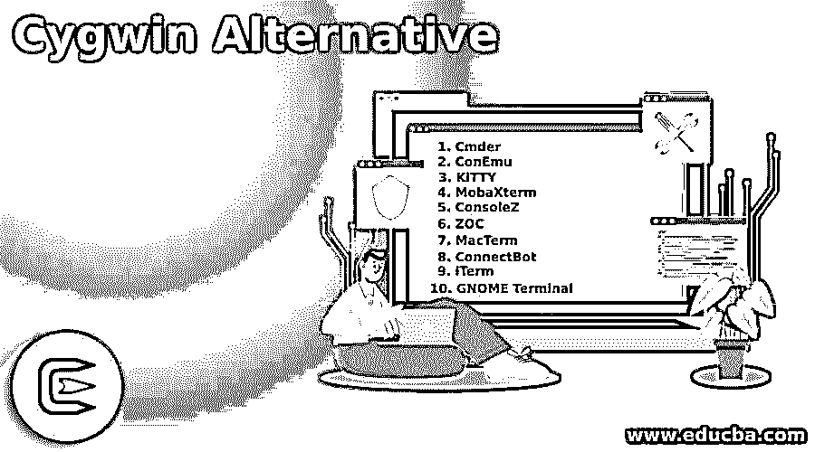

# Cygwin 替代方案

> 原文：<https://www.educba.com/cygwin-alternative/>

## Cygwin 替代方案简介

Cygwin 是一个基于 Linux 的 Windows 应用程序，使您能够轻松地连接到 POSIX 系统上的 Windows 操作系统，包括 UNIX、Linux 和 BSD。它是最大的 GNU 和开源工具集合之一，提供了与基于 Linux 的 Windows 发行版相似的功能。该软件还有一个 DLL，它提供了重要的 POSIX API 函数来改进它。Cygwin 集成到基于 Windows 的工具、数据和其他系统资源中，包括基于 UNIX 的应用程序、数据和设备。让我们讨论一下 Cygwin 替代方案。

### Cygwin 的顶级替代品

现在让我们来看看 Cygwin 的替代方案:

<small>网页开发、编程语言、软件测试&其他</small>

#### 1.Cmder

Cmder 是一个控制台模拟器，即使在 Windows 平台上也能提供出色的控制台体验。该软件是一个移动 Windows 控制台模拟器。这是一套不同种类的工具，全部都是便携式的。Cmder 基于各种程序，混合了 Monokai 的配色方案和快速定制设计。这是一个只需要下载的便携式应用程序。

#### 2.科内穆

ConEmu 是一个 Windows 增强控制台，为不同的控制台和简单的 GUI 应用程序提供多种功能、可定制的 GUI 选项卡式窗口。ConEmu 包括一个调整窗口大小的适当和平滑的系统。ConEmu 被认为是 Windows 最实用的终端之一。ConEmu 是一个为管理员、开发者和 Windows 用户提供的集成的全功能本地设备。要尝试 ConEmu，你建议你寻找一个更好的控制台窗口，带有标签、复制粘贴、雷神之锤风格的分割等等。

#### 3.小猫

KiTTY 是世界上最好的 Windows 操作系统 telnet 和 SSH 客户之一。KiTTY 的惊人特性是自动密码系统、会话过滤器、透明性、启动会话总是可见等。凯蒂是个油灰叉子。KiTTY 运行在 Windows 上，拥有所有 PuTTY 版本所没有的大量功能。KiTTY 可用的功能包括会话启动器、自动登录脚本、会话过滤器、预定义的快捷方式、运行本地保存的脚本的远程会话、每个会话都有图标和开放性，以及易于使用的界面。

#### 4.mobaxterm(mobaxterm)

MobaXterm 是一个免费的基于 Windows 的 SSH 服务器和选项卡式客户端。它是各种类型的远程计算机网络工具的最佳和增强终端之一。开发人员将 MobaXterm 视为最终的远程计算机工具箱，因此大多数时间都在使用它。所有必须处理远程工作的用户都被赋予了 MobaXterm 的功能。MobaXterm 最大的优点是它提供了几乎所有的程序和功能，如远程工作工具、桌面功能、Unix 命令系统和嵌入式 x-server 等。对生产工作至关重要。

#### 5.康索莱兹

ConsoleZ 是 Console 2 的修订版。它在所有 windows 平台上为您提供了更好的体验和更好的视觉表现。该软件有一个雷神之锤风格的动画控制台，将标签分为视图，组视图等。

#### 6.ZOC

对于 Windows 和 Mac OS X 操作系统，ZOC 是一个专业和先进的 SSH，终端模拟器，和远程登录客户端。该软件包括所有仿真和高级功能，允许用户使用安全外壳、调制解调器、telnet、串行电缆和其他交互方法。使用 ZOC 的优势是缩略图模式的选项卡式会话，颜色和文件夹编码的主机，非常可取，200 多个命令的脚本系统，用户友好等等，与最新版本的 Mac 和 Windows 兼容。

#### 7.MacTerm

MacTerm 是 Mac OS X 终端，也是 Mac OS X 终端最好、最先进的替代品之一。最棒的是，它还可以用来构建自己的软件。VT52、VT100 ANSI、VT220 以及某种程度上的 Xterm 中的 VT100 VT 设备也支持 VT100 终端。MacTerm 有一个不断发展，但很小的被子脚本 API。Python 被 MacTerm 的脚本 API 用作编程语言。

#### 8.ConnectBot

ConnectBot 是一个著名的 SHH android 客户端软件，适用于商业和工业环境。该软件提供了管理 SSH 会话、建立安全隧道以及在一个或多个应用程序之间复制/粘贴的完整功能。同时，客户机将允许您完整地链接到安全的 shell 服务器，这些服务器通常可以在基于 UNIX 的服务器上运行。至于 Ascii 终端，它们将优雅地出现在屏幕上。

#### 9.iTerm

iTerm 是一个终端设备的模拟器，可以轻松方便地在 Mac OS 上使用用户。该软件允许用户将一个选项卡分成几个面板，用户还可以查看同时发生的会话。此外，它允许用户垂直和水平分割标签，并创建一组可想象的面板。

#### 10.GNOME 终端

GNOME 终端是一个 GNOME 桌面模拟器。它允许程序员和开发人员访问 UNIX shell，模拟 Xterm 终端模拟器，并在您的桌面上提供一些相同的功能。她的突出特点包括后台支持，多个文件，彩色文本，兼容性，鼠标事件，重新文本包装，标签，网址检测，安全退出，等等。VTE 小部件是基于 GNOME 终端的。

### 结论

在这篇文章中，我们看到了 Cygwin 的各种替代方案。您可以根据自己的需求选择任何一种。我希望这篇文章对你有所帮助。

### 推荐文章

这是一个指南 Cygwin 替代。这里我们详细讨论 Cygwin 替代物的介绍及其不同的 Cygwin 替代物。您也可以浏览我们推荐的其他文章，了解更多信息——

1.  [谷歌地图替代品](https://www.educba.com/google-maps-alternatives/)
2.  [Spiceworks 替代方案](https://www.educba.com/spiceworks-alternative/)
3.  [Dropbox 替代品](https://www.educba.com/dropbox-alternatives/)
4.  [雷鸟替代](https://www.educba.com/thunderbird-alternative/)

