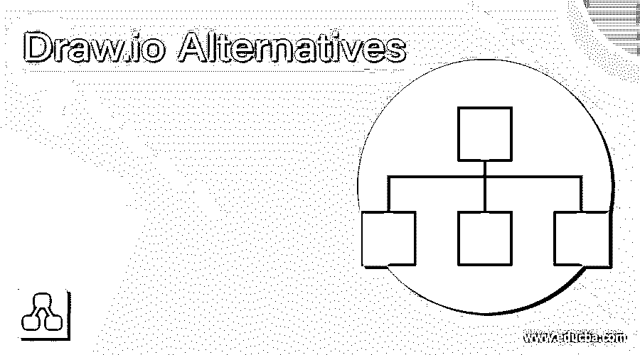

# Draw.io 替代方案

> 原文：<https://www.educba.com/draw-io-alternatives/>

## Draw.io 替代方案介绍

Draw.io 是围绕 google drive 构建的在线图表编辑器。使用 draw.io，用户可以创建 UML 图、流程图、网络图、实体关系等等。draw.io 的优势之一是它将数据存储在 google drive 中，因此不需要额外的第三方。draw.io 还可以使用其他替代方案。在本文中，我们将介绍这些替代方案。

### Draw.io 替代方案

draw.io 替代项列表如下:

<small>网页开发、编程语言、软件测试&其他</small>

**1。LucidChart:** LucidChart 是由 Lucid software inc .开发的 draw.io 的最佳替代品之一，它允许用户协作绘制、修改和共享图表。有免费版和付费版两个版本。免费版提供了除高级以外的各种功能，而付费版为用户提供了一些附加功能。LucidChart 可以在支持 HTML5 的浏览器上访问。

**2。visio:**draw . io 的另一个替代品是 Visio，它是微软家族的一部分。Visio 是图表和矢量图形应用程序。它有两个版本，标准版和专业版。两个版本都有相同的界面，但是专业版包含一些额外的模板，用于更高级的图表和布局。使用 Visio，用户可以轻松地将其图表连接到数据源，并可以轻松地以图形格式显示数据。专业版有三个额外的图表类型，验证、智能规则和子流程。它以各种格式保存文件，如 VSD，VSS，VST，VDW，VDX，VSX，VTX，VSDX，VSDM，VSSX，VSSM，VSTX，VSTM 和 VSL。

**3。Gliffy:** Gliffy 是 draw.io 的另一个替代品，它是一个使用 HTML5 基于云的应用程序来绘制图表和 UML 的软件。在该软件的帮助下，用户可以绘制 UML 图、平面图、流程图、维恩图和各种类型的其他图表。它使用户能够实时编辑和共享图表。它提供了拖放界面、实时在线协作和共享功能。它允许用户探索各种格式的图表，如 PNG、SVG、PDF 和 JPEG。Gliffy 支持各种浏览器，如 Firefox、chrome、internet explorer 和 safari。

**4。SmartDraw:**draw . io 的另一个最佳选择是 smart draw，这是一个在线工具，用于绘制图表，如流程图、思维导图、组织结构图、业务可视化、项目图表等。它有两个版本——在线版本和下载版本。它使用扩展。特别提款权，SDL，SDT，SCZ。SmartDraw 与微软产品集成，包括 Word、Excel、PowerPoint、G suite 应用程序，如 Google docs 和 Google sheets。

**5。Creately:** 它是 draw.io 的另一个替代方案。Create 是一个基于 Saas 的可视化协作工具，具有图表和设计功能。它有两个版本——在线云版本和可下载的离线版本。它支持基于桌面的 Windows、Linux 和 mac。使用 Creately，用户可以绘制流程图、UML 图、思维导图、项目图、组织图。和其他商业视觉效果。它为项目协作提供了预定义的模板和各种元素。它还支持拖放功能，有两种格式，预定义的和基于自定义的。自定义格式可用于绘制所需的图表。它有免费版和付费版。付费版本提供了比免费版本更多的功能。

**6。StarUML:**draw . io ks StarUML 的另一个最佳替代方案。由于它的名字包含一个 UML 单词，它是一个用于绘制 UML 图的 UML 工具，如类图、顺序图、组件图、用例图、对象图、实体关系图、流程图等。软件是在 GNU GPL 的修改版本下授权的。StarUML 支持几乎所有类型的图，在 4.0.0 版本中，它包括了时序图和交互式概览图。StarUML 使用自己的文件格式，扩展名为。mdj 扩展。它的图形用户界面使它很受欢迎。它提供了命令托盘，使用户能够搜索和执行命令并安装扩展。

7 .**。Edraw Max:** Edraw Max 是一款用于绘制流程图、思维导图、网络图、组织图、工作流程图、业务图的软件。支持 Windows、Linux 和 macOS 等操作系统。为了绘制图表，它提供了各种各样的内置符号和各种类别的模板。Edraw Max 有两个版本——免费查看器版本和专业可编辑版本。它使用 XML 文件格式来保存文件。默认文件格式是. edxz。它支持 Windows、Linux 和 macOS 等操作系统。

**8。Pingboard:** 是用来制作实时组织图表的软件。它允许用户与特定的人共享图表，可以保持私密，或由所有员工访问。它自动更新信息；这些特点使它更受欢迎。

### 结论

Draw.io 是一个在线图表编辑器。这里我们讨论了 draw.io 的各种替代方案，每一种都有自己的特性和功能。根据需求和可用性，您可以采用这些可用的备选方案之一。

### 推荐文章

这是一个 Draw.io 替代方案的指南。这里我们讨论一下引言，Draw.io 备选列表。您也可以看看以下文章，了解更多信息–

1.  [OpenSSL 替代方案](https://www.educba.com/openssl-alternatives/)
2.  [地图框备选方案](https://www.educba.com/mapbox-alternatives/)
3.  [Swagger UI 替代品](https://www.educba.com/swagger-ui-alternatives/)
4.  [Express.js 备选方案](https://www.educba.com/express-js-alternatives/)

