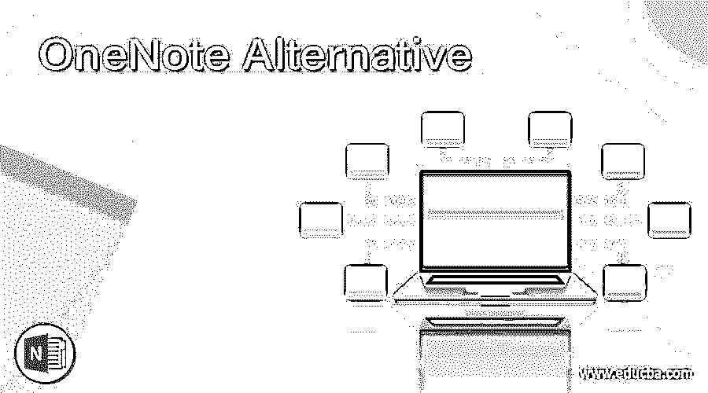

# OneNote 备选方案

> 原文：<https://www.educba.com/onenote-alternative/>

## OneNote 备选方案简介

OneNote 是一种笔记记录程序，由 Microsoft office 套件开发，用于信息收集和多用户协作。它收集用户的笔记、屏幕剪辑、绘图和音频组件。OneNote 笔记可以通过 internet 或网络与其他 OneNote 用户共享。它支持 Windows 10、android、iOS 和 macOS 等操作系统。作为 onedrive 和 office for web 的一部分，它有基于网络的版本。OneNote 的其他替代产品也可以提供与 OneNote 相同的功能。

### Onenote 备选方案

让我们讨论 Onenote 的替代方案。

<small>网页开发、编程语言、软件测试&其他</small>

#### 1.Evernote

Evernote 是 OneNote 的最佳替代产品，OneNote 设计用于记笔记、任务管理、组织和存档。它允许用户创建文本格式、绘图格式、音频格式、图像格式或 web 内容格式的笔记。这些笔记保存在笔记本里。可以对笔记进行标记、注释、搜索、编辑、添加附件和导出。通过互联网连接，Evernote 可以自动将笔记与 Evernote 服务器上的主副本同步

#### 2.Google keep

Google keep 是谷歌开发的另一款假钞软件。它既有 android 和 iOS 系统的移动应用格式，也有移动应用的 web 应用格式。对于记笔记，google keep 提供了各种工具，如文本、音频、列表、图像。它允许用户使用光学字符识别从图像中提取文本。它还允许用户设置提醒。通过 google keep 创建的语音记录是自动转录的。用户还可以使用颜色编码选项来突出显示注释，例如白色、橙色、红色、绿色、黄色、灰色、蓝色或蓝绿色。

#### 3.概念

OneNote 的另一个选择是概念。这是一个提供各种组件的应用程序，比如笔记、维基、日历、数据库、提醒、看板。用户可以使用它来连接这些组件，以创建自己的知识管理、项目管理、数据库管理系统。概念也可以使用 web 浏览器来访问。它包含了从网页中剪切内容的工具。它允许用户安排他们的任务。

#### 4.简单注释

OneNote 的另一种选择是 simplenote。Simplenote 是一个笔记应用程序，支持 windows、Linux、macOS、Android 和 iOS 等平台。它还有一个基于网络的版本。它有外部可访问的 API。它允许编写其他客户端，如 macOS dashboard widget dash note、nvpy、跨平台 simplenote 客户端等。

#### 5.辛塔诺特斯

OneNote 的另一种选择是 cint OneNote，这是由 Microsoft windows 提供的笔记应用程序。它提供了一种存储文本或从其他网站或文档中检索文本的方法。它允许用户通过热键从任何应用程序中执行文本剪辑，并捕获 web 或本地文件链接。它还允许标签和基于标签、文本、链接或日期的即时搜索。它还允许用户将选定的注释和数据库导出为 XML 或 Unicode 格式。它把窗口分成两部分，左边显示标签列表，右边写注释。

#### 6.阿马诺特

这是另一个笔记应用程序，专门为学生设计，提供适合学生需要的解决方案。它的主要目标是提高学习和讲座期间的生产率和效率。它允许用户将笔记导出为 PDF 格式。它还允许用户插入数学或其他公式、代码、图表、绘图等。

#### 7.维基百科

Wikipad 是 OneNote 的另一种选择，它允许用户存储他们的笔记。在 wikipad 中，链接是通过键入 wikiwords 创建的。Wikiword 是按顺序键入的任何大小写混合的单词。您可以存储旅游想法，联系，待办事项，想法，或任何其他东西。Wikidpad 不是 web 服务器或应用程序服务器，它是一个独立的类似记事本的应用程序。

#### 8.文书工作

这是 OneNote 的另一个最佳选择。它允许用户以自己的方式做笔记和存储。它的使用使其在用户中很受欢迎。它是自托管的。用户可以以自己定制的方式保存他们的笔记。它允许用户创建自己的存储笔记的环境。它有一个基于网络的版本。它提供了各种定制选项、简单的用户界面和多存储备份。它为笔记提供了有限的存储区域，对于额外的笔记，用户需要购买他们的高级版本。

### 结论

在本文中，我们讨论了 OneNote 的各种替代方案，如 Evernote、文书工作、amanote、simplenote、wikidpad、idea、google keep 和 cintanote。各有各的特点和优缺点。根据需求和使用可靠性，您可以选择其中之一。

### 推荐文章

这是 OneNote 替代指南。在这里，我们将讨论 OneNote 的简介和各种替代方案。您也可以看看以下文章，了解更多信息–

1.  [MobaXterm 替代方案](https://www.educba.com/mobaxterm-alternative/)
2.  [打嗝套件替代品](https://www.educba.com/burp-suite-alternatives/)
3.  [融合 360 替代方案](https://www.educba.com/fusion-360-alternative/)
4.  [VMware 替代产品](https://www.educba.com/vmware-alternatives/)

