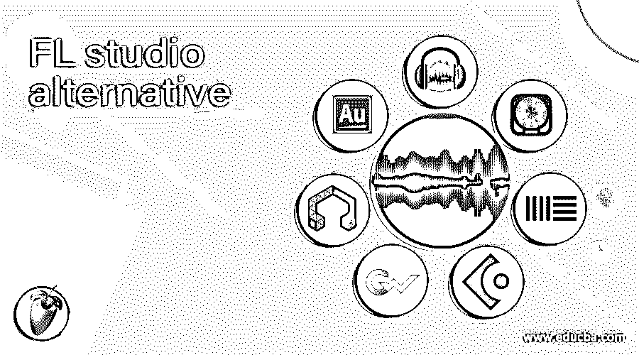

# FL 工作室备选方案

> 原文：<https://www.educba.com/fl-studio-alternative/>

## FL 工作室备选方案介绍

谈到顶尖的音乐制作软件，“FL Studio”，即 FruityLoops，长期以来一直是我们许多人的平台，包括专业音乐作曲家。数字音频工作站具有多方面的特点，例如多功能性、可定制的界面，以及最重要的高效率。也就是说，FL Studio 没有一些缺点，包括笨重的图形和复杂的编辑，尤其是如果您的工作流程要求过高，这会降低生产率。复杂的编辑过程让新手很难掌握业务的窍门。该软件保证了从 99 美元开始的高价，并一直达到惊人的 899 美元。这正是为什么有些人在寻找他们的替代品。如果你是这样一个人，那么 2020 年 FL 工作室的最佳选择。在本主题中，我们将了解 FL studio 替代方案

### FL 工作室的替代方案

让我们看看 FI 工作室的替代方案

<small>网页开发、编程语言、软件测试&其他</small>

#### 1.大胆

你有足够昂贵的音乐制作软件吗？如果你正在寻找超级方便的音频创作和编辑软件，那么看看 Audacity 就够了，它可以让你的口袋里没有空洞，也能创作出令人印象深刻的音乐。这款应用可能缺乏优雅的界面，但它有足够的工具来声称它相当好地替代了 FL Studio。此外，由于开源软件，音频编辑变得非常容易。所有的工具都很容易操作，所以即使你是音乐新手，你也不会觉得入门很难。您可以通过麦克风或混音器轻松获取现场音频，甚至数字化其他媒体记录。

#### 2.Logic Pro X

如果你是专业从事音乐创作的，那么听说“Logic Pro X”的几率是相当高的。无论是在效率还是高端功能方面，它都能轻而易举地超越 FL Studio。Logic Pro 还可以在界面上接近其杰出的对手所提供的功能。该软件有一个不断增长的工具包，可以随意创建一个杰作。Logic Pro 与所有其他竞争对手的区别在于其生产速度。如果你发现 FL Studio 经常很难处理音频文件，你的自动选择应该是 iota-free。您还可以利用各种高质量的音频效果来提高音乐质量。

#### 3.Ableton Live

作为一名专业音乐制作人，如果你优先考虑优秀的乐器，“Ableton Live”应该是你显而易见的选择。该软件拥有一个巨大的现代工具库，保证了以最佳方式创作和编辑音乐的最大自由。而且软件在这方面和 FL Studio 很像。Ableton Live 谈到了界面，并保持它非常简单，所以获得所有的要素并不是一件大事。我发现它的窗口非常方便，因为它提供了对在记忆图标中起重要作用的工作区组件的简要描述

#### 4.CubaseIt

如果想要找到一个完整的数字声音工作站，那么错过“Cubase”就太糟糕了。在功能上，该软件非常类似于 FL Studio，并具有多种适合创作和编辑专业音乐的工具。尽管它有丰富的功能，但由于非常灵活的工具和设计流畅的界面，它看起来一点也不令人生畏。

#### 5.金波

虽然 GoldWave 的功能不像这一轮中的一些大牌那样全面，但作为 FL Studio 这样的最佳应用程序之一，它值得找到一个安全的地方。它凭借超过 25 年的专业知识提供可靠的音频编辑体验。本着简单的原则，该软件可以用于所有重要的问题，如录音、编辑、音频处理、转换等等。

#### 6.LMMS

我把《LMMS》留给了那些想在花大价钱购买高端乐器之前欣赏音乐作品的人。作为新手，这个软件比功能性的 FL Studio 更加用户友好和高效，对于新手来说，FL Studio 有时显得笨拙。它可以让你方便地开展业务，无论是创作节拍和旋律、合成和混合声音，还是编排样本。用于回放的乐器和样本非常容易处理。如果你想把你的手添加到插件中，你会喜欢各种插件，这些插件可以给你的音乐带来缺失的魅力。

#### 7.Adobe Audition

Adobe Audition 无疑是数字音频工作站精英群体中的一员。如果你不想退而求其次，就不要错过仔细看看它。Audition 拥有强大的工具集，包括波形、多任务、混音、编辑、音频内容创建和恢复。在高端工具方面，Audition 与 FL Studio 匹配得相当好。

### 结论

这是一个指南，以 FL 工作室替代。这里我们讨论了 FL studio 的各种替代方案。您可以根据自己的需求选择任何一种。您也可以阅读以下文章，了解更多信息——

1.  [UiPath 工作室](https://www.educba.com/uipath-studio/)
2.  [颤振版本](https://www.educba.com/flutter-version/)
3.  [什么是 Visual Studio 代码？](https://www.educba.com/what-is-visual-studio-code/)
4.  [Google Data Studio 是什么？](https://www.educba.com/what-is-google-data-studio/)

