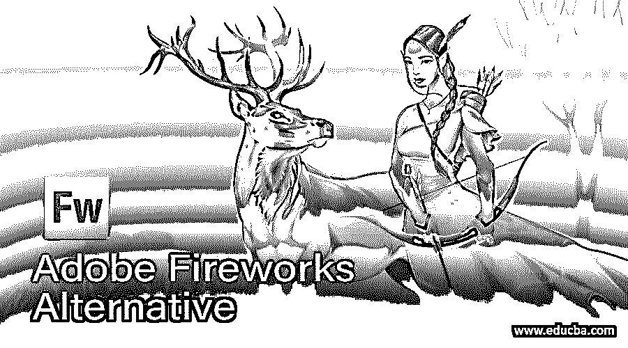

# Adobe Fireworks 替代产品

> 原文：<https://www.educba.com/adobe-fireworks-alternative/>

## Adobe fireworks 替代产品简介

Adobe fireworks 是一种停产的位图和矢量图形编辑器，专为 web 设计人员设计，用于快速创建网站原型和应用程序界面。它提供了各种工具，让用户可以轻松地绘制和编辑矢量和位图。它允许用户快速轻松地创建 CDd 精灵。adobe fireworks 还有其他可用的替代产品，如 GIMP、Inkscape、CorelDraw Graphic suite、Adobe illustrator CC、Figma、Vectr、Webflow、Affinity designer、Sketch 等。在本文中，我们将讨论这些替代方案。

### Adobe Fireworks 的最佳替代品

Adobe fireworks 的替代产品如下

<small>网页开发、编程语言、软件测试&其他</small>

*   **GIMP:** 是 adobe fireworks 的最佳替代品。这是一个用于图像处理的免费开源光栅图形编辑器。它是一个跨平台的平台，可用于 windows、Linux、OS x 和更多操作系统。GIMP 为用户提供了复杂的工具，用户可以使用插件和定制选项来提高工作效率。它提供一流的色彩管理功能，确保数字和印刷媒体的高保真色彩再现。通过许多语言，kike python、Perl 和其他 gimp 提供了可扩展性。
*   Inkscape:adobe fireworks 的另一个最佳替代产品是 Inkscape，它是一个免费的开源矢量图形编辑器，用于创建 SVG(可缩放矢量图形)格式的矢量图像。它提供了符号库来使用现有的符号，如逻辑门符号或点象形图。它提供了像图像跟踪这样的功能，可以从光栅源中提取矢量图形。它允许用户在画布中以首选的堆叠顺序组织对象。使用这些功能，对象可以是可见的和不可见的。Inkscape 有各种工具来编辑路径。
*   **CorelDraw 图形套件:**它是 adobe fireworks 的另一个最佳选择。这是一个矢量图形编辑器，包括位图图像编辑器 corel photo paint 和其他图形相关的程序。它使用称为 corel script 的脚本语言提供任务自动化。它有活的多功能工具，如节点成形和网格填充，这很方便。它提供了各种工具，如挑选工具，形状工具，裁剪工具，缩放工具，手绘工具，矩形工具，艺术媒体工具，椭圆工具，多边形工具，投影工具，等等。
*   **Adobe illustrator CC:** 它是一个矢量图形编辑器，可以用来代替 Adobe fireworks。在这些帮助下，用户可以设计横幅和高质量控制像素矢量图像。所有不受特定尺寸限制的数字和字母图像均由 adobe illustrator CC 设计。它支持 windows 和 macOS。它有一套强大的工具和功能，用于从其称为 adobe stock 的设计模板库中创建艺术品。
*   **Figma:** Figma 是 adobe fireworks 的另一个最佳替代产品。它是矢量图形和基于 web 的原型工具。它提供了一些由桌面应用程序启用的脱机功能。适用于 macOS 和 windows。它的插件可以自动完成任务，并为用户提供可靠性。它为项目设计企业提供所有的资源，包括全长幻像使能矢量工具、原型制作能力和移交代码创建。虽然 figma 是基于网络的版本，但也有 window 和 macos 版本，两者都有浏览器。
*   **Vectr:** 是烟花的另一种替代品。Vectr 是开源矢量图形编辑器，用于轻松直观地创建图形。这是一个简单而强大的跨平台图形编辑器，将设计变成现实。vectr 提供各种工具，如钢笔工具创建曲线和直线路径，手绘工具绘制自定义形状，分组工具添加和修改组层，该软件用于创建图标，网站，用户界面设计，标志，横幅，小册子等。
*   Webflow 是一个网页设计器，用于创建网站。当你设计你的网站时，它为你写一个代码，所以你不需要知道任何关于代码或网站设计的事情。Webflow 讲述了一种网站设计的可视化方法，这意味着你可以改变网站，使它看起来像你想要的那样。您可以简单地设计网站，而不是编写复杂的代码，webflow 会自动编写相同的代码。
*   **Affinity designer:** 它是一个矢量图形编辑器，可以用来代替 fireworks。兼容 AI (Adobe illustrator)、SVG(可缩放矢量图形)、PSD (Adobe photoshop)、PDF(便携文档格式)、EPS(封装 Postscript) formtat 等常用图形文件格式。它还可以从 adobe freehand 文件导入数据。Affinity designer 功能包括矢量笔、形状绘制工具、光栅画笔、动态符号、自定义矢量画笔、笔画稳定、导出选项等。
*   **Sketch:** 它是 adobe fireworks 的另一个最佳替代品，它是一个矢量图形编辑器，用于设计网站的用户界面设计。它具有原型制作和协作等功能。草图中创建的设计保存在自己的草图中。草图文件格式。设计也可以保存为 JPG，TIFF，SVG，PDF 等格式。

### 推荐文章

这是 Adobe Fireworks 替代产品的指南。在这里，我们还讨论了 Adobe Fireworks 的介绍和替代方案，并给出了解释。您也可以看看以下文章，了解更多信息–

1.  [Adobe Flash 中的动画](https://www.educba.com/animation-in-adobe-flash/)
2.  [土坯的种类](https://www.educba.com/types-of-adobe/)
3.  [Adobe 编辑软件](https://www.educba.com/adobe-editing-softwares/)
4.  [Adobe 特快专递](https://www.educba.com/adobe-speedgrade/)

