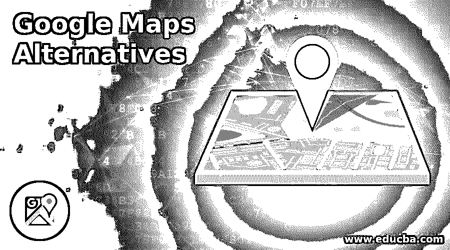

# 谷歌地图替代品

> 原文：<https://www.educba.com/google-maps-alternatives/>

## 谷歌地图替代品介绍

Google Maps Alternatives 是一个很棒的导航和地图工具，但是由于一些原因，实际上有很多 Google Maps 解决方案。你想如何计划你的旅行和如何使用你的地图完全取决于你的偏好。你是想在家里用电脑计划你的旅行，还是用手机计划和导航你的大部分行程？

### 谷歌地图的各种替代品

以下是谷歌地图的替代方案:

<small>网页开发、编程语言、软件测试&其他</small>

#### 1.袖珍地球

此地图应用程序仅适用于 iOS，它使用 OpenStreetMaps 中的特定信息来提供最新的全球导航。离线地图主要可以下载，大型组织工具可用于聚类，如大头针。关于如何添加袖珍地球以及在地图中显示多少细节，有许多图层和信息。维基百科图层是一个真正的奖励，它将您的地图链接到一个在线百科全书，提供许多有趣的内容。

#### 2.城市地图

Citymapper 的范围比谷歌地图窄，但它唯一的工作比任何 app 都好。这张地图展示了世界上有多少最好的城市可以通过公共汽车、地铁、电车和其他公共交通工具到达。这是一张公共交通地图。该应用程序维护着一个最先进的数据库，其中包含其支持的城市中每条公共交通路线的价格和通知，列出了您最喜欢的旅行目的地。

#### 3.必应地图

你有没有注意到谷歌和必应地图一样古老？嘿，微软拥有的地图服务最初被称为 MapPoint，直到它取了最吸引人的名字。它提供了许多功能，包括交通叠加和 3D 视图。传统的地图绘制者或从事城市规划的人拥有完整的英国监管机构调查图。Bing 经常选择与 Google 不同的路线，这通常是 Google 在计划旅行时进行比较的最佳方式。但是，如果你想寻找额外的功能，如 3D 视图和操作系统地图以及广泛的街景响应，必应是值得一游的。

#### 4.穷乡僻壤导航员

天知道在加拿大森林的什么地方，可能在山腰上，也可能在密林中。谷歌地图不会有太大帮助，因为这个国家的地形不像穷乡僻壤那样精确。这张地图是为徒步旅行者和户外类型设计的，使用 GPS 点来做一些事情，例如输入经度/纬度的位置坐标。在大自然中，你是一个重要的支持者，依赖于几个著名来源的高度详细的地图，包括 USTopo、OpenCycleMaps，甚至是 NOAA RNC 的航海图。

#### 5.Navmii

Navmii 是一个丰富的导航和地图服务，服务于超过 85 个国家。它提供了一切，如路线导航，书签，离你最近的位置，搜索和卫星视图。警报包括限速、测速摄像头、交通、建筑工地、减速等。有了 Navmii 其他用户的社区更新，这一切甚至会更好。Navmii 还与猫途鹰、Foursquare 和 What3Words 合作，提供个性化搜索服务。其他功能还有谷歌街景、ETA、高清地图、自动重定路线和完全离线浏览。我最喜欢的是你手机上的司机测量你的运动和 GPS 传感器！谷歌街景也有。

#### 6\. MapQuest

对于谷歌地图来说，MapQuest 是一个很好的选择，尤其是在乘坐公共交通工具旅行的时候。像 car2go routes 或优步这样的本地服务可以与网上订车相媲美。它还提供您所在地区所有当地交通选项的即时更新。如果你想去不同的地方，它会告诉你你吃了多少卡路里。

#### 7.Maps.me

现在是个可爱的。Maps.me 拥有你想从地图应用中获得的一切——交通信息、自行车导航、公共交通，应有尽有。然而，与地图上的许多其他应用程序相反，谷歌地图还可以让你下载离线地图——当你在外国城市旅行或上网时，这很有用。在任何情况下，它都是完美的。当你参观一个城镇时，它会显示你必须看到的所有东西，而步行者通常会从荒野中受益，因为它每天都会更新世界各地的步道数据库。一旦你计划好了你的旅行或散步，你可以做一个书签并把它送给你的朋友。

#### 8.奥斯曼帝国

这款强大的开源导航应用程序最重要的功能之一是包含离线地图，无论信号如何，都可以在世界任何地方找到自己的路。这些地图非常精确，让人想起英国地形测量局地图的美学，定期更新让你永不过时。

### 结论

与主要的 G-map 相比，上述大多数请求侧重于提供最新的本地信息。所以在这篇文章中，我们看到了谷歌地图的各种替代品。您可以根据自己的需求选择任何一种。我希望这篇文章对你有所帮助。

### 推荐文章

这是谷歌地图替代品的指南。在这里，我们讨论了谷歌地图的 8 个不同的地图替代品介绍。您也可以浏览我们的其他相关文章，了解更多信息——

1.  [安卓事实](https://www.educba.com/android-facts/)
2.  [谷歌项目管理工具](https://www.educba.com/google-project-management-tools/)
3.  [在谷歌地图的职业生涯](https://www.educba.com/career-in-google-maps/)
4.  [反应原生闪屏](https://www.educba.com/react-native-splash-screen/)

