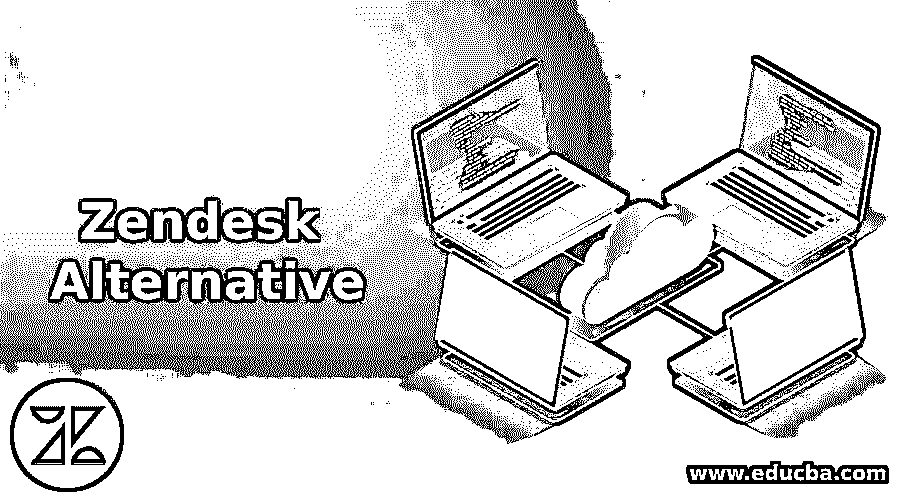

# Zendesk 替代方案

> 原文：<https://www.educba.com/zendesk-alternative/>

## Zendesk 替代方案简介

Zendesk 是一种面向客户的解决方案服务，提供全渠道支持、票务和客户自助服务功能。它以各种尺寸和简单易用的 API 而闻名于各行各业，并且可以快速安装。该报告卡用于客户支持，以跟踪代理的表现。安全性很强，符合 TLP 加密、单点登录和 HTTPS。尽管 Zendesk 具有一些特性，但它并不适合商业，而是支持医疗领域、媒体零售和金融服务中的流程。它没有经过医疗保健和电信等垂直行业复杂情况的测试。除了 Zendesk 之外，很少有其他产品能以相对较低的价格提供有效的功能。分析了库存中列出的 170 多种不同客户服务的数据，以找到最好的替代 Zendesk 的服务。

### Zendesk 备选方案列表

以下是标准，如客户服务功能、用户评论、可能性推荐、功能和功能评级。该产品应提供端到端的客户服务，如知识库，支持多渠道，票务。它支持确保用户评论检查产品的利弊。每个产品都有一个平均建议，以及最低功能的评级。

<small>网页开发、编程语言、软件测试&其他</small>

#### 1\. Freshdesk

与客户的软件支持聊天通过由 Freshworks 实施的服务支持进行管理。它可以通过愤怒的点击和信号、混乱的滚动、崩溃的光标来预测发现客户挫折的能力，并帮助他最大限度地获得正确的支持。Freshdesk 自动对每一单票据进行优先级排序，启动后续通知，根据用户技能和工作量将票据发送给相关用户。它可以被分析和报告，这使得用户能够跟踪代理和他的工作量，以增强客户体验和代理的生产力。

它可以在浏览器中嵌入组件来收集客户反馈。但是这里有一些详细了解该产品的优点和缺点。用户喜欢在应用上工作，因为它提供了快速和简单的用户界面。它帮助用户调用各种有用的选项，如报告、集成、仪表板和固定响应。但是用户可以强调需要统一的格式选项和增强的定制能力。用户报告集成了智能垃圾邮件检测器、报告和分析、高级自动化和其他有价值的软件。它有五种不同的计划，如 sprout 是免费版，其次是 blossom，然后是 Garden，高级包是 estate 和 forest。

#### 2.LiveAgent

正是票务、帮助台和实时聊天软件使用规则来实现高级自动化，以点击来自电子邮件、社交媒体、聊天、呼叫和其他渠道的客户查询。它将数据转换为票证，代理可以在仪表板上显示他们的详细信息。它还有其他选项，如知识库、录音存储、反馈管理和使用游戏技术对代理人的表现进行跟踪。审核人员认为该软件在标记代理、创建票证方面非常用户友好，并对及时更新软件以支持客户表示赞赏。

但是用户对附加的内部规则功能不满意，键盘上的快捷键，聊天设置的扩展可以提高产品的质量。但是很少有评论者提到提供高级定制会更有帮助。每个代理每月的价格约为 39 美元。

#### 3.Salesforce 服务云

它是一个客户服务支持和帮助台软件的产品。该工具使用户能够通过社交媒体、电子邮件和电话等多渠道关联客户。它还组织客户和通信的细节，为不同的团队(如营销、销售和客户支持)提供统一的视图。人工智能驱动的聊天机器人通过 Salesforce 在自助服务上提供更多功能，并支持符合条件的消费者数据，以限制用户的处理时间。

聊天机器人找到关键案例，并将其传送给正确的代理。它还使用户能够开发宏来自动执行经常发生的任务。用户可以定制、报告和集成功能，并提供管理项目细节和销售以及机会管道的集中控制台。但很少有用户认为它很昂贵，并提到 Salesforce 增强了对客户端和技术人员的支持，以解决系统错误问题和停机问题。

#### 4.团队支持

它提供广泛的背对背客户服务和服务台软件。它提供通过邮件、电话、聊天和社交媒体等多渠道与客户关联的协作、票证管理、分析和报告功能，有助于检索客户详细信息以及组织和创建新的客户票证。它使用户能够通过类似票据和产品的分组来跟踪客户问题，以识别服务问题。分析功能为用户提供了实时的客户冲动。内置功能有助于代理进行协作，并在查询或票据被记录后对客户端做出快速响应。

#### 5.Zoho 书桌

它提供实时聊天、票务、多渠道客户支持功能。Zoho desk Zio，AI 工具，自动标记标签，与客户分享知识库中的相关解决方案，并为客户对话提供情感分析。它提供了一个吸引人的仪表板来跟踪重要业务的指标。用户可以根据品牌改变布局的字体、显示、颜色以匹配工具。它可以集成 Zoho 工具和第三方集成工具，如 Slack 和吉拉。

它提供协作功能，如评论和标记。审查人员使该软件与所有其他 Zoho 产品集成，并可以与第三方应用程序集成到 Zoho CRM 中。用户被出现在用户界面、报告、仪表板、自动建议功能和键盘快捷键上的解决方案所吸引。但是许多用户认为这些解决方案没有本地版本。用户告诉我们，它有一个陡峭的学习曲线，具有用于配置目的的高级功能。

### 结论

可以根据用户分配的预算来选择产品。因此，这是 Zendesk 的几个重要替代品，Zendesk 提供广泛的客户支持和有吸引力的用户友好界面。

### 推荐文章

这是一个 Zendesk 替代指南。在这里，我们讨论 Zendesk Alternative 的介绍以及相应的替代列表。您也可以看看以下文章，了解更多信息–

1.  [神童备选方案](https://www.educba.com/wunderlist-alternatives/)
2.  [远程桌面替代方案](https://www.educba.com/remote-desktop-alternatives/)
3.  [Todoist 替代方案](https://www.educba.com/todoist-alternative/)
4.  [松弛替代方案](https://www.educba.com/slack-alternatives/)

