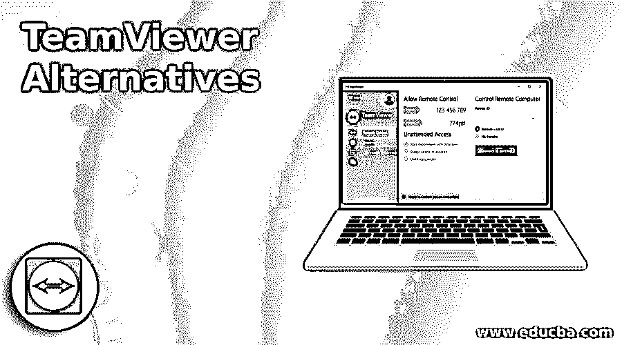

# TeamViewer 备选方案

> 原文：<https://www.educba.com/teamviewer-alternatives/>

## TeamViewer 备选方案介绍

下面的文章提供了 TeamViewer 替代方案的概要。TeamViewer 是一个虚拟桌面软件，允许用户远程连接到多个工作站。它通过硬件加速的图像处理提高了远程控制的性能。它允许将文件从一个桌面拖放到另一个桌面。然而，TeamViewer 的主要缺点是专业版价格非常高，当升级到最新版本框架时，它会变得更慢。

此外，它还有一系列各种恶意网络攻击，导致数据泄露和窃取用户的敏感数据。因此，许多用户正在寻找 TeamViewer 的替代品。这是 TeamViewer 的备选列表，包含商业(付费)和开放(免费)软件。这些工具有助于随时随地连接设备，以实现支持、监控、管理、培训、协作和其他各种目的。这些工具提高了效率，降低了风险，同时节省了资金和时间。

<small>网页开发、编程语言、软件测试&其他</small>

### TeamViewer 备选列表

以下是备选方案列表:

#### 1.Dameware 远程支持

Dameware Remote Support 是一个广泛使用的远程桌面工具，它具有快速和安全的远程访问能力。它有两种类型，如 Dameware Remote Support(内部解决方案)和 Dameware Remote Everywhere(基于云的解决方案)。它为 windows，mac OS linux 台式机，笔记本电脑和服务器，android 和 iOS 设备提供远程支持，并有一个内置的远程管理工具。它还具有自动化的 It 支持任务和帮助台，因此可以节省用户的时间和维护费用。

**软件远程支持的特点:**

*   它随时随地提供远程协助。
*   它简化了 windows 管理。
*   它有助于远程管理活动目录(AD)。
*   它提供了一个内部售票系统以及一个报告引擎，以增加性能审查。
*   用户可以远程重启冻结或休眠的计算机，拍摄其他远程设备的屏幕截图，并与其他用户聊天。
*   它为安全的远程桌面网络提供认证和身份管理。

#### 2.蜜子

Mikogo 是 Teamviewer 的一个很好的替代品，因为它可以通过智能手机、笔记本电脑、平板电脑或台式机上的各种操作系统直接访问。它允许多达 25 个用户在 HTML 浏览器的帮助下同时访问一台计算机。它还允许以一种简单的方式快速交换管理权限。Mikogo 有标准版、团队版和专业版等版本。

**Mikogo 的特点:**

*   在这种情况下，用户可以通过网络浏览器远程连接。没有必要等待和下载，节省时间。
*   它提供远程鼠标和键盘控制来帮助客户。
*   它提供高质量的语音会议。
*   它允许提前安排远程会议。

#### 3.防溅板

Splashtop 是一款广受欢迎的远程桌面工具，提供免费和付费的远程桌面解决方案。它受 Windows、macOS X、Linux、Android 和 iOS 以及智能手机的支持。它提供多层次的数据加密，因此用户的数据是安全的。Splashtop 具有高质量的视频或音频流，因为延迟非常低。

**防溅功能:**

*   Splashtop 中的所有远程桌面服务都使用 256 位 AES 和 TLS 加密。它还使用了设备认证、多个二级密码选项和两步验证。
*   它可以通过命令行或通过与其他用户共享链接来部署。

#### 4.远程实用程序

远程工具是一个开源和自动化的远程桌面软件。个人和商业都可以免费使用。它提供了从任何地方远程访问系统的安全连接。在这种情况下，您可以查看远程屏幕，发送击键，并远程移动鼠标。

**远程工具的特性:**

*   它有各种其他远程访问工具。
*   它允许免费建立多达 10 台设备的远程连接。
*   它提供双因素身份认证，以提供更多保护。
*   它允许您添加新的域控制器，并通过活动目录网络推送安装程序。
*   它还支持便携模式。
*   这是一个非常好的软件，可以在隔离或受限的环境中使用。

#### 5.RealVNC 连接

RealVNC 是计算机和智能手机的安全远程访问和支持软件。它提供了将实时远程访问安全集成到设备和服务中的工具包和解决方案。

**RealVNC Connect 的特性:**

*   分享、协作、培训和支持您的团队成员。
*   它提供了很好的按需服务台服务，有助于提高客户满意度。

#### 6.远程桌面管理器

远程桌面管理也称为 RDM，允许在单一平台上安全地远程管理所有连接。这个软件有两个版本，像免费版和企业版。

**远程桌面管理器的功能:**

*   它允许用户将所有凭证密码存储在一个安全的中央系统中。
*   在粒度保护访问控制的帮助下，它保护连接免受安全攻击。
*   它允许创建一个易于管理的模板。
*   用户可以根据特定标准生成定制报告。

### 推荐文章

这是 TeamViewer 备选方案指南。在这里，我们讨论 TeamViewer 替代方案的介绍，包括 6 种不同的替代方案以及各自的特性。您也可以看看以下文章，了解更多信息–

1.  [远程桌面替代方案](https://www.educba.com/remote-desktop-alternatives/)
2.  [CamScanner 替代品](https://www.educba.com/camscanner-alternatives/)
3.  [硒替代品](https://www.educba.com/selenium-alternatives/)
4.  [Siri 替代品](https://www.educba.com/siri-alternatives/)

