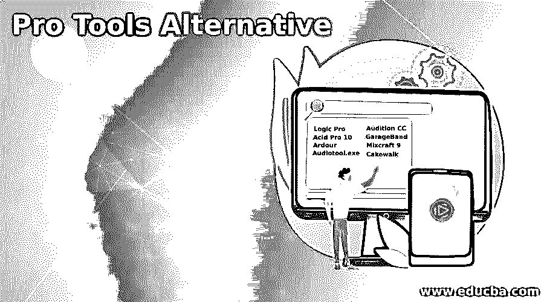

# 专业工具替代方案

> 原文：<https://www.educba.com/pro-tools-alternative/>

## 专业工具简介

以下文章提供了 Pro Tools 替代方案的概述。Pro Tools 是一个有效、强大和常见的 DAW，但不是音频应用程序世界的全部。如果出于某种目的的专业工具不符合您的标准，还有一些其他的选择。这些其他音频平台中的一些是可访问的，一些具有有趣和特殊的功能。

### 不同的 Pro 工具备选方案

下面给出了不同的 Pro Tools 备选方案:

<small>网页开发、编程语言、软件测试&其他</small>

#### 1.Logic Pro

Logic Pro 是一款强大、全面的音乐应用程序，拥有创建专业音乐作品的所有必要资源。音频和 MIDI 片段可以被录制、编辑、排列，以添加高质量的结果，立体声和立体声混合音乐，并将最终的混音导出为多种交付格式。您可以使用 Logic Pro 创建各种项目，包括简单的歌曲和复杂的合奏。Logic Pro 允许您调整软件以适应您的工作方法。使用 USB 剪贴板或其他 MIDI 控制器来播放和录制 Logic Pro 附带的软件设备。也可以播放和录制第三方的软件乐器。

#### 2.酸性 Pro 10

对于今天的创作者和艺术家来说，ACID Pro 10 是艺术之光。这是一个坚实的、功能齐全的 DAW，在它圆滑而复杂的界面后面，复杂的工具和简单的工作流并排放置。64 bits power 为最困难的项目提供了最简单的方法，尽管数百种乐器和效果结合起来为成千上万个酸化循环的音乐创作创造了最终的曙光。20 年前，ACID 描述了基于循环的音乐的发展，现在 ACID Pro 10 正在为今天的创新音乐家完善它。

#### 3.热情

Ardour 是一个硬盘录像机和数字音频工作站的应用。Linux、OS X 和 FreeBSD 正在运行。保罗·戴维斯是他的主要作者，他也是杰克音频连接套件的负责人。热情的目的是提供一个专业的数字音频工作站软件。Ardour 是自由软件，可以在 GNU 通用公共许可证下获得。通过 Ardour.org 网站下载的人将被收取下载热情费。无需付费，整个源代码和完整的 GNU/Linux 版本仍然可以下载，但是 OSX 二进制不具备加载或保存所有插件设置的能力。

#### 4.Audiotool.exe

佳能图像网关是佳能公司创建的视频播客实用程序。AudioTool.exe 是一个可执行文件。通常，该计划措施约。8.1 MB。的。exe 文件扩展名显示可以执行的文件。在某些情况下，机器可能会被可执行文件损坏。请参阅以下内容，以确定您是否需要从设备中删除 AudioTool.exe，或者它是否是合法的 Windows 操作系统文件或稳定下载。

#### 5.试听 CC

来自 Adobe Audition 的软件是一个全数字音频记录器、混音器和 Windows 编辑器多轨。当与 Windows 声卡一起使用时，该软件为用户提供了完整的数字录音棚体验。借助 Koenig Solutions 提供的这款跨平台音频编辑器 Adobe Audition CC training，您可以加速音频、音乐、图像和游戏的开发。Audition 是一种多轨录音和数字音频编辑技术，它巧妙地与同一软件集成在一起。

此 Adobe Audition 课程是专为希望使用 Adobe Audition 学习音乐作曲和制作的专业人士设计的。您可以学习使用不同的工具和高级功能来创建令人印象深刻的音频，包括声音消除器，它可以消除音频文件中的噪音。

#### 6.GarageBand

GarageBand 是苹果众多用户体验的基石，预装在超过一百万台 MAC 电脑、iPads 和 iPhones 上。然而，并不是每个人都知道所有的技能。这个应用程序将消除对昂贵的音频设备或为音乐家预订昂贵的工作室时间的需求。简化的程序设计和编辑使浏览几个功能变得简单。它还提供了一些工具和声音，但并没有克服用户的不熟悉。

#### 7.Mixcraft 9

Mixcraft 9 是一款非常简单但坚固、性价比高的 DAW。该应用程序允许您通过添加虚拟乐器的效果、声音和音乐来捕捉和混音音频。

#### 8.蛋糕漫步

Cakewalk 是一个 DAW(数字音频工作站)，一个用于 windows 计算机的专门软件，最初被称为 SONAR，直到被 BandLab 收购。Cakewalk 更适合高级音乐录制和母带制作，不像 BandLab 这样的网络和移动应用。它的功能包括无限的音轨支持，MIDI 录音和编辑工具以及单音轨效果。

### 推荐文章

这是一个专业工具替代指南。为了更好地理解，我们在这里讨论简介和不同的 pro tools 替代方案。您也可以看看以下文章，了解更多信息–

1.  [谷歌地图替代品](https://www.educba.com/google-maps-alternatives/)
2.  [Dropbox 替代品](https://www.educba.com/dropbox-alternatives/)
3.  [Zabbix 替代方案](https://www.educba.com/zabbix-alternative/)
4.  [Freshdesk 替代品](https://www.educba.com/freshdesk-alternatives/)

