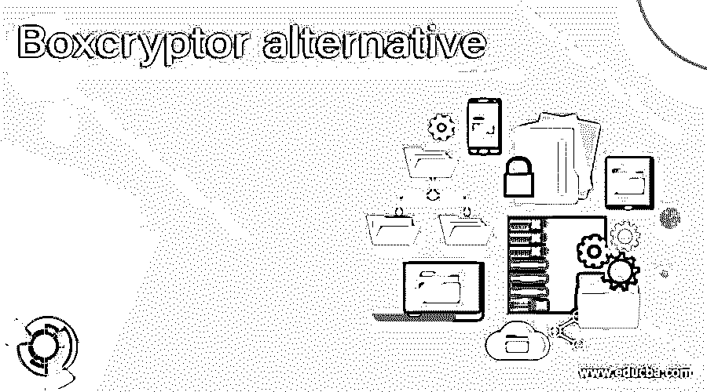

# Boxcryptor 替代方案

> 原文：<https://www.educba.com/boxcryptor-alternative/>

## Boxcryptor 替代产品简介

Boxcryptor 通过本地加密文件，为云存储提供了一个额外的用户友好的安全层。由于 Boxcryptor 从一开始就针对云进行了优化，因此可以对所有文件进行加密，并且可以共享访问权限。因此，每个文件都被加密，而不考虑其他文件。此外，还支持云存储的典型功能，如文件历史记录或选择性同步。Boxcryptor 不是同步客户端，所以 Boxcryptor 不会将你的文件同步到 Windows 或 MacOS 上的云端。您的云提供商也对此负责。您必须在设备上安装云提供商的软件。使用下面的精选列表来比较贵公司或组织的 Boxcryptor 备选方案。2021 年，SourceForge 将 Boxcryptor 列为最佳替代方案。为了对您的业务做出明智的决策，请比较 Boxcryptor 的功能、用户评论、评级、定价等等。

### Boxcryptor 的替代品

让我们来看看 Boxcryptor 的替代品

<small>网页开发、编程语言、软件测试&其他</small>

#### 1.特雷索里特

同步和共享端到端加密文件 Tresorit 是云的超安全位置，可以在任何地方轻松保存、同步和共享文件。通过灵活的权限系统，Tresorit 实现了端到端加密，防止内部数据违规或黑客从您的文件中删除。在微软 Azure 数据中心，所有数据都安全地存储在欧洲的 GDPR 下。Tresorit 有助于保护您的团队成员与共享团队文件夹的合作。管理哪些人可以添加、编辑或仅查看您的共享信息。团队成员可以安全地使用他们的浏览器、桌面和移动设备来访问更新的文件。

#### 2.网络安全管理软件产品

网络安全管理软件产品备份为服务器、应用程序、数据库、工作站和 Microsoft 365 数据提供保护。云存储包含在 30 个全球数据中心之一，允许您选择的硬件维护您的备份的本地副本。灵活的恢复选项包括裸机恢复、虚拟恢复和文件/文件夹恢复。通过从单一控制面板管理所有客户及其设备和数据类型的备份，减少管理时间。自动检索测试允许屏幕截图备份监控。

#### 3.gdpr365 天

GDPR365 是一款基于云的 GDPR 合规软件，可满足所有 GDPR 要求。因为我们将 GDPR 分为七个步骤，所以您可以监控状态和编辑报告，并管理您的合规之旅。GDPR365 是您必须遵守的软件，从 DPO 的名称到主题访问请求和数据侵权的管理。立即开始 14 天的免费试用。

#### 4.趋势科技

趋势科技 Endpoint Encryption 可加密各种设备上的数据，如 PC 和 MAC、笔记本电脑 USB 驱动器和台式机设备等。该解决方案作为单独的代理提供，结合了企业的全磁盘、文件/文件夹和可移动介质加密，以避免对私有数据的未授权访问和使用。您可以使用同一个终端防护控制台和其他趋势科技安全产品来全面管理您的用户。使用端点加密代理，确保您的数据在移动计算机和组织需求变化时得到保护。

#### 5.索福思

越来越多的远程操作使得保护计算机和数据变得前所未有的重要。防止设备丢失或被盗的第一道重要防线是全磁盘加密，因为每天都有大量的笔记本电脑丢失、被盗或放错地方。Windows BitLocker 和 macOS FileVault 用于保护 Sophos Central 设备加密中的设备和数据。

#### 6.质子机

在瑞士，质子邮件是集成的，我们在瑞士的服务器位于。因此，所有用户数据都受到瑞士严格的隐私法的保护。借助端到端加密，所有电子邮件都会自动得到保护。这意味着我们甚至不能破译和阅读你的电子邮件。因此，您不能与第三方共享您的加密电子邮件。创建安全电子邮件帐户不需要个人数据。默认情况下，我们不会维护与您的匿名电子邮件帐户相关联的 IP 日志。

#### 7.维纳菲

保护您机器的所有身份。您是否希望保护您公司的 TLS 密钥和证书、SSH 密钥、代码签名密钥或用户证书？了解如何保护这些不断变化的新机器身份。提前应对故障并提高开发运维的安全性。信任保护平台提供公司解决方案，使您能够在整个公司范围内查看、智能化和自动化机器身份。

#### 8.数据块

中央管理服务器的软件。使用 SafeConsole 中央管理服务器软件，您将立即获得对所有加密 usb 闪存驱动器和笔记本电脑的全面和精细控制:符合对 USB 存储使用的完全控制和审计合规性。保持 USB 存储设备的工作效率，而没有数据泄露、恶意软件或违规的风险。可作为现场软件使用，也可作为在全球位置托管 DataLocker 的云服务使用。

### 推荐文章

这是 Boxcryptor 替代方案的指南。这里我们讨论 Boxcryptor 的各种替代方案。您可以根据自己的需求选择任何一种。您也可以阅读以下文章，了解更多信息——

1.  [记录替代方案](https://www.educba.com/logstash-alternatives/)
2.  [Dropbox 替代品](https://www.educba.com/dropbox-alternatives/)
3.  [Spiceworks 替代方案](https://www.educba.com/spiceworks-alternative/)
4.  [Zendesk 替代方案](https://www.educba.com/zendesk-alternative/)

