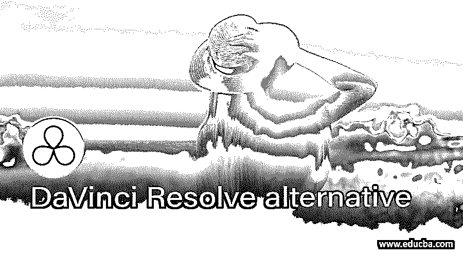

# 达芬奇解决方案

> 原文：<https://www.educba.com/davinci-resolve-alternative/>

## 达芬奇解决方案简介

DaVinci Resolve 是一个创新的 64 位视频整理平台，它提供了一个带有多用途编辑器和颜色校正工具的协作工作流程。32 位浮点图像处理系统使用特殊的 YRGB 分级颜色空间。“解决”使用基于节点的处理，其中颜色校正、电动车窗和影响可以应用于每个节点。上下文响应编辑软件和几个人能够在同一时间框架内一起工作。它高度可扩展，支持多达 8 个 GPU，并为所有分辨率提供高效的版本控制、整理和分发选项。它可以与 Final Cut Pro X、Media Composer 和 Premiere Pro CC 共享序列和往返，而 VFX 镜头可以使用 Fusion 和 After Effects CC 进行拍摄和完成。在本主题中，我们将了解达芬奇解决方案。

### 达芬奇解决方案的替代方案

让我们来看看达芬奇的决心

<small>网页开发、编程语言、软件测试&其他</small>

#### 1\. Crow drawx6

有标准的矢量编辑工具，以及直观的调色板系统和一个有趣的矢量整形工具集，允许基本矢量被扭曲，以更有机地形成。对象样式也可以应用于亚麻制品上的任何特征，包括文本。其他吸引人的地方包括绘制页面布局占位符材料的能力、内置的应用程序脚本支持以及使用位图作品填充对象的高级填充选项。有趣的一点是，微软 Publisher 文件被 Corel Draw 愉快地打开，这可能是有客户提交艺术品的艺术家最大的时间节省。

#### 2.SVG-Edit

有一些在线编辑器可以做到这一点，比如 Atobe Illustrator，让你快速输出 SVG，或者编辑当前的 SVG 文件。可缩放矢量图形(SVG)是一种开放格式，使您能够以编程方式复制矢量图形。它完全基于 HTML5、CSS3 和 JavaScript，没有在服务器上进行任何处理。

#### 3.亲和力设计者

Affinity Designer 为新设计师和老商人提供了一个时尚、直观的用户界面，允许用户在他们和 Illustrator 之间进行无缝切换。初露头角的设计师会发现结构清晰且可用的工具，Adobe 的用户会对默认的工具栏和键盘快捷键感到舒适。对于插画师或 Photoshop 设计师来说，学习曲线是一条温和的道路。Affinity Designer 附带了用于矢量和像素的设计和形式的所有基本工具。

#### 4.金刚鹦鹉

Macaw 是一个由设计师和开发人员共同设计的专业 web 开发平台，它已经成为第一个将图像编辑器与强大的设计代码引擎相结合的 web 设计师。界面流畅直观。通过 Kickstarter 资助 Macaw 的开发团队，你可以使用网络作为你的媒体来构建响应式的网页设计。这是为了轻松构建线框、原型和模型，并通过静态 CSS、HTML 和 JavaScript 快速提供您的 web 设计。

#### 5.喧嚣炒作 2.5

响应式网页设计现在是网络发展的一个趋势，它允许设计者创建一个可以在各种设备和屏幕尺寸上适当缩放的网页。到目前为止，对于包含动画内容的响应式设计，还没有找到好的解决方案。Tumult Hype 2.5 的灵活布局选项允许用户在调整纸张大小时监控动画元素的位置和缩放。

#### 6.像素网格

虽然没有软件，但它可以作为照片编辑器轻松操作，并为开始图片提供了很好的选项，如照片管理器和一些高级工具。Mac Pixelmator 照片编辑软件是全面的，负担得起的软件。该软件包括一系列简单和高级的编辑工具、共享和文件兼容性。各种各样的编辑工具，都可以在软件的干净界面上获得。Pixelmator 您可以通过在流动屏幕之间切换来为应用程序配置一个黑色的工作空间。

#### 7.Corel 的 AfterShot Pro 2

Corel 的 AfterShot Pro 2 可以让您专业地改善和维护您的图像。该应用程序使用 64 位输出，比其他原始图片处理应用程序快 4 倍。释放 RAW 图片拍摄灵活性的最佳方式是 afterShot Pro 2。AfterShot Pro 2 是一款 RAW 转换器、照片编辑器和完整的照片管理应用程序，具有无与伦比的速度和功能以及全新的 GUI。这种高速相机管理器和非破坏性照片编辑器的最新版本提供了先进的图像适应和 RAWs 的快速转换和管理。

#### 8.黑魔法融合

Fusion 7 是一个 64 位的视觉效果和移动图形套件，新所有者 Blackmagic Design 最近作为免费软件推出。该软件最初由 Eyeon 开发，多年来一直是全球 VFX 工作室的支柱。Fusion 7 具有无限的 3D 工作空间和基于节点的处理流程，可用于快速开发无限效果和高级 3D 合成、绘画、旋转镜、重定时、稳定和字幕工具。

### 推荐文章

这是达芬奇解决方案的指南。在这里，我们将详细讨论什么是 DaVinci Resolve 及其特性。我们希望这篇文章对您有所帮助。您也可以阅读以下文章，了解更多信息——

1.  [鲁弗斯的替代品](https://www.educba.com/rufus-alternatives/)
2.  [Spiceworks 替代方案](https://www.educba.com/spiceworks-alternative/)
3.  [Dropbox 替代品](https://www.educba.com/dropbox-alternatives/)
4.  [燃烧基替代品](https://www.educba.com/firebase-alternatives/)

