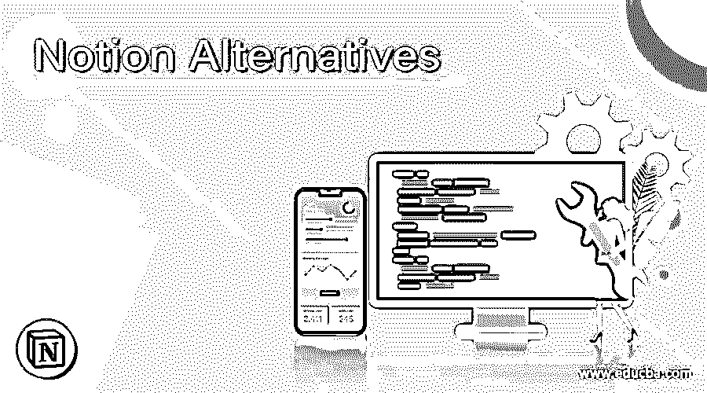

# 替代概念

> 原文：<https://www.educba.com/notion-alternatives/>

## 概念选择简介

很少有应用程序像“概念”一样灵活和高效无论您喜欢简化的笔记记录、处理所有任务，还是有效地处理数据库，这种一体化的工作空间都能泰然自若地满足您的要求。然而，该平台也有一些缺点，如安静和不可靠的离线功能。有限的存储空间使得免费增值版即使是个人使用也非常基本——更不用说专业要求了。关于高级版本，它从每月 4 美元开始，到每月 20 美元，这不符合所有人的预算。这就是为什么你们中的一些人想要探索 2020 年的最佳概念来填补空白。

### 可选概念列表

让我们来看看替代方案的概念

<small>网页开发、编程语言、软件测试&其他</small>

#### 1.嘲弄

如果你想让出色的合作成为你的优先事项，看看“妙语”就知道了文档、聊天、标签和幻灯片的独特集成使它从市场上的许多应用程序中脱颖而出。你可以和你的队友保持完美的和谐，享受在一个地方和他们一起工作的乐趣。因此，如果你对这个概念的协作特性不感兴趣，你应该毫不犹豫地选择 Quip。

#### 2.OneNote

尽管 Microsoft 的 OneNote 看起来并不能完美地替代 concept，但它不仅具有方便的功能，还能帮助您高效地做笔记，并与您的团队无缝协作。你可以使用这个应用程序来捕捉和组织各种格式的想法。当你想快速访问一些经常使用的笔记时，锁定功能非常有用。而且你的笔记用漂亮的便笺条会看起来更令人愉快，而且是同步的。至于笔记的功效，在灵活性和自定义方面，OneNote“更好一些”。如果“概念”不能满足您的笔记要求，OneNote 应该是您更好的选择。OneNote 最喜欢的功能是它可以在不同的设备上使用。

#### 3.泰特拉

Tettra 是一个强大的内部知识管理系统，可以取代任何团队的概念，无论团队规模大小。它可以帮助您实现巧妙的工作流程，以便您可以快速回答新团队成员的问题。有了这个功能，登机程序变得超级简单。该应用程序支持集成第三方应用程序。无论你是使用 Dropbox 这样的云存储服务，还是在 GitHub 这样的服务中托管你的代码，你都可以在一个位置添加你的团队的所有现有信息。

#### 幻灯片 4

如果这个想法和 Slack 有个孩子，感觉就像 Slite。该应用程序将这两种工具结合在一起。虽然 Slack 启发了它的用户界面，但其功能更接近于概念。你所有的文档，比如 Slack，都是按频道排序的。这些频道可以是公共的，也可以是私有的，但是你可以随心所欲地在每个频道上保存大量的文档。Slite 还提供了比 concept 更好的准确性。已经开发了太多的工具，使得笔记和文档有点让人不知所措。

#### 5.Evernote

在通用性和生产力方面，Evernote 可以与 idea 相媲美，甚至在某些方面超过它。这就是为什么它可能是后者最丰富的替代品。该应用程序可以以各种格式向文本、图片、pdf、照片、视频甚至网络剪报发出通知。所以，你想到什么并不重要，你甚至可以在路上用仪器捕捉它。

#### 6.努克利诺

选择“Nuclino”作为 concept 的替代方案的原因是，它对于整个团队以及极简主义协作 wiki 来说都非常有效。因此，无论您是需要一个简单的工具来捕捉笔记、管理作品还是自己处理文档，它都可以毫无障碍地满足您的需求。我也喜欢看到这与概念非常相似，让用户在这里有宾至如归的感觉。

#### 7.乔普林

寻找概念的最佳免费解决方案？如果答案是肯定的，“乔普林”可能是一个明智的选择。不可否认，开源的笔记和任务管理应用不如其著名的竞争对手通用。然而，它有很好的工具，可以极大地改善你的笔记和任务管理。你也不需要一分钱。提供了一个非常方便的 web clipper 来帮助您轻松保存浏览器的网站和截图。在你广泛的研究中，它会发挥作用。像概念一样，Evernote 也可以通过 ENEX 文件导入数据，包括笔记、标签、资源(连接的文件)和笔记元数据，如作者、地理位置。

### 结论

在本文中，我们看到了概念的各种替代方案。您可以根据自己的需求选择任何一种。我们希望这篇文章对您有所帮助。

### 推荐文章

这是一个观念选择的指南。在这里，我们讨论了引言，带有需求的可选概念列表。您也可以看看以下文章，了解更多信息–

1.  [站长备选方案](https://www.educba.com/adsense-alternatives/)
2.  [打嗝套件替代品](https://www.educba.com/burp-suite-alternatives/)
3.  [VMware 替代产品](https://www.educba.com/vmware-alternatives/)
4.  [Dreamweaver 替代品](https://www.educba.com/dreamweaver-alternatives/)

