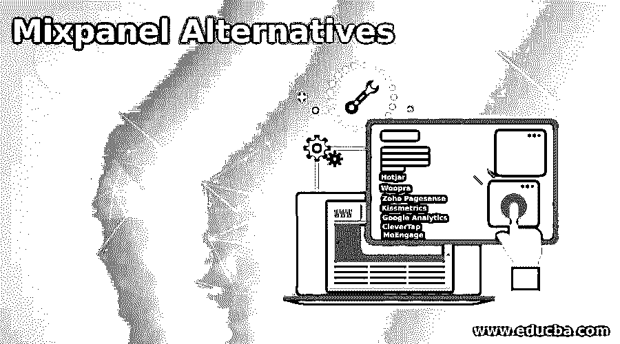

# 混合面板替代品

> 原文：<https://www.educba.com/mixpanel-alternatives/>

## 混合面板替代品介绍

Mixpanel 是一个网站和移动应用行为分析平台，帮助你了解用户如何以及何时与你的产品互动。为了分析、衡量和改善客户体验，Mixpanel 为在线平台提供了一个平台，该平台提供了对统计数据、趋势、事件跟踪和其他关键数据的全面使用，以做出更好的决策。Mixpanel 是一个优秀的工具，但肯定不是唯一的一个。如果 Mixpanel 对你来说有点沉重，如果它不符合你的要求，或者如果你只是想看看外面的其他东西，那么我们已经涵盖了你！

### Mixpanel 替代品的 7 大替代品

让我们来看看 Mixpanel 的替代品。

<small>网页开发、编程语言、软件测试&其他</small>

#### 1.热罐

Hotjar 是 Mixapnel 的一个很好的替代品，是一个广泛的用户分析和优化转化率的工具。Hotjar 促进了用户与您的网站或应用程序之间的交互，并优化了客户体验。热图直观地概述了用户的点击、磁带和显示行为。在您的网站/应用程序上。你也可以看到访问者的记录，并看到你的用户在何时何地被卡住。拥有这些数据对优化你的转化漏斗是很重要的，因为你可以看到在哪里，什么时候，可以做些什么来防止它。你可以通过调查、投票和直接向访问者提问的反馈形式让他们参与到你的网站中来。

#### 2.乌拉巴

Woopra 提供端到端的客户旅行分析，以跟踪、分析和优化客户旅行的每一步。Woopra 分析各种接触点，研究访问者如何浏览你的网站、营销活动和产品，并详细报告。Woopra 的个人资料是一个很棒的功能，它们提供了与你的网站互动、付款、打开电子邮件或使用重要产品功能的人的信息。您可以看到您的最后一次访问，您的网页，社交媒体档案和更多！每当您的网站访问者即将离开或被困，您可以触发并帮助实时信息。用户可以自动触发电子邮件或发布时差或更新用户驱动的 Salesforce 字段。

#### 3.Zoho Pagesense

Zoho Pagesense 是一个优化转化率的平台，也是一个很好的选择，它是我们名单的最后一个。该页面允许您根据客户和数据使用情况跟踪、分析和优化您的网站。用户可以创建业务目标来监控关键指标，并利用漏斗来查看哪些页面在您的网站上显著减少。热图提供了对用户最常用功能和滚动模式的洞察，而日志记录则有助于提供关于单个客户行为的数据。你也可以在 Zoho Pagesense 中创建不同的登录页面，这样你就可以测试不同的版本 A/B，看看什么最能引起你的观众的共鸣。

#### 4.接吻度量

Kissmetrics 提供了关于访问者如何与您的网站互动，然后参与高度集中的电子邮件和脸书活动的深刻见解。Kissmetrics 凭借强大的客户细分和精确的目标定位，绝不会让访客从你的销售漏斗中溜走。为了确保客户参与其中，您可以触发行为并自动添加电子邮件。还可以衡量电子邮件活动的影响，以了解推动销售的策略。

#### 5.谷歌分析

谷歌分析是最受欢迎的网站分析工具，可以从我们的列表中自由选择。大多数人的首选工具是谷歌分析，这是一个流量分析工具，市场份额为 85%，占所有网站的 55.5%。为了更好地了解你的网站和应用程序用户，并评估他们的营销和转化活动，谷歌分析为公司提供关键数据。

#### 6.CleverTap

CleverTap 是唯一集成的留存分析和参与平台。创建更有意义的客户关系，无论您刚刚推出一个应用程序还是数百万个 mau，以增加客户保留率和终身价值。有了 CleverTap，用户可以省去整合和维护多个平台的需求和成本，从而在手机和网站上分析、细分用户并与之互动。

#### 7.莫恩加格

MoEngage 是一款智能营销解决方案，旨在帮助您构建、查看和实施无处不在的生命周期活动。其理念是，无论你使用何种渠道，都要主动吸引用户，并构建一个营销工作流程，帮助你在购物时确定顾客的旅程。MoEngage 有一个人工智能算法，可以为您的客户提供个性化的建议，以增加他们的承诺，并最终增加他们的收入。

### 推荐文章

这是混合面板替代品的指南。在这里，我们还讨论了 mixpanel 替代品的介绍和 7 大替代品，并给出了解释。您也可以看看以下文章，了解更多信息–

1.  [站长备选方案](https://www.educba.com/adsense-alternatives/)
2.  [打嗝套件替代品](https://www.educba.com/burp-suite-alternatives/)
3.  [VMware 替代产品](https://www.educba.com/vmware-alternatives/)
4.  [Dreamweaver 替代品](https://www.educba.com/dreamweaver-alternatives/)

