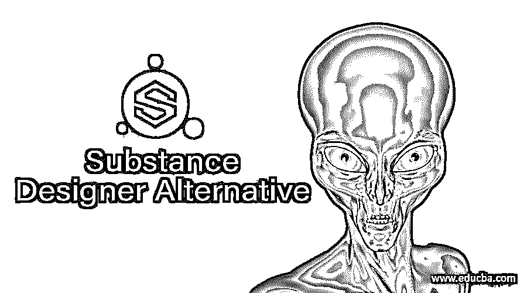

# 物质设计替代方案

> 原文：<https://www.educba.com/substance-designer-alternative/>

## 物质设计替代方案简介

在这篇文章中，我们将了解物质设计替代。探索需要新应用功能或尝试不同解决方案的消费者的最佳选择。在寻找设计者的替代品时，物质设计者的使用便利性和可靠性也是重要的考虑因素。我们编制了一个解决方案列表，评论者将其选为最佳全球选择，包括 3D Coat、Houdini、Maya 和 KeyShot，以及设计物质的竞赛。

### 物质设计者的替代品

让我们来看看物质设计师的替代方案。

<small>网页开发、编程语言、软件测试&其他</small>

#### 1.乌丹尼

Side Effects Software 是一家有 25 年历史的公司，总部设在多伦多，是 3D 动画和特效应用软件。胡迪尼是为 3D 动画艺术家和 VFX 电影、电视、电脑游戏和虚拟现实艺术家开发的。胡迪尼将这些领域联合成一个强大的平台。胡迪尼是为 3D 动画艺术家和 VFX 电影、电视、电脑游戏和虚拟现实艺术家开发的。胡迪尼将这些世界聚集在一个强大的论坛上。

#### 2.按键快照

开发 KeyShot 是为了允许动画和 3D 渲染。它可以快速实现材质和照明，并提供最精确的材质外观和真实世界的照明，所有这些都在一个强大的界面中，该界面提供了高级功能和实时查看所有变化的能力。所以，是什么？这对你有什么帮助？KeyShot 非常容易学习和使用，简单的基于工作流的界面具有所有高级功能，最完善的 3D 渲染器可以在几分钟内产生摄影效果。

#### 3.3ds max

3ds Max 是一个 3D 平台、动画和交互式计算机图形应用程序。它是计算机图形行业中最受欢迎的程序之一，以其强大的 3D 工具集而闻名。3ds Max 是最著名的游戏设计师、电视商业工作室和建筑师之一，属于 Autodesk，也是运行应用程序的公司。比如 Maya 和 AutoCAD。3Ds Max 还用于建模、制作动画和重新创建具有照片级真实角色的建筑物和其他对象。当谈到 3ds 的模拟时，Max 在速度和简单性方面是无与伦比的。

#### 4.搅拌机

Blender 是一个开源的免费 3D 创意套件，支持几乎所有的 3D 开发方面。固体纹理，动画，粘贴，照明，和其他一些三维建筑技术也可用于建模的坚实基础。如果你只想处理静态模型或进入动画领域，这个应用程序是完美的。Blender software 是一个非盈利组织，成立于 2002 年，是以 Blender 基金会为背景成立的。2007 年见证了分拆 Blender Institute 的成立，现在是持续创造和创新企业的家园。

#### 5.布鲁什

ZBrush 是一个最先进的 3D 雕刻应用程序。ZBrush 模仿传统的雕塑技术；所有这些都是在机器上数字化完成的，这与其他 3D 工具不同。ZBrush sculpture 类似于一个数字粘土球的作品，创建它就像你用手工作一样。ZBrush 的雕塑软件允许大量的艺术自由。艺术家不仅可以使用 ZBrush 制作有机和更详细的模型，而且可以比 Maya 或 Max 3ds 等其他应用程序更快地完成成品。

#### 6.一致

Unity 于 2005 年 6 月在苹果公司的全球开发者大会上首次亮相，作为 MacOS X 独有的游戏引擎，它是由 Unity Technologies 开发的多平台游戏引擎。到 2018 年，该引擎增加了超过 25 个平台。该引擎可用于生成 3D、2D、虚拟和增强现实游戏、模拟和其他体验。视频游戏之外的行业，如电影、汽车、建筑、工程和建筑，都采用了这种引擎。

#### 7. Lumion

Lumion 是一个高效、易用的建筑可视化工具，允许任何人构建 3D 环境，然后创建可爱的图片、视频和现场表演。这是在几分钟内收集 3D 模型并创建场景的最简单方法。这一章将帮助你更好地理解 Lumion，你将快速开始使用 Lumion。

#### 8.孪生运动

虚幻游戏引擎开发商 Epic Games 最近收购了 Twinmotion，这是一个高品质、高质量的 3D 成像、标准和 360 VR 视频制作平台。它提供了一个简单直观的图形用户界面，由虚幻引擎的力量支持，以帮助建筑师，建筑，城市植物和景观专业人士更好地交流他们的设计。

### 推荐文章

这是一个物质设计者替代指南。在这里，我们将详细讨论 Substance Designer 的各种替代方案。您可以根据自己的需求选择任何一种。您也可以看看以下文章，了解更多信息–

1.  [建筑设计软件](https://www.educba.com/architectural-design-software/)
2.  [建筑设计类型](https://www.educba.com/architecture-design-types/)
3.  [3ds Max 室内设计](https://www.educba.com/3ds-max-interior-design/)
4.  [Revit 备选方案](https://www.educba.com/revit-alternative/)

