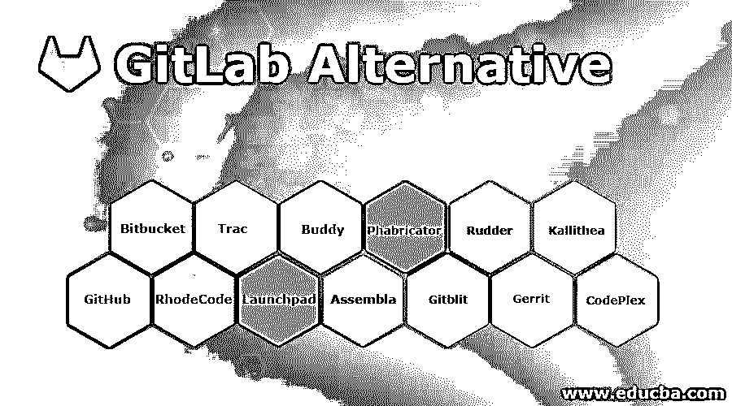

# GitLab 替代方案

> 原文：<https://www.educba.com/gitlab-alternative/>

## GitLab 替代方案介绍

GitLab 的替代方案克服了这些缺点，并根据需求进行部署。用户不必通过终端仿真器或者有时使用 GitLab 的图形用户界面来执行任何程序。它允许执行每个管理任务来完成浏览器活动。从任何远程位置管理任何版本的控制系统的需求可以首选 GitLab 工具。对于操作只使用有限系统资源的机器的人来说，这应该很有用。它不需要安装任何棘手的软件解决方案，用户有多余的机会来节省本地存储空间。对于希望从平板电脑或上网本处理集体修订矩阵的用户来说，它更有吸引力。

### GitLab 的替代品

下一节解释了 GitLab 的一些替代方案。部署它们是为了克服 GitLab 的缺点，比如字体渲染问题、支付方式、web 浏览器速度慢等等。

<small>网页开发、编程语言、软件测试&其他</small>

#### 1.GitHub

它是跟踪协议的一个版本，有一个 Git 托管服务。它以其计算机代码库而闻名。它吸引了许多开发人员将其代码开源并公开。使用 GitHub，任何用户都可以通过派生一个项目来提交 pull 请求。它是直观的、可用的、可回收的代码块，具有用户友好的用户界面。它已经整合了轨道上的问题，但它是微软专有和拥有的。

*   开源
*   可回收代码
*   方便用户的

#### 2\. Bitbucket

对于 Git 管理来说，这是一个很有吸引力的工具。该软件可以免费使用，也可以在需要额外的 bitbucket 服务器时转换为付费订阅。它可以免费扩展为许多无限的私有库。

*   开源。
*   原生于 Mac 和 Window。
*   仅限五名用户。

#### 3.罗德码

它具有高安全性，可以作为开源软件使用，并且可以部署在自己的代码开发环境中。它以一种稳定的方式支持三个主要版本，如 Git、subversion 和 Mercurial，使用户能够进行和共享代码评审。代码评审也可以通过提交、投票规则、拉请求、更智能的评论和随机评审池来完成。它也可以与 AD 或 LDAP 集成。但是由于集中管理系统，升级选项和维护很复杂。

*   高度安全。
*   支持 Git、subversion 和 Mercurial。
*   LDAP 的集成。
*   班级许可制度。

#### 4.期末租金调整条款租赁协议（Terminal Rental Adjustment Clause 的缩写）

它可以确保团队成员在项目、工作量、票据、评审和时间表方面的状态。它可以使具有集成目的的项目受益，并且可以添加颠覆来增强项目中生产力的功效和有效性。

*   结构简单。
*   有效整合到项目和团队中。
*   提高生产力。

#### 5.发射台

它有先进的错误跟踪选项和网络浏览器的翻译。它使用户能够做出更多的贡献，并显示关于 bug 的统计数据。

*   集成的内置机制和部署。
*   提供简单的语言翻译。

#### 6.好朋友

它在项目的生命周期中具有高度的集成性。它用于以一种简单的方法部署、创建和测试许多代码和项目。它可以通过一次推送从 Bitbucket、GitLab 和 GitHub 构建和传输代码。

*   持续部署和集成。
*   代码转移。

#### 7.安培拉

它能有效地消除问题和缺陷，改进管理开发过程。它可以为应用程序和其他系统适当地组织另一个更新版本。它可以保持和融合，使其更具可持续性。

*   有效的维基、文件共享和留言板。
*   修改的对比和比较。

#### 8.法布里克特法布里克特法布里克特法布里克特法布里克特法布里克特法布里克特法布里克特法布里克特法布里克特法布里克特法布里克

该工具可免费获得，并可主动更新，可在控制系统(如 SVN、Mercurial 和 Git)上备份主要的三个版本。它有适应性强的灵活业务策略和有组织的 bug 跟踪器。它支持管理、创建和评论 bug。

*   支持 SVN、Mercurial 和 Git。
*   复杂的配置系统。
*   有效的 Bug 跟踪器。

#### 9.吉特布利斯

该工具是一个纯 java 栈，可以作为管理、查看和服务 Git 存储库的开源工具。它被有效地开发为在喜欢处理集中存储库的最小规模团队中工作。

*   纯 Java 栈。
*   Git 仓库。

#### 10.方向舵

rudder 非常专注于持续集成和部署的生产。在不知道部署或自动化中的任何过程的情况下，可以通过接口操作代码。它不可能一蹴而就，过程繁琐复杂。它可以与 web 用户界面以及 CLI 和 API 集成。即使它有很多优点，但社区并没有扩展到其他人。

*   一次性安装。
*   使用内置库和编辑器模板开发。
*   小社区。

#### 11.格利塔

它使用插件和挂钩定制了项目策略，这使得工作流和定制的项目流更具配置性。但是定制是困难的。Gerrit 备份最佳用户认证，即使在最大的存储库，推动代码到头和主分支机构。

*   Bug 跟踪工具，如吉拉、詹金斯、哈德森和 Bugzilla。
*   用户界面高度集群化。
*   支持用户验证。

#### 12.Kallithea

该工具是用于管理源代码的免费软件。它支持:

*   Git 和 Mercurial。
*   开源。
*   小社区。

#### 13.代码综合体

它是为托管网站而开发的，并作为开源软件提供，在 CodePlex 上开发和部署新项目，以在全球范围内交换和共享观点。

*   项目的全球转移。
*   开源网站。

#### 14.弹簧圈

它用于 web 开发和版本控制的快速部署。

*   开源。
*   快速部署和开发。

#### 15.一套合作式软件开发管理系统

该工具是开源的，并且是在线托管的，开发者可以在这里与参与软件项目的社区进行协作和共享。

*   在线开源。
*   软件项目合作。

### 结论–git lab 替代方案

Gitweb，Kanbanize，Saltstack，Kanbanflow chisel，Eylean board，Flow-e，Heroku，Gitea，Deveo，SaltStack，窑，Beanstalk 也是 GitLab 的其他替代产品。所以根据用户的要求和分配的预算，用户可以选择自己的工具。

### 推荐文章

这是 GitLab 替代方案的指南。在这里，我们讨论介绍和它的顶级 GitLab 替代品，如 GitHub，Bitbucket，RhodeCode，Launchpad 等。您也可以浏览我们推荐的其他文章，了解更多信息——

1.  [什么是 Git 分支概述？](https://www.educba.com/what-is-git-branch/)
2.  [GIT 版本控制系统](https://www.educba.com/git-version-control-system/)
3.  [Git 生命周期的三个阶段以及工作流](https://www.educba.com/git-life-cycle/)
4.  [举例说明如何使用 GIT Cherry-pick？](https://www.educba.com/git-cherry-pick/)

