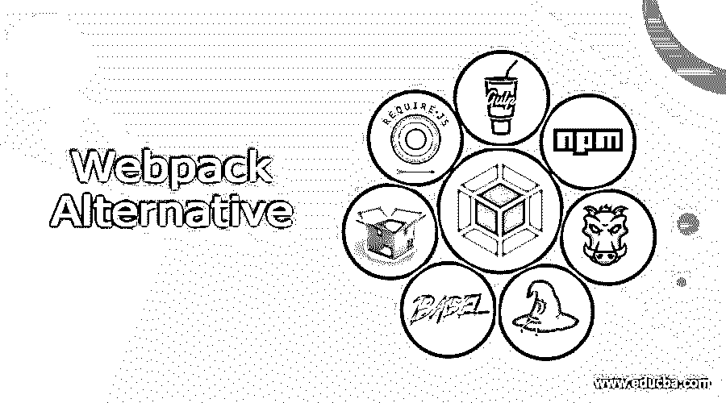

# 替代 web 包

> 原文：<https://www.educba.com/webpack-alternative/>

## Webpack 简介

Webpack 是一个主要为 JavaScript 设计的开源 JavaScript 模块。如果包含相应的加载器，它可以转换前端资产，如 HTML、CSS 和图像。Webpack 采用依赖关系和通用依赖关系图，允许 web 开发人员在他们的 web 应用程序开发过程中使用模块化方法。它还提供了内置的开发服务器，称为 webpack dev server，可以用作 HTTP 服务器，在开发时提供文件服务。Webpack 的一些替代产品提供了与 webpack 相同的功能。这些选项是吞咽、通天塔、包裹、浏览、咕哝、npm 和要求。在本文中，我们将讨论这些替代方案。

### Webpack 的 6 大备选方案

webpack 的替代品如下所示:

<small>网页开发、编程语言、软件测试&其他</small>

*   **Gulp:** Gulp 是 webpack 的最佳替代品。它是一个开源的 JavaScript 工具包，用于前端 web 开发中的流构建系统。它是一个基于 nom 和 node.js 的任务运行器，主要用于自动化以节省时间和重复 web 开发中涉及的某些任务，如缓存破坏、林挺、连接、缩小、单元测试、优化等。它使用代码超过配置的方法来定义任务，并依靠它的小型、单一用途的插件来执行它们。它允许用户编写自己的插件来定义自己的任务。
*   webpack 的另一个最佳替代方案是 Babel，它是开源的 JavaScript transcompiler。它用于将 ECMAScript 2015+代码转换为可以由旧的 JavaScript 引擎运行的向后兼容版本的 JavaScript。它是使用 JavaScript 编程语言最新特性的流行工具。开发人员使用这个称为 npm registry 的工具将他们的源代码转换成 web 浏览器能够处理的 JavaScript 版本。它将不受广泛支持的语法转换成向后兼容的版本。它还可以转换非标准的 JavaScript 语法，如 JSX。
*   **Parcel:** Parcel 是另一个 JavaScript 工具，它可以将任何类型的文件作为入口点。它利用现代多核处理器，利用工作进程并行编译您的 cod。它提高了初始构建的速度。它还有一个文件系统缓存，可以保存每个文件的编译结果，甚至可以用于后续的启动。Parcel 将单个条目资产作为输入，该资产可以是任何文件类型，如 JS、HTML、image、CSS 等。对资产进行解析，提取它们的依赖关系，并将它们转换成最终的编译形式。
*   BrowserifyBrowserify 是 webpack 的另一种替代方案，web pack 是一种开源 JavaScript 工具，它允许开发人员编写 node.js 样式的模块，这些模块可以在浏览器中编译使用。浏览器不需要 method，但是 node.js 需要。使用 browserify 用户可以编写使用所需的代码，就像在节点中使用它一样。它支持 windows、Linux 和 macOS 等操作系统。Browserify 是一个将 NPM 生态系统的许多资源从服务器转移到客户端的工具。它添加了 source.js 中使用的所有 require 模块及其依赖项的源代码，并将它们捆绑在 target.js 中。
*   这是一个 JavaScript 任务运行工具，可以自动执行诸如编译、林挺、单元测试和缩小等任务。为了运行文件中定义的定制任务，grunt 使用命令行界面。它支持操作系统，如 Windows、Linux 和 MacOS。Grunt 允许开发人员添加、修改和扩展定制任务，以满足他们的个人需求。这些任务中的每一个都有一组可由用户设置的配置选项。它能够将多个现有任务合并成一个任务或全新的功能。
*   **npm:** npm 代表节点包管理器。它是 JavaScript 编程语言的一个包管理器。它是一个名为 node.js 的 JavaScript 运行时环境的默认包管理器，由命令行客户端和一个公共和付费私有包的在线数据库组成。它允许用户使用和分发注册表中可用的 JavaScript 模块。在 npm 注册表中，包以通用 JS 格式存储，并包含 JSON 格式的元数据文件。nom 可以管理特定对象的本地依赖包以及全局安装的 JavaScript 工具。
*   **RequireJS:** RequireJS 是一个 JavaScript 库和文件加载器，管理 JavaScript 文件之间以及模块化编程中的依赖关系。它提高了代码的速度和质量。RequireJS 可以加载嵌套依赖项，并提供异步模块加载。它将模块合并并缩小到一个脚本中，以获得优化的体验。它能够从不同的模块收集 JavaScript 文件。它可以加载多个 JavaScript 文件。

### 推荐文章

这是 Webpack 替代方案的指南。在这里，我们还讨论了 webpack 的介绍和替代方案，并给出了解释。您也可以看看以下文章，了解更多信息–

1.  [Browserify vs Webpack](https://www.educba.com/browserify-vs-webpack/)
2.  [Rollup vs Webpack](https://www.educba.com/rollup-vs-webpack/)
3.  [CSS 加载器](https://www.educba.com/css-loader/)
4.  [React Native TypeScript](https://www.educba.com/react-native-typescript/)

