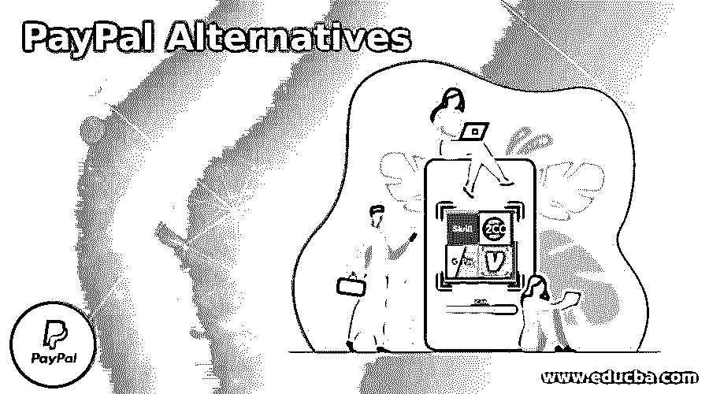

# PayPal 替代品

> 原文：<https://www.educba.com/paypal-alternatives/>

## PayPal 简介

以下文章提供了 PayPal 替代方案的概要。我们成为 PayPal 的客户已经快三年了，我们非常喜欢它。当我们开始在网上购物时，我们不知道如何从自己国家的人那里收钱，而 PayPal 使从外国购买这些东西的人那里收钱变得太容易了。由于 PayPal 和 RBI 在我的祖国(印度)的冲突，我们不能再像来自英国、美国和澳大利亚的其他人一样使用 PayPal。也有或多或少的功能与 PayPal 完全相同的地方。我们将列出一些我们在寻找其他收款方式时发现的最佳汇款地点。

### 贝宝的替代品

以下是 PayPal 的替代方案:

<small>网页开发、编程语言、软件测试&其他</small>

#### 1.尖叫吧

Skrill 是一种著名的在线支付方案的 PayPal 替代品。它通常被称为 MoneyBookers。这是一个基本的在线支付门户网站，用于个人和商业用途。它使我们能够连接账户，存储卡信息，使用我们的电子邮件地址和密码来发送和接收金钱。超过 40 多种货币和 200 多个国家在使用它。

#### 2.2 结账

2Checkout 被认为是 PayPal 的优秀替代品。这是国际通用的收费方式。预计交易和转会费会很高。它支持以 8 种支付形式、200 个国家和 30 种语言发送和接受付款。与其他选项相比，它提供了更多的便利，这也是大多数用户选择 2Checkout 支付方式进行在线购物的原因。

#### 3.德沃拉

Dwolla 是一种快速发展的支付解决方案，适用于完全可调的组织。这是 PayPal 的一种简单、划算、受欢迎的在线支付服务。它使我们能够使用互联网连接向我们的朋友和家人在线转账。它提供了使用互联网、钱包和银行向银行付款、银行向卖方付款、消费者向卖方付款以及卖方向买方付款的不同方式。在一个 API 订单中，Dwolla 可以向我们发送多达 5，000 笔付款。

#### 4.Google Pay

Google Pay 是一种简单、快捷、方便的在线支付转账模式，仅在美国和印度最常用。它是 PayPal 的最佳竞争对手之一。对于 iPhones 和 Android，它是可用的。它还可以在谷歌账户中作为虚拟钱包使用，存储信用卡和借记卡信息，以便随时随地通过互联网连接使用。它提供不同的支付处理解决方案，并与电子商务、CMS 页面、应用程序等网站商店无缝连接。

#### 5.布伦特里

Braintree 是 PayPal 的完美替代品。这是一个全球性的支付网络，支持各种支付方式。它是一个开发人员友好的应用程序，在超过 45 个国家使用，支持 130 多种货币的在线支付。优步、DropBox、GitHub 等大公司都使用这种支付解决方案。它帮助我们收集经常性的账单，也可以存储信用卡。Braintree 为 Python、iOS、Java、PHP 和 Android 提供了库。

#### 6.文莫

Venmo 是一款流行的移动支付应用，通常用于个人在线支付和银行转账。这是一个快速、安全的支付平台，使我们能够以安全的方式向我们的联系人汇款。这鼓励我们连接银行账户和借记卡号。现在大约有 6000 万人使用 Venmo 应用程序进行在线购物。

#### 7.种类

如果您在网上商店中搜索接受付款的 PayPal 解决方案，Stripe 是最佳选择。这是一家总部设在美国的公司&欢迎来自世界各地几个国家的建议。如果您来自 Stripe 运营列表之外的国家，您可以利用 Stripe Atlas 服务，帮助您进入美国企业，并为您开立银行账户。对于几乎所有的在线网站、电子商务商店，Stripe 都具有融合功能，但你更有可能找到一个插件或一种方法来将 Stripe 整合到你的网络商店或电子商务平台中。要接受一次性付款和年度付款，您将使用 Stripe。

#### 8.Instamojo

Instamojo 是印度用户的 PayPal 对等物。您可以使用@用户名或电子邮件地址轻松向另一位 Instamojo 消费者提交付款。同样，通过向某人提供您的用户名，您将获得付款。如果你喜欢卖数码产品或公用设施，你也可以建立一个网上商店。快两年了，我们一直在用 Instamojo，每天都在增长。

#### 9.轻率地

对印度和菲律宾的另一个著名服务是 Remitly。他们给出了惊人的折扣，其中一个的转会费不超过 1000 美元。通过信用卡或借记卡转账时，付款将立即生效，统一费率为 3.99 美元。

### 推荐文章

这是一个贝宝替代品指南。在这里，我们讨论贝宝的介绍和替代品，以便更好地理解。您也可以看看以下文章，了解更多信息–

1.  [Neo4j 替代品](https://www.educba.com/neo4j-alternatives/)
2.  [缩放选项](https://www.educba.com/zoom-alternatives/)
3.  [纳吉奥斯替代品](https://www.educba.com/nagios-alternatives/)
4.  [神童备选方案](https://www.educba.com/wunderlist-alternatives/)

