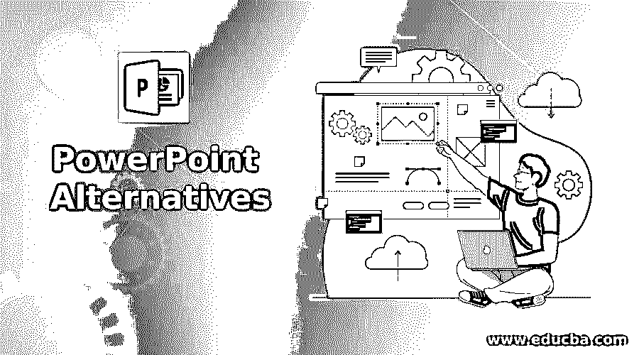

# PowerPoint 备选方案

> 原文：<https://www.educba.com/powerpoint-alternatives/>

## PowerPoint 简介

下面这篇文章提供了 PowerPoint 替代方案的概要。PowerPoint 是微软的演示软件。这个软件帮助你创建一个重要的信息图。然而，PowerPoint 有一定的限制，比如不能表现某些主题的复杂性，以及有限的集成信息图。然而，演示软件的可访问性只是你需要的一个因素。你将需要更多的功能软件来创建能持续吸引观众注意力的演示文稿。

一个理想的应用程序允许您以符合您预算的费用在各种设备上创造和展示惊人的性能。取代 PowerPoint 的最佳工具列表可以在这里找到。这个列表包含了商业和开源演示常用的工具。

<small>网页开发、编程语言、软件测试&其他</small>

### PowerPoint 备选列表

以下是 PowerPoint 备选列表:

#### 1.设计上限

DesignCap 是一个在线演示工具。它使每个人都能够以一种非常简单的方式创建专业的演示文稿，而不需要必要的技术技能。它提供了数千个不同主题的专业模板。这是自由设置颜色，位置，大小的对象，并使用其他有用的功能，如解组/组，图像编辑工具等。多种选择，随时随地在线和离线保存和共享设计。库存中有超过一百万张照片和图标。

#### 2.谷歌幻灯片

谷歌幻灯片是谷歌开发的演示应用程序。它允许编辑们实时地一起工作，并为共享演示文稿提供了许多选项。Google slides 提供了一百种字体、视频嵌入、显示主题、动画等等。各种各样的投资组合，插槽和其他预制介绍可以选择。

#### 3.Vyond

事实证明，在各个行业中，视频比大多数媒体更具吸引力和参与度。众所周知，视频通过大幅增加产品或服务的利润来增加人们的理解。而且，视频权力放在每个人手中的任何地方。该平台为任何人提供了创建强大、动态媒体所需的工具，无论他们的制作技能如何。您可以构建角色驱动的帐户或引人注目的数据可视化，吸引公众，并通过移动文本和图像之外的功能产生结果。

#### 4.Zoho Show

Zoho Show 也是一个幻灯片平台，但它的界面比 PowerPoint 更加简单、干净和容易。作为 PowerPoint 的替代产品，Zoho 为任何没有多少设计技能、不想花钱购买 PowerPoint 但需要创建简单幻灯片演示的初学者提供了一个免费版本。Zoho Show 易于使用，在几个选项卡中清晰地展示了最少的功能，因此所有用户都可以使用该平台，无论他们的经验水平如何。对于 25 人以下的团队，Zoho Show 是免费的。他们为大型团队提供每个用户 4-6 美元的高级计划。

#### 5.俳句甲板

俳句甲板是欧洲最富想象力的演示应用之一。如果一切都是为了视觉效果。它的目的是像 PowerPoint 一样制作幻灯片，但模板鼓励使用少量文本，以使用户能够在背景中拥有令人惊叹的图像。另外，Haiku Deck 有一个非常大的图书馆，里面有免费的模板和图片，这样你就不必开始构建一个精彩的演示了。在 Haiku Deck 中不支持并发编辑，但是可以与用户共享演示文稿，以便在不同时间进行查看和编辑。

#### 6.幻灯片日志

有时候你需要展示的不仅仅是你的幻灯片。您可能还需要其他文件，如视频或文档。SlideDog 软件允许你将所有文件收集到一个演示文稿中，而不是一个笨重的演示文稿，在那里你可以切换到不同的格式。用 SlideDog 界面设置播放列表很容易。但用户有时会报告在尝试切换不同媒体时出现技术问题。

#### 7.维斯梅

PowerPoint 的模板可以感觉到文本和图像的限制性空间非常明显。尝试重新安排各种元素，突然错位你的演示。Visme 是一个更加灵活的替代软件，可以个性化模板和添加各种视觉元素。即使没有设计经验，该平台也足够简单易用。它具有复杂的功能和数百个模板，可以同时产生出色的视觉效果。

#### 8.海库德克

Haiku Deck 提供了一种简单易行的方法来制作 iPad、web 或 iPhone 演示文稿。它通过使信息更简单和提供清晰的信息来促进最佳的演示实践。您的演示文稿将可以在云中与任何相关设备共享。超过 4000 万张免费的常用创意图片可供选择。

#### 9.亲切地

它通常用于创建演示文稿、简历、视频演示文稿、调查问卷、信息图表、电子海报、文件等。这个工具允许任何人创造难以置信的视觉故事，以创造更好的交流体验。

### 结论–PowerPoint 备选方案

在本文中，我们看到了 PowerPoint 的各种替代方案。您可以根据自己的需求选择任何一种。

### 推荐文章

这是 PowerPoint 替代品指南。为了更好地理解，我们在这里讨论 PowerPoint 备选方案的介绍和列表。您也可以看看以下文章，了解更多信息–

1.  [缩放选项](https://www.educba.com/zoom-alternatives/)
2.  [cPanel 备选方案](https://www.educba.com/cpanel-alternative/)
3.  [站长备选方案](https://www.educba.com/adsense-alternatives/)
4.  [MobaXterm 替代方案](https://www.educba.com/mobaxterm-alternative/)

