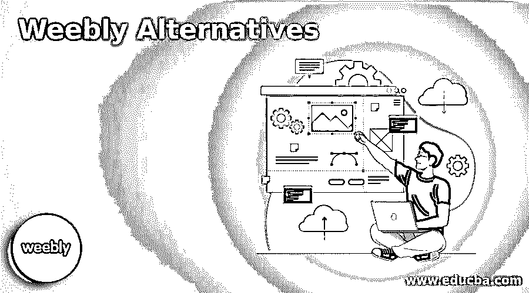

# Weebly 替代品

> 原文：<https://www.educba.com/weebly-alternatives/>

## Weebly 替代品介绍

下面的文章提供了 Weebly 替代品的概要。毫无疑问，Weebly 是一个成功的网站创建者。该应用程序的特点是精简的功能和基于服务的市场模板。但对所有人来说，Weebly 不是。其他人发现它使用起来不够方便。其他人不喜欢它的建筑。这篇文章是写给你的，如果你梦想用 Weebly 做一个网站，或者你有一个帐户，并且你想转换平台。我们多年来一直在寻找和研究网站建设者，并处于有利地位，以寻求最佳答案。我们对市场上最好的网站建设者进行了排名，但是你不一定拥有最好的平台。

### Weebly 替代品列表

以下是 Weebly 替代品列表:

<small>网页开发、编程语言、软件测试&其他</small>

#### 1.威克斯

说到网站建设者，Wix 树立了标杆。它提供了超过 510 个制作精美的模板选项和一个优雅的拖放编辑器。Wix 具有支持电子商务和博客等功能，面向服务型公司和多语言网站。借助设计辅助选项 Wix ADI，网站建设也变得更加简单。

Wix 使任何人都能创建 flash 网站。它鼓励从预先构建的内容、自定义内容的导入或两者的结合来开发网站。而 [Wix 强调](https://www.educba.com/what-is-wix/)它的易用性。然而，当涉及到将更个性化的内容集成到其结构中时，它并不总是最可定制或最复杂的。

#### 2.方形空间

对于创意行业，Squarespace 是量身定制的，有创意模板；因此，每个人都认为是网站开发者设计了网站。Squarespace 不仅仅有外观，但它没有 Wix 那么多的功能，但 Squarespace 带来了优质的质量。

#### 3.吉姆多

Jimdo 绝对是我们尝试过的最快的网站创建者。如果你有一个强有力的计划，Jimdo 会给你所有的排名工具。不是因为其他人难以置信的困难，而是因为它的快速拖放功能和奇妙的用户界面，Jimdo 只能完全控制你。他们没有弱电商，SEO 中等偏上。

#### 4.Webnode

它也是一个受欢迎的网站开发者。对于一个专业的电子邮件地址为您的域名，您需要支付额外的 Weebly。对于他们的迷你计划及以后的计划，Webnode 免费提供。但是他们对多种语言的强调显然对他们有用——他们允许你用 20 多种不同的语言开发你的网站，甚至提供多种语言。让我们从销售的角度来看看顶 Weebly 是否合适。

#### 5.WordPress

WordPress 不需要像上面任何一个那样多的介绍，而是因为它自成一类。你只需为你需要的额外服务付费。WordPress 是一个免费网站。第二，与 Weebly 相反，它是如此复杂和精密，听起来像一个全新的物种。， [WordPress 保护](https://www.educba.com/what-is-wordpress/)如前；你的责任不完全符合逻辑。这是你的责任。您仍然可以免费使用该工具。模式完全不同。然而，正如你在下面看到的，其他地方的价格会增加。

#### 6.站点 123

SITE123 比榜单上的其他网站建设商更为精简，专注于简单性和用户体验。它令人难以置信的帮助和支持，尤其是通过实时聊天，是 SITE123 努力使其平台尽可能用户友好的证明。它还为您提供设计帮助，方便网站的开发。

#### 7.显著地

醒目也是一个广泛使用的网站建设者，它提供了快速和简单的核心是它所做的一切是醒目。如果你需要为简单的个人网站如博客、在线简历等设计一个大型的、创新的或复杂的网站，它不是一个适合你的平台。

#### 8.GoDaddy

GoDaddy 是最好的在线网站开发者之一。GoDaddy 为您提供服务，无论您是想创建网站、托管网站还是只想购买域名。它有一个名为 GoCentral 的网站建设者，专注于速度。创建一个关于网站目标的调查有助于为你创建网站的初始设计。

#### 9.你怀疑吗

如果你想要一个设计良好的网站，但缺乏将你的愿景变为现实的创造性技能，杜达是你的理想选择。这些模板给了你一个很好的起点，同时，还有一些有用的提示，包括如何创建完美网站的建议和指导。你也可以把它带到你喜欢的任何地方，这样你就不会拘泥于一个死板的模板。

#### 10\. Shopify

Shopify 在电子商务领域越来越发达。Shopify 提供不同种类的电子商务专用模板，非常适合各种规模的商店。它很容易使用。

### 结论

在本文中，我们看到了 Weebly 的各种替代方案。您可以根据自己的需求选择任何一种。

### 推荐文章

这是一份关于 Weebly 替代品的指南。为了更好地理解，我们在这里讨论 Weebly 替代品的介绍和列表。您也可以看看以下文章，了解更多信息–

1.  [Wix 替代品](https://www.educba.com/wix-alternatives/)
2.  [页面任务选项](https://www.educba.com/pagerduty-alternatives/)
3.  [CamScanner 替代品](https://www.educba.com/camscanner-alternatives/)
4.  [基巴纳替代品](https://www.educba.com/kibana-alternatives/)

