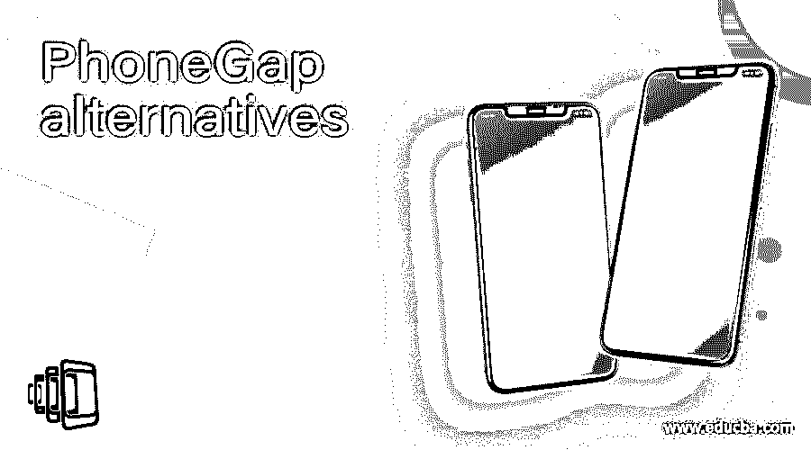

# PhoneGap 替代方案

> 原文：<https://www.educba.com/phonegap-alternatives/>

## Phonegap 替代产品介绍

PhoneGap 是一个开源的免费软件，但还没有被积极开发。最终，最新版本的操作系统将继续不兼容。创建 PhoneGap 完全没有资金，因为它不是开源的。PhoneGap 构建文件在上述日期后被删除。所有相关信息也必须事先获得。在本主题中，我们将了解 PhoneGap 替代产品。

### PhoneGap 的最佳替代产品

以下是下面提到的替代方案

<small>网页开发、编程语言、软件测试&其他</small>

#### 1.反应自然

React Native 是脸书最好的开源交易之一。这是一种构建智能手机和 web 应用程序的健壮且廉价的技术，ReactJS 库完全可用。由于它创建了大多数智能手机和网络应用程序，它被认为是一个理想的 JavaScript 库。 [React Native 有一个](https://www.educba.com/what-is-react-native/)开源平台，采用经济高效的方法，提供最佳的速度、用户体验和知识。它利用 Java、objective-c 和 swift 组件的积极组合，在 iOS/Android 应用程序中开发相同的 UI 块。使用这种革命性的技术，可以很容易地在 React Native 中开发应用程序的一部分，并使用本机代码开发更多部分。

#### 2.离子的

Ionic 是一种常见的混合跨平台技术，可以在多个平台上使用单个代码库。通过 Ionic，开发者将为 iOS 和 Android 等原生和在线平台构建混合平台应用。Ionic 充分利用了 CSS、HTML 和 JavaScript 代码，它需要一个 Cordova 插件来将程序捆绑到本地容器中。凭借快速的解决方案和持续的更新，它得到了集团的大力支持。网络和智能手机应用程序开发人员喜欢它，因为它可以快速学习曲线。它显示了巨大的成果。

#### 3.我的锅

Kotlin 是谷歌最喜欢的 Android 编程语言。它是由 JetBrains 开发的，并在开发人员中获得了极大的欢迎。它旨在让创建移动和网络应用程序变得更容易，尤其是在 Android 应用程序中。它有能力开发新的、稳定的、复杂的应用程序。无能，编码结构，速度，执行都用 Kotlin 解决[。它提供了扩展能力，允许底层部件合并附加功能。](https://www.educba.com/what-is-kotlin/)

#### 4.煎茶触摸

Web 开发人员已经使用 Sencha Touch 构建了一个用户界面，并创建了移动 web 应用程序，这些应用程序是 JavaScript UI 的一个公共库，尤其适用于移动互联网。它促进了基于 HTML5 的移动应用程序的简单而流畅的开发，这些应用程序可以轻松地与多种设备一起工作。与 Sencha Ext JS 合并的 Sencha Touch 是一个强大的跨平台应用程序的 JavaScript 框架。该软件支持各种功能，如形状、树、列表、旋转网格等。

#### 5.阿帕奇科多娃

Apache Cordova 是已经在运行的 PhoneGap 的非常受欢迎的替代品，尽管 PhoneGap 已经过时了。它是一个开源框架，用于构建 HTML、CSS 和 JavaScript web 应用程序。该软件是开源的，完全得到了业界的认可。在设计和部署混合移动应用程序时，这是一个常见的选择。codebase 应用程序受 HTML5 和 JavaScript 格式支持，然后可以在 iOS、Linux 等多种智能手机设备上运行。JavaScript/ HTML 脚本与 JS APIs 一起捆绑在本地容器中，允许使用应用程序特性。

#### 6\. Xamarin

Xamarin 是一个流行的免费、开源、Microsoft.NET 平台驱动的应用程序。该组织对它很感兴趣，并由 NET 资助。Xamarin 应用程序可以安装在 macOS 或 Windows 上，并在多个 OS、iOS 等上运行。Xamarin 提供了与其他库如脸书、Google Play、Google API 等的深度结合。跨平台和第三方。Xamarin 应用程序的平台详细加速显示。

#### 7.安卓工作室

Android Studio 被认为是一个合适的 Android 设备编程环境，它是基于 Google 的集成生产环境，构建于 JetBrains 的 IntelliJ 概念软件之上。分别是 Kotlin，Java，C++的。自从 Google 和 Jet Brains 成立以来，该组织提供了强有力的支持。它有一系列内置功能，有助于快速快速地构建 Android 设计和模块。

#### 8.jQuery Mobile

基于 JavaScript 和 JQuery 核心编程标准的 JQuery Mobile 是一个通用的 UI 平台。它有一个简单的主题和简化的 API，是轻量级的。这个 API 允许以高响应性构建智能手机应用程序和成功的网站。JQuery 移动编程标准是基于 JavaScript 和 JQuery 核心编程标准的流行 UI 框架。主题和 API 是简单的、轻量级的。它是流线型的。这个 API 帮助你开发高效的网站和高反应性的移动应用。

#### 9.摆动

Flutter 是一个 Google 驱动的开源移动软件开发项目，旨在为 web、移动和类似桌面的原生、可适应和图形高级应用程序创建多平台应用程序。它在 iOS 和 Android 平台上生成生动、可扩展的原生输出的能力越来越得到认可。

### 推荐文章

这是 PhoneGap 替代品的指南。这里我们讨论文章；我们已经看到了 PhoneGap 的各种替代品。您可以根据自己的需求选择任何一种。您也可以阅读以下文章，了解更多信息——

1.  [使用 Phonegap 构建移动应用的技术](https://www.educba.com/how-to-build-a-mobile-app-using-phonegap/)
2.  [科尔多瓦本地存储器](https://www.educba.com/cordova-local-storage/)
3.  [软件事件管理](https://www.educba.com/software-incident-management/)
4.  [远程支持软件](https://www.educba.com/remote-support-softwares/)

