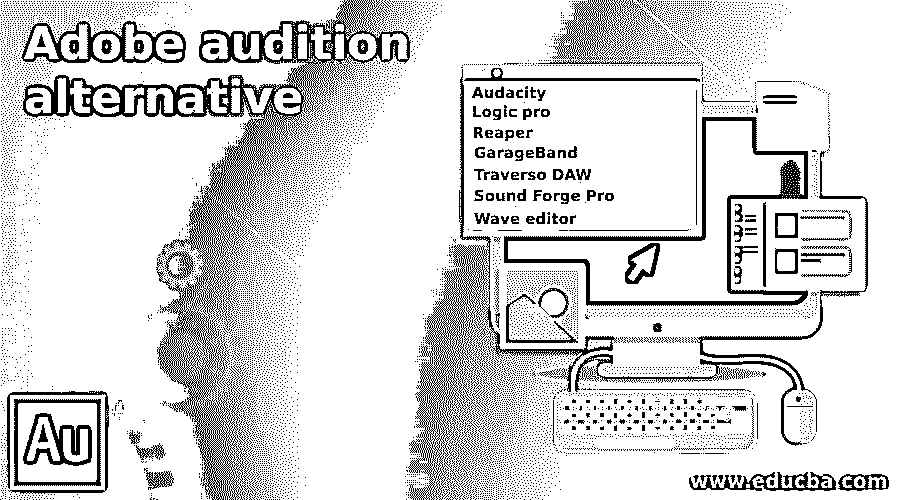

# Adobe audition 替代方案

> 原文：<https://www.educba.com/adobe-audition-alternative/>

## Adobe 音频替代方案简介

您正在寻找合适的 Adobe audio 替代品来混合声音效果，轻松添加编辑声音剪辑和音频片段吗？嗯，我们列出了一整套数字音频站，以便您能够执行上述所有活动以及更多活动。它们都集成了大量出色的功能，允许你调整歌曲，删除任何不想要的声音，甚至创建额外的节拍。一旦你通过以下任何一个程序编辑完你的声音片段，就像你想象的那样，你将享受到听觉上的愉悦。

### Adobe Audition 的替代方案

让我们逐一看看 Adobe audition 替代方案

<small>网页开发、编程语言、软件测试&其他</small>

#### 1.大胆

Audacity 对于初学者来说是一个优秀的免费音频编辑器，专业人士经常可以找到它来完成更简单的工作。Audacity 是一个可免费下载的开源音频编辑器，适用于 Mac、Windows 和 Linux。它可能不是制作创意音乐或电影配乐的最佳选择，但如果您需要快速创建播客，它是理想的选择。从 2000 年开始，它就存在了，同时它的基本界面没有太大的变化，所以它可能显得有点过时和简单。

#### 2.Logic pro

Logic Pro 有助于音乐制作，也可以帮助其他音频任务。价格为 199.99 美元，一次性费用。虽然这可能看起来很高，但随着时间的推移，它可以比专业工具更便宜地工作，并且 Audition 的订阅模型和未来的更新已经包括在内。Logic Pro 是苹果的数字音频站，旨在最大限度地发挥创造力，类似于大多数苹果软件。它有几个创新的选项，可以增强音乐制作，以及一个强大的和本能的界面。

#### 3.收割机

数字音频程序为音乐爱好者提供完整的音频和 MIDI 采集环境，用于编辑、混音、处理和多轨。不，这不是可怕的类型，而是“快速音频制作、工程和录音环境”的缩写。正如这项工作背后的大脑所揭示的那样，它可以让你调整你的录音，甚至增强许多音频和 MIDI 处理效果。这需要时间来学习，并且可能显得复杂和僵硬。但是开发者和在线社区有很多支持，而且它的适应性非常强，有数千个可用的插件。

#### 4.GarageBand

如果您是一名 Mac 用户，正在寻找比 Logic Pro 更简单、更便宜的音频编辑器，GarageBand 可能是您的选择。每台 Mac 都是免费的，旨在使录制和混合音乐变得容易。使用看起来像 Logic Pro 的简单版本的光滑界面，入门和学习都很简单。您可以使用乐器或麦克风在 GarageBand 中录音，或者从丰富的声音资源库中提取声音。虽然其他一些软件没有更高级的功能，但当您准备好升级时，您可以将 GarageBand 导出到 Logic Pro 项目。

#### 5.淘气的道

音频录制和编辑软件是录制乐队，声音，甚至整个管弦乐队的绝佳伙伴。界面清晰的 Sports 可以利用新手和专业人士可以提供的各种功能。本质上高度可扩展，它有一个优化的音频引擎，允许您录制和修改您的曲目，在专辑混音的帮助下为您的歌曲引入多种效果。

#### 6.Sound Forge Pro

您可以信赖最后提到的我们的计划，如声音设计和红皮书 CD 设计，Adobe Audition round up for professional recording and mastering。在最新版本中，你会在音频编辑器和音乐制作工具中看到更多的功能。该列表包括内置的 CD 刻录、基于事件的编辑、音频转换、文件编辑和乐器的时间拉伸。这种标签的起价低于 375 美元，以 Sound Forge Pro 的价格出售。

#### 7.波形编辑器

Wave Editor 是一款简单的 Windows 数字音频编辑软件。它提供了一个强大的编辑环境，特别适合初学者，并执行基本的编辑功能，如剪切、复制、插入和删除录音部分。与基于相同引擎的其他声音编辑器相比，我们的声音编辑器从头开始开发，易于使用且快速。用户界面的设计速度快、准确且易于使用。

播放时简单选择音频块是 Wave 编辑器的关键特性。非破坏性版本支持模拟音频路径更改，而不会覆盖原始文件。

### 推荐文章

这是 Adobe audition 替代方案的指南。在这里，我们讨论 Adobe 音频替代品。您可以根据自己的需求选择任何一种。您也可以看看以下文章，了解更多信息–

1.  [Adobe Flash 版本](https://www.educba.com/adobe-flash-versions/)
2.  [SQLite 替代品](https://www.educba.com/sqlite-alternatives/)
3.  [GitLab 替代方案](https://www.educba.com/gitlab-alternative/)
4.  [观念选择](https://www.educba.com/notion-alternatives/)

